# Lezione 1 — Introduzione ai Data Center

> Corso: *Data Center Design and Operation* — Prof. **Antonio Cisternino**, Università di Pisa
> Visione orizzontale dell'infrastruttura dietro Cloud, VM e sistemi HPC.

---

## Dalle Sale Server alle Gigafactories

Venti anni fa un data center era una stanza con un condizionatore, qualche rack e PC desktop senza monitor. Oggi è infrastruttura critica a livello nazionale.

> [!info] Definizione legislativa
> Il parlamento italiano sta lavorando a una **legge delega** per regolamentare i data center. Un impianto è considerato di **rilevanza nazionale** quando supera **0,5 MW** di assorbimento.

**Riferimenti storici (Università di Pisa):**
- **2013** — Primo data center di Cisternino (vicino al bar d'ingresso): **80 kW**
- **Oggi** — Polo di San Piero: **250–300 kW**

Con l'esplosione delle **AI factories**, si entra nell'era delle **Gigafactories**: esistono progetti per data center da **2,5 GW**, un valore che impone vincoli estremi sulla rete elettrica nazionale (in Italia pochissimi siti possono erogare tale potenza in un unico punto).

---

## Infrastruttura di Rete e Switching

| Contesto | Tecnologia | Velocità |
|---|---|---|
| Campus / Management DC | Ethernet RJ45 | < 1 Gbps |
| Traffico principale DC | Fibra ottica | 10–25 Gbps |

**Switch moderno (< $10.000):**
- 48 porte × 25 Gbps
- Architettura **non-blocking** → nessun overbooking, zero colli di bottiglia
- Capacità di switching: **1,2–2,4 Tbps** (fino a 24 Tbps in TX+RX)

> [!note] Non-Blocking Switch
> Tutti i nodi possono trasmettere e ricevere simultaneamente senza subire rallentamenti. Lo switch diventa esso stesso un sistema di calcolo intensivo.

---

## Il Paradigma Sconvolto dall'IA

### Prima dell'IA: virtualizzazione e Cloud

I laptop e i server moderni rimangono al **10% del potenziale** per il 90% del tempo → a partire dal **2008** l'industria enterprise ha sfruttato la **virtualizzazione** per recuperare questa inattività, dando vita al **Cloud**.

### L'IA rompe l'equilibrio

L'IA è il **primo workload che satura integralmente l'hardware fisico**. Conseguenze:

- La virtualizzazione non ha senso nello stack AI
- Si usano architetture distribuite su **GPU multiple**
- La **latenza di comunicazione** è un vincolo critico → i cavi devono essere i più corti possibile

### Costo computazionale dei token

> [!example] Esempio: LLM da 7B parametri
> - 1 token (≈ 3 caratteri) → **7 miliardi di moltiplicazioni**
> - 1.000 token → **~7 trilioni di operazioni**

Per modelli come **GPT-4** (stimato ~600B parametri), il costo sarebbe improponibile senza la tecnica **Mixture of Experts**: la rete si divide in strati specialistici, limitando le moltiplicazioni attive a **1–3 miliardi per esperto**.

> [!note] Mixture of Experts (MoE)
> Paradigma computazionale che attiva dinamicamente solo una piccola porzione della matrice di parametri per ogni inferenza, abbattendo drasticamente il costo del token.

### Hardware richiesto (2024–2025)

Per eseguire modelli open-source da **120B parametri** (es. GPT-OSS, Deepseek R1):
- 2× **Nvidia RTX 6000** → ~**€50.000 cadauna**

---

## Fisica dei Data Center: Alimentazione e Cooling

### Evoluzione della densità per rack

| Periodo | Potenza per rack |
|---|---|
| Primi anni 2000 | 3 kW |
| 2013–2016 (San Piero) | 15 kW |
| Oggi (AI hardware) | ~200 kW |
| Previsione a breve | 500 kW – 1 MW |

> [!warning] Scala: 200 kW per rack
> Equivale alla potenza massima di **70 appartamenti** collegati simultaneamente a un singolo armadio.

### Implicazioni fisiche

- **Cablaggio:** a 200 kW il rame classico è inutilizzabile → si usa un **power bar rigido** nella parete posteriore del rack
- **Raffreddamento:** il **liquid cooling** è passato da opzione futuristica a **necessità obbligatoria** — un sistema HPC non può essere acceso senza raffreddamento attivo a liquido

> [!tip] Perché i chip generano calore?
> L'algebra booleana è intrinsecamente dissipativa. Nelle porte logiche (es. AND con due input `1`), la tensione in eccesso non può accumularsi e viene disposta come **calore**. Le **Fredkin Gates** (porte trinomiali invertibili, non dissipative) avrebbero risolto il problema, ma non sono mai state realizzate commercialmente per limiti manifatturieri.

---

## Supercomputer e Tensioni Geopolitiche

### Top500 & Green500

- **Top500**: classifica semestrale (dal 1993) basata su benchmark di algebra lineare
- **Green500**: efficienza in **petaflops/Watt**
- La partecipazione non è obbligatoria (es. NSA, Ferrari nel 2003 non hanno certificato i propri sistemi)

### Sistemi di punta

| Sistema | Note |
|---|---|
| Frontier | USA |
| Aurora | USA |
| Jupiter Boost | Europa |
| Fugaku | Giappone (ex campione) |
| **Eagle** (Microsoft Azure) | 2M core, AI-oriented, **distribuito virtualmente** |
| **Leonardo** (CINECA) | 2M core, **10° posto**, Italia |

### Geopolitica europea

- **2019**: post-Brexit, la Commissione Europea (dir. **Roberto Viola**) ha investito **~2 miliardi €** in 7 anni per colmare il vuoto lasciato dal Regno Unito
- L'Italia ha avviato una gara d'appalto (gestita dal CINECA) per un'**AI Factory nazionale**: **500 milioni €**

> [!info] Scala degli investimenti USA
> **Project Stargate** (Oracle/OpenAI/Ellison): **500 miliardi di dollari**
> La capitalizzazione di **Nvidia** supera il PIL di Italia, Francia e Germania.

---

## Localizzazione: Vincoli Geografici e Fiscali

### L'Italia è un paese sfavorevole per i data center

> [!danger] Problemi strutturali italiani
> 1. **Rischio sismico** — Hardware delicato vulnerabile alle scosse. Es: il data center della Regione Lazio è costruito al primo piano su **pilastri ammortizzanti** antisismici.
> 2. **Escursione termica** — Oscillazioni fino a **50°C** tra estate e inverno destabilizzano i sistemi di raffreddamento (stesso fenomeno che crepa l'asfalto italiano).

Stesso problema: sud della Spagna, Barcellona, Grecia.

### Soluzioni adottate nel mondo

| Approccio | Esempio |
|---|---|
| Deserti freddi di notte | Nevada (ghiaccio notturno per raffreddamento diurno) |
| Paesi nordici | Scandinavia, Islanda (ma: rischio eruzioni vulcaniche) |
| Caverne alpine | ENI — supercalcolatore nelle Alpi a temperatura costante |
| Free cooling invernale | **Aruba** (Arezzo) — turbina reversibile: aria fredda d'inverno, estrazione d'estate |
| Fondale marino | **Microsoft Project Natick** — cicli quinquennali; rischi: corrosione salina, servicing difficile |

### Vantaggi fiscali: l'esempio irlandese

Google, Apple, Microsoft e altri hanno scelto l'**Irlanda** principalmente per gli **sconti fiscali** legati all'ingresso nell'UE, non solo per il clima favorevole.

---

## Problematiche Acustiche, Fiscali e Gestionali

### Impatto acustico

I **chiller** (pompe di raffreddamento) sono rumorosi e continui. Il data center del dipartimento di Ingegneria di Pisa fu smantellato per **sentenza di un giudice**: nonostante fosse sotto la soglia legale di decibel, un professore vicino fece causa e vinse, costringendo al trasferimento nel polo extra-cittadino (con ulteriori problemi burocratici legati ad aree boschive vincolate).

### Infrastruttura elettrica

A Pisa, la cabina vicino al bar era predisposta fino a **2 MW**, ma la rete urbana limitava l'impianto a **80 kW**.

### Gestione di larga scala

> [!important] Documentazione e gestione
> In una server farm con **700+ macchine** interconnesse via fibra ottica, non è ammissibile tracciare fisicamente un cavo in caso di guasto.
> Ogni componente, porta logica e armadio deve essere catalogato e rintracciabile via **software di gestione centralizzato**.
> L'efficienza energetica si misura con il **PUE (Power Usage Effectiveness)**.

---

## Glossario

| Termine | Definizione |
|---|---|
| **Legge Delega** | Iter normativo per regolamentare i data center di rilevanza nazionale |
| **Non-Blocking Switch** | Switch senza overbooking: tutti i nodi trasmettono/ricevono senza code |
| **Mixture of Experts (MoE)** | Paradigma AI che attiva dinamicamente solo una frazione dei parametri per ridurre il costo computazionale per token |
| **Top500 / Green500** | Classifiche semestrali di performance HPC (dal 1993) e di efficienza energetica (petaflops/W) |
| **Fredkin Gates** | Porte logiche teoriche trinomiali e invertibili, non dissipative termicamente — mai realizzate commercialmente |
| **PUE** | Power Usage Effectiveness: rapporto tra potenza totale del DC e potenza consumata dall'IT |
| **Liquid Cooling** | Raffreddamento a liquido, oggi obbligatorio per hardware HPC ad alta densità |

```{=latex}
\newpage
```

# Architettura e Gestione dei Datacenter

La lezione esplora l'infrastruttura fondamentale dei datacenter moderni: non solo i componenti tecnologici, ma le sfide ingegneristiche, fisiche e legali legate alla loro progettazione. Il filo conduttore è la tensione permanente tra due esigenze opposte — la **ridondanza** totale richiesta dall'utente e l'**efficienza** economica richiesta dal fornitore — che determina ogni scelta progettuale, dal pavimento ai cavi di rame.

## Fondamenti e Vincoli della Progettazione

### La Complessità del Datacenter e la Ricerca dell'Efficienza

Un datacenter non è un ambiente complesso per l'elevato numero di componenti diversi; alla base, gli "ingredienti" sono pochi: un edificio che ospita un insieme di armadi di server (**rack**), l'alimentazione elettrica, gli apparati di rete, il cablaggio e un sistema di raffreddamento (**cooling**). La vera complessità deriva dalle enormi risorse necessarie per farlo funzionare e dalla continua ricerca dell'efficienza.

Fino a poco tempo fa, l'aria veniva usata come principale mezzo di raffreddamento non perché fosse il più efficiente in assoluto, ma perché era economica e immediatamente disponibile. Oggi questa scelta viene messa in discussione man mano che la densità energetica dei rack cresce.

> [!tip] Efficienza come metrica economica
>
> Intel dimostrò che modificare la temperatura operativa di design delle CPU di un solo grado Celsius poteva generare risparmi energetici per milioni di dollari. Più di recente, Dell immette sul mercato **AI rack** da 200 kW progettati per operare a 40°C: la soglia elevata riduce drasticamente l'energia spesa per il raffreddamento, e poiché il rack è fisicamente sigillato, gli operatori non devono lavorare in quelle temperature.

### Il Paradigma "Always On" e i Tre Pilastri della Sicurezza

I fornitori di servizi cloud non possono permettersi di spegnere i datacenter per la manutenzione: gli utenti pretendono disponibilità 24/7. L'interruzione del servizio è percepita come un evento eccezionale — basti pensare che se i server Google vanno offline anche solo per mezz'ora, la notizia finisce sui telegiornali di tutto il mondo.

Creare un datacenter perfetto e infallibile è però impossibile, perché la ridondanza ha costi altissimi. Le aziende devono quindi valutare quante copie dei dati siano necessarie in base al rischio che intendono tollerare. Una disconnessione momentanea genera frustrazione ma è tollerata; perdere anche un solo file nello storage è considerato un errore imperdonabile.

> [!definition] CIA Triad — Disponibilità, Integrità, Riservatezza
>
> La progettazione dei servizi si basa su tre pilastri normativi e tecnici:
> - **Disponibilità** (*Availability*): il servizio deve essere sempre raggiungibile.
> - **Integrità** (*Integrity*): i dati non devono essere corrotti o alterati.
> - **Riservatezza** (*Confidentiality*): i dati non devono essere accessibili a soggetti non autorizzati.
>
> Il [[GDPR]] sanziona la violazione di **tutti e tre** i pilastri: non solo le fughe di dati, ma anche la corruzione e la mancata disponibilità.

> [!example] Università La Sapienza — violazione senza furto di dati
>
> In seguito a un grave attacco informatico che ha bloccato i servizi per una settimana senza sottrarre materialmente dati, La Sapienza ha dovuto comunque segnalare la violazione alle autorità, proprio a causa della mancata **disponibilità** dei propri sistemi. Nel mondo digitale, l'incapacità di accedere ai propri dati o ai sistemi di pagamento equivale a un danno economico tangibile.

### Disastri, Ridondanza e Normative Geografiche

Per garantire la continuità, le infrastrutture devono poter essere aggiornate in ogni parte senza mai interrompere il servizio. Le normative impongono vincoli fisici stringenti: i datacenter devono essere mantenuti a una distanza di sicurezza di almeno **10 chilometri** l'uno dall'altro, per proteggersi da catastrofi che colpiscono una specifica area.

> [!warning] Il caso di Bruxelles
>
> Un provider aveva collocato due datacenter "distinti" all'interno della stessa piazza cittadina. Un vasto incendio li rase al suolo entrambi, costringendo l'azienda a comunicare ai clienti la **perdita totale** dei dati. La distanza geografica tra i siti non è una preferenza di design, è un requisito di sopravvivenza.

A questi vincoli si aggiungono obblighi legali di posizionamento: il **GDPR** impone di mantenere i dati all'interno dei confini dell'Unione Europea. Le grandi piattaforme cloud mitigano i rischi investendo in infrastruttura propria: Microsoft, ad esempio, possiede una rete globale di cavi oceanici privati, riducendo la dipendenza tecnica da terzi. Per evitare *single points of failure*, queste aziende stipulano contratti con cinque diversi operatori di rete, pretendendo che non condividano nemmeno un segmento di infrastruttura tra di loro; analogamente, si interfacciano con fornitori di energia che, per contratto, devono attingere da centrali elettriche rigorosamente distinte.

> [!example] Netflix e il tornado nel New Jersey
>
> Nonostante ogni precauzione, disastri su scala globale accadono. La piattaforma Netflix è rimasta inaccessibile per quasi una settimana quando un devastante tornado ha raso al suolo le strutture Amazon nel New Jersey, privando l'intera macro-area di energia elettrica e distruggendo le facility fisiche.

---

## Vincoli Fisici e Legacy Tecnologica

### I Limiti Fisici della Progettazione (Hard Thresholds)

A differenza del lavoro di un informatico — dove si applica il principio dell'induzione matematica per scalare algoritmi all'infinito — il mondo dell'ingegneria comporta limitazioni intrinseche che non possono essere scavalcate.

> [!definition] Hard Threshold
>
> Soglia fisica oltre la quale un design non può essere semplicemente "ingrandito", ma è necessario riprogettare radicalmente la tecnologia da zero usando approcci diversi.

Un esempio concreto: in elettronica un **relè** elettromagnetico è utile per accendere o spegnere la corrente per dispositivi comuni, ma non viene mai usato in sistemi pesanti come gli ascensori. L'enorme quantità di ampere richiesta fonderebbe in pochi istanti la bobina di rame del componente. Questa logica si ripete a ogni scala nella progettazione di datacenter: il cablaggio elettrico, il raffreddamento, la struttura portante — ciascuno presenta soglie oltre le quali occorre cambiare tecnologia.

### L'Eredità degli Standard e il Pavimento Flottante

Molte soluzioni di ingegneria dei datacenter odierni si basano su standard fisici vecchi di decenni, mantenuti in vita per evitare i costi enormi di riprogettazione e sostituzione di massa. Nel mondo del networking, avendo già posato oltre 70 miliardi di metri di cavo Ethernet (RJ45), si è preferito forzare le vecchie architetture via cavo a spingere 2.5 o 5 Gbps, invece di ricablare interi edifici in vista delle moderne antenne Wi-Fi ad alta velocità. Questo stallo ha prodotto una scissione: i "campus network" sono rimasti sull'Ethernet standard (spesso alimentando i dispositivi tramite **PoE**, *Power over Ethernet*), mentre il cuore dei datacenter è migrato verso standard specifici più veloci e stabili.

Tra i residui tecnologici adattati vi è il **pavimento flottante** (*floating floor*): una griglia rialzata su piedistalli metallici incrociati, con mattonelle rimovibili posate sopra.

> [!definition] Floating Floor (Pavimento Flottante)
>
> Struttura rialzata di un datacenter composta da piedistalli metallici e mattonelle rimovibili. Nei vecchi uffici le mattonelle reggevano ~500 kg/m²; nei datacenter moderni, dove lo storage pesa molto di più, si usano pannelli in polvere di marmo compattata strutturati per reggere da **1 a 1,5 tonnellate per metro quadrato**.

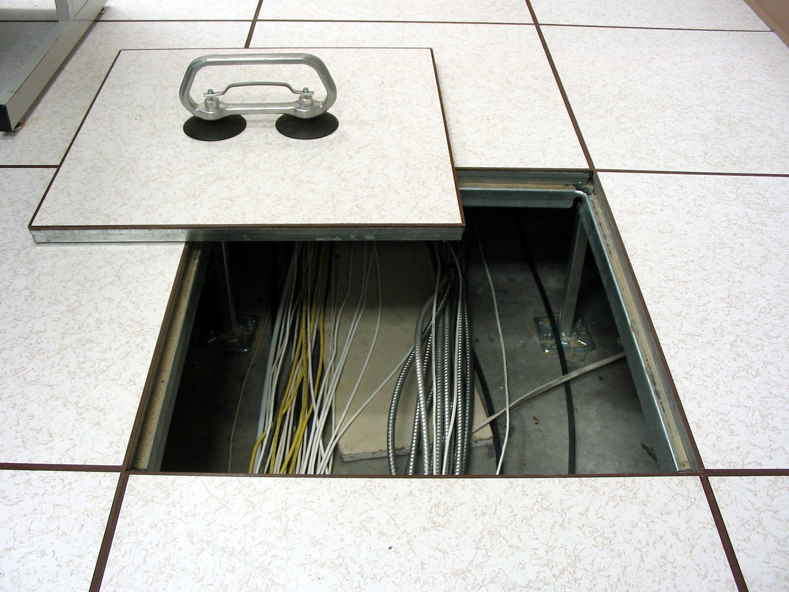
*Fonte: Wikimedia Commons (Jonathan Lamb, Public Domain) — Mattonella del pavimento flottante sollevata con ventosa; sotto sono visibili cavi e condotte.*

Mantenere il pavimento flottante offre due vantaggi ingegneristici fondamentali:

1. **Accesso immediato** a tutta l'infrastruttura elettrica e idraulica nascosta sotto il pavimento, senza dover spostare i rack.
2. **Condotto di raffreddamento**: la cavità sotto il pavimento diventa un plenum isolato per spingere enormi quantità di aria fredda verso l'alto, attraverso mattonelle forate posizionate strategicamente davanti ai rack.

Tenere i passaggi separati sotto il pavimento evita anche potenziali cortocircuiti: il pericolo di innescare incendi è severo, specie in presenza di batterie al litio — notoriamente inestinguibili con le procedure standard e severamente vietate nelle stive degli aerei proprio per questo motivo.

---

## Strategie di Raffreddamento

### Aria, Acqua e Olio

Per massimizzare l'efficienza termica, l'intero edificio del datacenter viene isolato all'estremo dall'ambiente esterno. Non mancano eccezioni creative: il complesso di Aruba, ad esempio, immette liberamente l'aria gelida esterna in inverno ed espelle il flusso caldo verso fuori, risparmiando energia.

Il principio fondamentale del raffreddamento a rack è la separazione fisica tra **corridoio freddo** (*cold aisle*) — da cui i server aspirano l'aria fresca — e **corridoio caldo** (*hot aisle*) — da cui espellono il calore. Questa separazione evita che l'aria fredda e quella calda si mescolino prima di raggiungere i server, massimizzando l'efficienza termica.

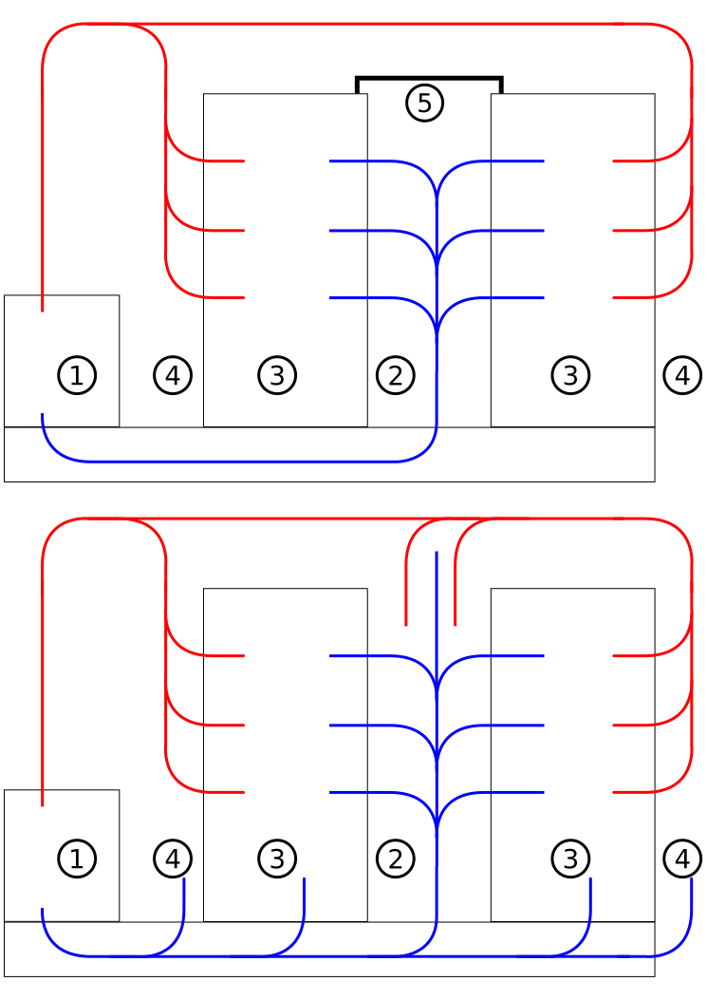
*Fonte: Wikimedia Commons (CC BY-SA 3.0 DE) — Schema di contenimento del corridoio freddo: il flusso blu (aria fredda) entra dal basso, attraversa i server e fuoriesce come flusso rosso (aria calda) sul corridoio opposto.*

Dato che la logistica delle condotte idrauliche sta diventando l'elemento centrale delle server farm moderne, si privilegia sempre di più l'acqua per le sue eccezionali proprietà termiche. Ricalcando il meccanismo biologico del sudore umano, i datacenter più grandi impiegano attivamente la **dispersione tramite evaporazione**. Nonostante sia una tecnica incredibilmente efficiente, il suo costo ambientale è elevato: circa l'**80% dell'acqua iniettata viene evaporata**. Sebbene questa acqua ritorni nell'atmosfera come pioggia senza essere distrutta, la dispersione massiccia locale crea sacche artificiali di umidità che rischiano di alterare il microclima circostante.

> [!warning] Il problema idrico negli USA
>
> I massicci impieghi idrici agro-industriali combinati a quelli dei datacenter hanno sostanzialmente prosciugato le risorse basate sul fiume Colorado. Questo ha spinto alcune aziende a pianificare la migrazione delle proprie sedi verso il Sud America — Argentina in primis — in cerca di riserve idriche intoccate. L'acqua usata deve essere desalinizzata e ripulita a fondo, il che aggiunge ulteriore complessità logistica.

Un'alternativa d'avanguardia è la **total immersion cooling**: i server vengono immersi in vasche ricolme di olio minerale o vegetale. A differenza dell'acqua, l'olio isola chimicamente i contatti e non conduce elettricità, disperdendo il calore con grande efficacia — tecnica usata anche per overclock estremi nei PC da gaming.

> [!note] Limiti dell'immersion cooling
>
> - L'**olio vegetale** tende rapidamente a irrancidire, sprigionando odori acri.
> - L'**olio minerale** è molto costoso da approvvigionare in quantità industriali.
> - Ogni operazione di manutenzione su schede madri immerse diventa una procedura sporca e complessa.
>
> Per queste ragioni, l'industria ha preferito affinare il raffreddamento localizzato tramite tubazioni ad acqua pura anti-versamento, accettandone la complessità tecnica.

---

## Infrastruttura Elettrica

### Scale Up vs Scale Out

> [!definition] Scale Up vs Scale Out
>
> - **Scale Up**: si aumenta la capacità di un singolo apparato (es. si aggiunge RAM a un server esistente).
> - **Scale Out**: si replica il numero di macchine separate per distribuire il carico (es. si aggiungono nuovi server al cluster).

Nel contesto dell'approvvigionamento elettrico, un intero edificio è **costretto a operare in logica Scale Up**: all'aumentare del consumo dell'infrastruttura, occorrono cavi di rame via via più voluminosi e spessi. Scalare elettricamente è dolorosamente costoso, soprattutto per il prezzo del rame. A titolo di esempio, il cablaggio per supportare soli 80 kW di picco in un piccolo complesso accademico — trascinando il fascio dalla cabina esterna ai server — è arrivato a costare circa **25.000 €**. Per minimizzare la resistenza elettrica intrinseca con correnti molto elevate, i tecnici sostituiscono i fasci di cavi intrecciati con **sbarre di rame pieno** (*busbars*), singole e dritte.

### Fondamenti Elettrici: Potenza, Corrente Alternata e Distribuzione

Un datacenter richiede una concentrazione energetica enorme, che può essere fornita da rinnovabili, combustibili fossili o nucleare. Nelle logiche macro-aziendali americane in espansione, si intravede l'uso di reattori di ultimissima generazione — tecnologicamente più puri e sicuri, con materiali radioattivi come il torio — che generano circa un decimo delle scorie rispetto all'uranio tradizionale.

Per gestire questo flusso, l'ingegnere deve dominare il concetto di **potenza effettiva**, che non si ricava semplicemente dai Volt, ma dal prodotto:

$$
P_{\text{apparente}} = V \times I \quad [\text{VA}]
$$

$$
P_{\text{reale}} = V \times I \times \cos\phi \quad [\text{W}]
$$

dove $\cos\phi$ (**Cosfi**, o *fattore di potenza*) è il coseno dell'angolo di sfasamento tra tensione e corrente. I moderni trasformatori *switching* — presenti sia nei server farm sia nel piccolo alimentatore del laptop — hanno un Cosfi variabile: scende a circa **0.56** quando i componenti sono inattivi (*idle*), ma sale fino a **0.96** sotto carico computazionale intenso.

> [!tip] Perché il Cosfi è cruciale negli acquisti
>
> Durante le gare di acquisto per apparecchiature industriali, esigere trasformatori con un elevato *power factor* è una scelta economicamente discriminante: apparecchi con basso Cosfi disperdono una quota significativa dell'energia prelevata dalla rete, aumentando i costi operativi nel lungo periodo.

Nonostante l'elettronica digitale lavori esclusivamente in **Corrente Continua** (*DC — Direct Current*), tutti i datacenter globali ricevono energia in **Corrente Alternata Trifase** (*AC — Alternating Current*), standardizzata a **380 V** in Europa. Le ragioni sono storiche e fisiche: far transitare enormi flussi di corrente continua scalda i conduttori in modo molto più pericoloso, e le scosse in DC sono fisiologicamente più letali di quelle in AC a parità di energia. Sarà ogni singolo server, nell'ultima maglia della rete, a convertire la corrente alternata in continua attraverso il proprio alimentatore interno.

> [!definition] UPS (Uninterruptible Power Supply)
>
> Componente al vertice della piramide di distribuzione elettrica del datacenter. Non si tratta dei piccoli dispositivi domestici anti-blackout, ma di **interi armadi e batterie industriali** destinati a stabilizzare la linea e garantire continuità in caso di interruzione della rete esterna. Gli interruttori di sezionamento — talmente potenti da non poter essere azionati manualmente a mani nude — vengono commutati da **molle metalliche precompresse**, che il meccanismo rilascia automaticamente per garantire la massima velocità di intervento e proteggere il personale.

> [!definition] PDU (Power Distribution Unit)
>
> Centraline di gestione che suddividono progressivamente il carico elettrico lungo la gerarchia di distribuzione. La rete elettrica segue un'architettura ad albero: dalla cabina esterna si scende attraverso PDU di piano, fino ai **Rack PDU** dove ogni server inserisce il proprio cavo di alimentazione.

L'architettura di distribuzione elettrica segue quindi questo percorso gerarchico:

**Rete Trifase Esterna → UPS → PDU di edificio → PDU di piano → Rack PDU → Server**

> [!abstract] Sintesi — Infrastruttura Elettrica
>
> La progettazione elettrica di un datacenter è vincolata da hard threshold fisici non aggirabili: cavi più grossi, costosi e difficili da gestire. La corrente arriva dall'esterno in AC trifase a 380 V, viene stabilizzata dall'UPS e distribuita gerarchicamente tramite PDU fino ai server, che la convertono in DC internamente. Il fattore di potenza è una metrica economica critica da valutare in fase di acquisto delle apparecchiature.

---

## Glossario

> [!definition] Scale Up / Scale Out
>
> Tecniche per rispondere al fabbisogno crescente di risorse. **Scale Up** aumenta la capacità di un singolo nodo (più RAM, CPU più potente); **Scale Out** distribuisce il carico su un numero maggiore di nodi separati. In ambito elettrico, i datacenter sono forzati a operare in Scale Up, con tutti i costi che ne derivano.

> [!definition] CIA Triad (Disponibilità, Integrità, Riservatezza)
>
> Il trittico fondamentale su cui si basa la progettazione protettiva dei servizi digitali. Garantire **Disponibilità** significa che il servizio è sempre raggiungibile; **Integrità** significa che i dati sono corretti e non manomessi; **Riservatezza** significa che solo i soggetti autorizzati possono accedervi. Il GDPR sanziona la violazione di ciascuno dei tre pilastri.

> [!definition] Fattore di Potenza (Cosfi, $\cos\phi$)
>
> Rapporto tra la potenza reale (W) e la potenza apparente (VA): $\cos\phi = P / S$. Quantifica quanto efficacemente l'energia prelevata dalla rete viene effettivamente convertita in lavoro utile. Un Cosfi basso indica dispersione energetica. Nei trasformatori switching dei server, varia tra ~0.56 (idle) e ~0.96 (sotto carico).

> [!definition] Floating Floor (Pavimento Flottante)
>
> Struttura rialzata del datacenter su piedistalli metallici, con mattonelle rimovibili che reggono fino a 1–1,5 t/m². Serve un duplice scopo: accesso facilitato all'infrastruttura nascosta sotto il pavimento, e creazione di un plenum per la distribuzione dell'aria fredda di raffreddamento verso i rack.

> [!definition] UPS (Uninterruptible Power Supply)
>
> Primo stadio di ingresso della rete elettrica nel datacenter. Sistema industriale di grosse dimensioni — non il piccolo dispositivo domestico — composto da batterie e meccanismi di commutazione automatica, progettato per garantire continuità di alimentazione e proteggere l'intera infrastruttura da fluttuazioni e blackout della rete esterna.

```{=latex}
\newpage
```

# Gestione dell'Energia e del Raffreddamento nei Data Center

L'infrastruttura di un Data Center moderno è un ecosistema estremamente complesso, paragonabile a un'orchestra in cui ogni elemento — alimentazione, reti, raffreddamento e rack — deve funzionare in perfetta armonia con gli altri. In questo capitolo esploreremo le dinamiche fisiche, economiche e gestionali che governano alimentazione e raffreddamento: dal mercato dei fornitori e dalle criticità della manutenzione, al rischio del surriscaldamento, ai parametri di efficienza energetica come il **PUE** (*Power Usage Effectiveness*), fino all'evoluzione delle architetture di condizionamento ad aria con i sistemi **CRAC**.

---

## Il Mercato dei Vendor e la Strategia di Acquisizione

Acquistare le singole parti di un Data Center per assemblarle autonomamente è un errore strategico considerevole. Poiché ogni componente influenza direttamente gli altri, è fondamentale affidarsi a ecosistemi integrati forniti da vendor specializzati. Al giorno d'oggi ogni parte del Data Center è considerabile "attiva": anche elementi passivi come rack e schede di controllo sono dotati di display e interfacce accessibili via protocollo HTTP.

Esistono pochi fornitori al mondo capaci di gestire le competenze necessarie per installazioni ad alta potenza. **Schneider Electric** domina le installazioni elettriche e ha acquisito **APC** (storica azienda specializzata in rack e gruppi di continuità). Un altro colosso è **Vertiv** (ex Emerson), nata come produttrice di *chiller* (refrigeratori industriali). In Italia il mercato è presidiato da **Riello** per sistemi elettrici e UPS, e **Climaveneta** per i chiller.

---

## La Manutenzione e il Ciclo di Vita

Quando si acquista un Data Center, in realtà non si compra solo hardware: si "sposa" il produttore attraverso un contratto di manutenzione. Il modello di business è analogo a quello delle automobili di fascia alta — BMW o Mercedes — dove l'accesso alle centraline e la riparazione richiedono strumenti proprietari che solo il produttore può fornire.

> [!warning] Costi dell'infrastruttura
>
> I costi sono imponenti: la ristrutturazione di un DC di piccole dimensioni parte da circa **250.000–300.000 €**, mentre impianti più grandi oscillano tra **2 e 5 milioni di €**. Acquistare un pezzo di ricambio da tenere in magazzino — per esempio un chiller da **100.000 €** — è economicamente insostenibile e logisticamente impraticabile per via degli ingombri fisici.

I contratti di manutenzione garantiscono interventi "Next Business Day" o entro **4 ore**, con monitoraggio remoto 24/7. Il costo annuo di questi contratti oscilla tra il **10% e il 30%** dell'investimento originale. Se si decide di non rinnovare, dopo alcuni anni i vendor non garantiscono più la disponibilità dei ricambi — specialmente per macchine con oltre **12 anni** di vita — costringendo di fatto l'operatore a un costoso aggiornamento totale. Il ciclo di vita tipico di un intero Data Center si aggira intorno ai **10 anni**.

---

## Surriscaldamento: Una Minaccia Critica per il Silicio

Dal punto di vista concettuale, un Data Center richiede le stesse risorse di un'abitazione domestica: rete, corrente, raffreddamento. La differenza è nella scala: mentre un contatore domestico eroga **3–5 kW**, un Data Center necessita facilmente di **1 Megawatt** per alimentare migliaia di server.

Questo fabbisogno energetico massiccio si traduce in un enorme rilascio di calore. Se il sistema di raffreddamento si guasta, la situazione degenera rapidamente: le ventole dei server, dotate di sensori termici, percepiscono l'aumento di temperatura e accelerano per compensare. Ma spostando aria già calda, il loro stesso attrito immette ulteriore energia termica nella stanza. Si innesca un **effetto esponenziale**: in assenza di aria fredda, la temperatura della sala può raggiungere **60–70°C** in tempi brevissimi, a tal punto che l'unica soluzione di emergenza è l'apertura fisica delle porte dell'edificio.

> [!warning] Surriscaldamento vs. blackout
>
> Il surriscaldamento è storicamente più pericoloso di una semplice interruzione di corrente. Un blackout tradizionale danneggiava i dischi rigidi meccanici — la testina rischiava di graffiare il piatto al momento dello stop improvviso — ma con la diffusione degli **SSD** questa mortalità si è drasticamente ridotta. Il calore estremo, invece, può sciogliere i componenti plastici e danneggiare irreparabilmente il **silicio** delle componenti elettroniche, rendendole inutilizzabili.

> [!example] La termodinamica del rack a 40°C
>
> Alcuni vendor certificano che i server, con vita utile media di **5 anni**, possano operare per **40 giorni all'anno a 40°C**. Sembra un limite elevato, ma bisogna considerare il **Delta T** del rack: la differenza di temperatura tra l'aria fredda in ingresso (*inlet*) e l'aria espulsa sul retro è tipicamente di circa **15°C**. Se l'aria in ingresso è a 40°C, sul retro del rack si raggiungono facilmente 55–60°C. I dischi meccanici per *cold storage* (archiviazione economica) possono arrivare a temperature superficiali operative di **100°C** — letteralmente abbastanza calde da cuocerci sopra.

> [!example] Il guasto dei chiller pisani
>
> Durante una settimana di luglio con temperature esterne superiori ai **38°C**, i vecchi chiller del Data Center pisano — progettati in anni in cui quei picchi non si registravano — sono andati in blocco termico perché le loro dimensioni non consentivano di dissipare un tale carico. In sole **due ore** la sala macchine ha raggiunto i **50°C**, costringendo a spegnere tutto e a versare letteralmente acqua fredda sulle scocche dei chiller per poterli riavviare. Questo episodio dimostra quanto i servizi Internet siano vulnerabili alle condizioni fisiche dell'ambiente.

---

## Anomalie Elettriche e i "Bug"

Non solo il calore, ma anche le interruzioni elettriche causano gravi disservizi. I **UPS** (*Uninterruptible Power Supply*, gruppi di continuità) intervengono durante le micro-interruzioni di rete per dare il tempo ai generatori diesel di avviarsi. In un caso specifico, continue micro-interruzioni da **10–15 secondi** non furono tollerate dall'elettronica di controllo dei chiller — non messi sotto UPS per motivi di costo. I chiller, interpretando quel disturbo come un pericolo, si spensero autonomamente, causando la caduta di tre impianti di refrigerazione. La soluzione fu l'acquisto di un UPS dedicato esclusivamente ai chiller per stabilizzarne l'alimentazione.

> [!example] L'origine del termine "bug"
>
> Un serpente in cerca di calore durante l'inverno si infilò in una cabina di distribuzione ad alta tensione, attaccandosi alle bobine e causando un cortocircuito fatale che spense l'intero Data Center — lasciando a terra solo il proprio corpo carbonizzato. Il termine informatico **"bug"** deriva proprio da questo tipo di incidenti: veri insetti e roditori che causavano blackout masticando cavi o cortocircuitando componenti.

---

## L'Efficienza Energetica e il PUE

Sprecare energia non comporta solo perdite economiche dirette, ma impone costi indiretti: componenti elettriche e cavi più spessi e costosi per reggere i picchi. In uno scenario in cui i costi energetici sono passati da **300.000 € a 1.000.000 € all'anno** — complice il conflitto in Ucraina — misurare l'efficienza è diventato cruciale.

> [!definition] PUE — Power Usage Effectiveness
>
> Il **PUE** è il parametro adimensionale standard per misurare l'efficienza energetica di un Data Center. Si calcola come:
>
> $$
> \text{PUE} = \frac{\text{Total Facility Power}}{\text{IT Equipment Power}}
> $$
>
> Il *Total Facility Power* è la somma del consumo IT, dell'illuminazione e — soprattutto — del dispendio per il raffreddamento. Poiché l'assorbimento IT compare sia al numeratore che al denominatore, il valore ideale teorico in assenza di overhead è **1**. Il PUE è sempre maggiore di 1: più alto è il valore, peggiore è l'efficienza. Alcuni utilizzano l'inverso della formula per ottenere un indice compreso tra 0 e 1, ma il concetto non muta.

| Valore PUE | Interpretazione |
|---|---|
| ≤ 1.2 | Eccellente — standard moderno |
| < 1.3 | Raccomandato dall'UE per DC Hyperscale |
| 1.15 | PUE annuo del Green DC Università di Pisa a pieno carico |
| 1.8 – 2.0 | Valore medio italiano — molto negativo |
| > 2.0 | Per ogni kW di IT si spende più di 1 kW solo per raffreddarlo |

### Le Insidie del PUE

Sebbene essenziale, il PUE può nascondere informazioni fuorvianti. La prima domanda da porsi davanti a qualsiasi valore dichiarato è: *"Su quale arco temporale e a quali condizioni è stato misurato?"*

> [!warning] Trappole nel confronto tra PUE
>
> **Impatto stagionale.** Refrigerare d'inverno costa molto meno che d'estate. Esibire un PUE istantaneo misurato a gennaio (es. 1.05) è "barare". È necessario calcolare un **PUE annuo** (*Yearly PUE*), mediando la curva stagionale lungo l'intero anno. In Europa il picco dei consumi è in estate; in Australia — con le stagioni traslate di sei mesi — il picco cade tra dicembre e gennaio.
>
> **Saturazione del Data Center.** Un DC quasi vuoto (es. con un solo server) può mostrare un PUE pessimo perché il compressore dei chiller gira "a vuoto" rispetto al carico IT. Al contrario, lo stesso DC pieno lavorerà all'efficienza progettata.
>
> **Dimensioni dell'impianto.** Per un piccolo rack di 5 server con un budget di **1.000.000 € annui**, potrebbe essere economicamente più vantaggioso installare un normale condizionatore domestico — accettando un PUE di 2.0 — piuttosto che affrontare l'investimento multimilionario di un impianto industriale ottimizzato.

---

## Data Center Orbitali: il PUE Perfetto

L'ossessione per il PUE ha spinto aziende a progettare **Data Center Orbitali nello spazio**. In assenza di atmosfera, lo smaltimento del calore e l'assorbimento dell'energia solare sono enormemente facilitati, permettendo di avvicinarsi a un PUE teorico di **1** (valori realistici stimati: 1.01–1.07). Questi sistemi avrebbero un ciclo di vita di **10–15 anni**, al termine del quale i moduli verrebbero de-orbitati per bruciare nell'atmosfera o — idealmente — recuperati e sostituiti.

> [!note] Latenza nelle comunicazioni orbitali
>
> Per comunicazioni *point-to-point*, la latenza non sarebbe un problema insormontabile: la luce percorre distanze nell'aria pressoché istantaneamente, mentre viaggia a circa **0.6c** nei cavi in rame a terra. La vera sfida attuale rimane la quantità di detriti in orbita (*orbital debris*), che rende pericolosa qualsiasi installazione stabile.

---

## L'Architettura ad Aria: Sistemi CRAC

Poiché l'acqua è un conduttore termico nettamente superiore all'aria — che funge anzi da ottimo isolante termico — il raffreddamento ad aria è economico ma decisamente non ottimale. Negli anni '90 si mantenevano temperature di sala macchine di circa **17°C**; oggi lo standard operativo si attesta a **26–27°C**. Nel 2000, nel data center Tiscali in Sardegna, un rack consumava appena **3 kW** e lo si raffreddava tenendo le finestre aperte. Con l'innalzamento delle potenze (*High Density Computing*), si sono rese necessarie architetture più sofisticate.

> [!definition] CRAC — Computer Room Air Conditioning
>
> Il **CRAC** è la prima architettura industriale di raffreddamento ad aria, ancora in uso in strutture classiche — come alcuni building Aruba, con carichi web server prevedibili di circa 300 W per server. Prevede macchinari verticali disposti nella stanza, un **pavimento sopraelevato** (*raised floor* o *floating floor*) e piastrelle forate (*perforated tiles*) posizionate con cura di fronte ai rack.

Il principio fisico alla base è la **convezione**: l'aria calda tende naturalmente a salire. Il ciclo di funzionamento è il seguente: il macchinario CRAC aspira l'aria calda dalla parte alta della stanza, genera aria fredda e la immette a pressione al di sotto del pavimento flottante. L'aria fredda viaggia nel *plenum* sottostante e risale solo attraverso le piastrelle perforate poste di fronte ai rack.


*Fig. — Il pavimento sopraelevato (*raised floor*) è la caratteristica strutturale che rende possibile il sistema CRAC: il *plenum* sottostante distribuisce l'aria fredda verso le piastrelle perforate posizionate davanti ai rack.* Viene poi aspirata dalle ventole frontali dei server, li raffredda, ed esce come aria calda sul retro, risalendo verso il soffitto per ricominciare il ciclo.

> [!tip] La regola d'oro del CRAC
>
> **Non mescolare mai aria calda con aria fredda.** Mescolare i due flussi annullerebbe il lavoro termodinamico speso per generare il raffreddamento, abbassando drasticamente l'efficienza. In alcuni DC specializzati come quelli Aruba, i rack sono dotati di una porta frontale in vetro antiesplosione con griglie di aerazione posizionate *all'interno* — tra il cristallo e i server — per canalizzare chirurgicamente il flusso freddo direttamente nell'IT senza dispersioni.

> [!warning] Il limite dell'architettura CRAC
>
> Con le odierne densità di potenza — fino a decine di kW per rack — lo spazio fisico si satura. Se il soffitto non è abbastanza alto e il *plenum* sotto il pavimento non è sufficientemente profondo, il volume d'aria calda diventa così imponente che la convezione viene vinta: l'aria calda scende di nuovo sui server, mandando il sistema in blocco termico. L'architettura CRAC incontra quindi un limite strutturale nelle installazioni *high-density* moderne.

---

> [!abstract] Sintesi
>
> La gestione dell'energia e del raffreddamento in un Data Center intreccia fisica termodinamica, economia e ingegneria dei sistemi. Il **PUE** è lo strumento standard per misurare l'efficienza, ma va sempre interpretato su base annua e in relazione al carico effettivo — un valore istantaneo è quasi sempre fuorviante. Le architetture di raffreddamento, dai sistemi **CRAC** tradizionali a soluzioni più moderne, devono affrontare densità di potenza crescenti mantenendo la separazione netta tra flussi di aria calda e fredda. Il *vendor lock-in* e i contratti di manutenzione rappresentano il vero costo nascosto di un'infrastruttura che, per sua natura, non può mai fermarsi.

```{=latex}
\newpage
```

# Densità, Calore e Raffreddamento Avanzato nei Data Center Moderni

L'industria dei data center sta attraversando una trasformazione radicale guidata da un fattore fisico incontrovertibile: la densità di potenza per rack è aumentata di un ordine di grandezza nell'arco di un decennio. Comprendere questa trasformazione richiede partire dai fondamenti fisici del silicio per poi risalire alle scelte architetturali e infrastrutturali che ne conseguono.

## I Limiti Fisici del Silicio

### Il Muro della Frequenza

L'industria dei semiconduttori si trova a confrontarsi con vincoli fisici che non sono aggirabili con la sola ingegneria. I processi litografici si sono spinti fino ai 2 nanometri, una scala alla quale gli effetti quantistici e le interferenze termiche diventano critici. Sul piano delle frequenze di clock, le CPU hanno raggiunto un plateau pratico attorno ai 2–4 GHz: spingersi oltre genera un numero insostenibile di errori logici e un'emissione elettromagnetica che inizia a sfiorare lo spettro dei raggi X.

> [!warning] Il plateau delle frequenze
>
> Aumentare la frequenza di clock oltre i 4 GHz non è semplicemente difficile — è fisicamente pericoloso per l'integrità dei transistor e produce interferenze elettromagnetiche inaccettabili. Questo spiega perché l'industria ha virato sul parallelismo multi-core invece di puntare sulla velocità del singolo core.

La risposta dell'industria è stata il calcolo parallelo: aumentare il numero di core piuttosto che la velocità di ogni singolo core. Tuttavia questa soluzione non risolve tutti i problemi. Esistono classi di carichi di lavoro — come le simulazioni Monte Carlo al CERN — che non sono parallelizzabili per natura e richiedono ancora poche CPU ad altissima frequenza. Questo crea un mercato di nicchia ma cruciale per processori single-core ad alte prestazioni.

---

## L'Impatto dell'Intelligenza Artificiale sui Data Center

### TDP e Densità Estrema

L'esplosione delle reti neurali profonde e dei **Large Language Model (LLM)** ha ridefinito completamente i parametri di progettazione dei data center. Il **TDP** (*Thermal Design Power* — potere termico di progetto) indica il calore massimo che un sistema di raffreddamento deve essere in grado di dissipare per mantenere il processore entro i limiti operativi. Questo parametro è cresciuto esponenzialmente: le moderne CPU top di gamma raggiungono i 500 Watt, mentre le GPU di nuova generazione (come le architetture NVIDIA Blackwell) superano 1 Kilowatt per singolo processore.

La densità raggiunte dai nodi moderni è straordinaria: un singolo server AI equipaggiato con CPU, svariate GPU e storage ad alta velocità può contenere fino a 18 trilioni di transistor in un volume di pochi rack unit.

> [!note] Co-evoluzione dell'architettura di sistema
>
> Per alimentare questi processori senza colli di bottiglia, l'intera architettura si è evoluta in modo coordinato. Lo standard PCIe ha aggiornato rapidamente le proprie specifiche, e l'introduzione di memorie non volatili (NVDIMM) e SSD ultra-veloci ha praticamente dissolto i confini tra i vecchi livelli della gerarchia di memoria tradizionale, rendendo il concetto stesso di "gerarchia" meno rigido di quanto fosse un decennio fa.

---

## La Transizione al Raffreddamento a Liquido

A causa della densità di transistor raggiunta dai processori moderni, l'aria — che è un mediocre conduttore di calore e si comporta di fatto come un isolante termico — non è più fisicamente in grado di smaltire il calore all'interno dei rack. L'industria ha compiuto una transizione strutturale verso il **liquid cooling** (raffreddamento a liquido), che si articola in diverse tecnologie con caratteristiche e compromessi ben distinti.

### Direct-to-Chip

Il sistema **Direct-to-Chip** porta il fluido refrigerante a diretto contatto con i componenti che generano calore, eliminando quasi totalmente le ventole. Soluzioni come *Lenovo Neptune* utilizzano reti di tubi e piastre in puro rame posizionate direttamente su CPU, GPU e banchi di memoria RAM. Il risultato è un'efficienza termica nettamente superiore rispetto ai sistemi ad aria, con una riduzione significativa del rumore e del consumo energetico delle ventole.

### Waterless Cooling

Per evitare i catastrofici danni hardware dovuti a eventuali perdite d'acqua — un'eventualità reale in ambienti che operano 24/7 — sono stati sviluppati sistemi basati su **fluidi dielettrici** come il glicole. Questi liquidi, a differenza dell'acqua, non conducono elettricità: un eventuale sversamento non causa cortocircuiti né incendi. Le loro proprietà fisiche consentono inoltre l'uso di tubazioni molto più sottili rispetto ai circuiti idraulici tradizionali, semplificando il routing interno al rack.

### Immersion Cooling

Il metodo più radicale prevede l'immersione fisica dei server in vasche di **olio minerale** dielettrico. Il centro di calcolo TACC in Texas è uno degli esempi più noti di questa tecnologia. L'efficienza termica è estrema: l'olio circonda uniformemente ogni componente, eliminando ogni punto caldo localizzato. Il prezzo da pagare è la complessità operativa: il costo dell'olio è elevato, la manutenzione richiede procedure dedicate e ogni componente estratto risulta inevitabilmente rivestito di olio.

> [!tip] Scegliere il metodo di raffreddamento
>
> La scelta tra Direct-to-Chip, Waterless e Immersion Cooling non è solo tecnica ma anche economica e operativa. Il Direct-to-Chip è il compromesso più bilanciato per la maggior parte dei data center HPC; l'Immersion Cooling si giustifica solo per densità estreme e carichi di lavoro uniformi e prevedibili.

### Manutenzione Idraulica

L'introduzione dei circuiti d'acqua trasforma il profilo di competenze richiesto ai team di gestione. L'acqua minerale comune tende a depositare incrostazioni di calcio che rischiano di ostruire tubi con diametri nell'ordine di pochi centimetri. I circuiti devono essere sottoposti a severi test di pressurizzazione a gas prima dell'attivazione per escludere perdite, e richiedono l'intervento periodico di idraulici specializzati — una figura professionale del tutto estranea al tradizionale mondo IT.

---

## La Sfida Energetica e le AI Factories

### Consumi su Scala Industriale

Le infrastrutture dedicate all'addestramento di modelli AI non sono più classificabili come semplici data center: sono vere e proprie **AI Factories**, impianti industriali che richiedono potenze nell'ordine di 1–2 Gigawatt. Per dare una misura concreta, 1 Gigawatt corrisponde al consumo elettrico di una città di circa un milione di abitanti.

> [!example] Consumo idrico dell'addestramento AI
>
> Per dissipare il calore prodotto durante l'addestramento di un singolo grande modello, le torri di raffreddamento evaporativo consumano quantità d'acqua paragonabili a intere piscine olimpioniche. Sebbene l'evaporazione non produca inquinanti chimici, sottrae risorse idriche ai bacini naturali e agricoli — un problema particolarmente acuto in aree già soggette a stress idrico come il bacino del fiume Colorado.

### Limiti Geopolitici e Saturazione della Rete

In Europa, e in particolare in Italia, il principale ostacolo all'espansione delle AI Factories non è la tecnologia ma la disponibilità di energia elettrica. La rete elettrica del Nord Italia ha raggiunto livelli di saturazione tali da non lasciare quasi più capacità disponibile per nuovi impianti ad alta densità. Questo vincolo spinge i soggetti industriali a individuare siti non convenzionali: le ex-aree industriali pesanti dismesse — come alcune zone di Bari — sono particolarmente appetibili perché dispongono già delle infrastrutture di rete elettrica ad alta tensione necessarie per supportare i Gigawatt richiesti, senza dover procedere a costosi potenziamenti della rete di distribuzione.

```{=latex}
\newpage
```

# Cablaggio e Tecnologie di Trasmissione

La progettazione e la gestione di un data center moderno richiedono una visione olistica che abbraccia discipline diverse: dalla termodinamica all'idraulica, fino alle tecnologie di trasmissione ottica ed elettrica. Questa lezione richiama le strategie di raffreddamento già introdotte, approfondisce la gestione del ciclo di vita dell'infrastruttura, e affronta le tecnologie di cablaggio di rete che costituiscono il vero e proprio "sistema nervoso" del data center.

## Raffreddamento e Distribuzione Elettrica

### Da CRAC all'In-Row Cooling

La dissipazione del calore è indissolubilmente legata alla distribuzione elettrica. Nelle architetture tradizionali, il raffreddamento era basato su unità **CRAC** (*Computer Room Air Conditioning*), che prelevavano l'aria calda dal soffitto per reimmetterla fredda attraverso un pavimento flottante. Questa architettura presenta severi limiti legati alla **densità di potenza**: funziona in modo efficiente solo fino a 5–8 kilowatt per rack, soglia oltre la quale raffreddare l'intera stanza diventa impraticabile ed energeticamente svantaggioso.

Lo standard odierno privilegia l'**in-row cooling**, un sistema che delocalizza la produzione del freddo rispetto al punto di utilizzo, sfruttando l'acqua come mezzo di trasporto termico. Ogni unità è dotata di sensori e attuatori gestibili digitalmente tramite HTTP e Web API, permettendo di aumentare dinamicamente la velocità delle ventole solo nelle zone dove si registrano picchi di calore, senza dover sovrarraffreddare l'intera infrastruttura.

### Raffreddamento a Liquido: Opportunità e Rischi

Quando la densità di potenza supera le capacità dell'aria, il **liquid cooling** diventa una necessità. Questo introduce però rischi concreti: l'acqua minerale comune conduce elettricità, creando un rischio reale di cortocircuito e incendio in rack che assorbono dai 30 ai 200 kilowatt. Le alternative presentano i propri compromessi: l'olio minerale è termicamente efficiente ma costoso e difficile da gestire, mentre i fluidi a base di glicole offrono capacità termica elevata e non conducono elettricità, ma a un costo significativo.

> [!warning] La gestione idraulica nei data center
>
> I circuiti di raffreddamento ad acqua operano in modo analogo al radiatore di un'automobile, introducendo variabili nuove per i team IT: l'accumulo di depositi minerali che ostruiscono tubi di piccolo diametro, la gestione della pressione per garantire il corretto flusso senza rotture, e la necessità di idraulici specializzati — una figura professionale storicamente estranea al mondo IT.

Anche la distribuzione elettrica segue una struttura ad albero, con una linea principale che si suddivide fino ai singoli rack. La progettazione prevede margini di **overbooking** (sovrassegnazione) che consentono di aggiornare le cabine elettriche in futuro senza dover ricablare l'intera infrastruttura. Se dieci anni fa 15 kW per rack erano sufficienti per l'**HPC** (*High Performance Computing*), oggi il limite minimo per installazioni ad alte prestazioni parte dai 30 kW a salire.

---

## Ciclo di Vita del Data Center e Horizon Effect

Un data center non si progetta per qualche anno: il suo orizzonte temporale è tipicamente di un decennio o più. Quando si definisce un'architettura si stabiliscono confini fisici difficilmente valicabili in seguito, rendendo la stima della futura densità di potenza una decisione strategica con conseguenze a lungo termine.

> [!definition] Horizon Effect
>
> L'incapacità di vedere oltre le necessità immediate durante la fase di progettazione, che costringe a costosi riprogettamenti prematuri. Una stima troppo conservativa della futura densità di potenza può rendere obsoleto un data center in pochi anni dall'apertura.

Un esempio virtuoso è il data center universitario di San Piero a Grado (Pisa). Progettato con una potenza di 15 kW/rack, ha servito egregiamente per dieci anni. Nel successivo ampliamento è stata adottata una soluzione ibrida **air-to-liquid** — che utilizza l'aria esterna per refrigerare il liquido destinato alle CPU — consentendo di supportare simultaneamente server raffreddati ad aria e server raffreddati a liquido per la ricerca avanzata.

Per governare infrastrutture con migliaia di oggetti su archi temporali così lunghi è imprescindibile un software di inventario. Strumenti open source come **RackTables** permettono di mappare minuziosamente la posizione dei rack, tracciare i log di errore e gestire database multi-brand, garantendo un controllo capillare sull'intera infrastruttura.

---

## Fondamenti della Trasmissione su Fibra Ottica

La rete è il sistema vascolare del data center e risponde a vincoli fisici insuperabili: esiste una capacità massima oltre la quale non si può andare. A differenza dei cavi in rame — in cui gli elettroni viaggiano a circa il 60% della velocità della luce ($0.6c$) — la **fibra ottica** sfrutta la luce stessa, raggiungendo velocità di propagazione nettamente superiori e azzerando la dissipazione termica lungo la tratta.

### Il Principio della Riflessione Totale Interna

Il funzionamento della fibra ottica si basa sulle leggi dell'ottica geometrica. Quando un raggio di luce colpisce la superficie di separazione tra due mezzi, subisce in parte una riflessione e in parte una rifrazione. La **legge di Fresnel** stabilisce che l'angolo di riflessione è pari all'angolo di incidenza. Se però l'angolo di incidenza supera un determinato **angolo limite**, la rifrazione cessa del tutto e si ottiene una *riflessione totale interna*: è esattamente questo fenomeno che intrappola i fotoni all'interno del cavo.

Il nucleo della fibra è rivestito da un materiale minerale riflettente chiamato **Cladding**, che forza i fotoni a rimbalzare contro i bordi senza fuoriuscire. Per la trasmissione non si utilizza luce bianca comune — che un prisma separerebbe nelle diverse lunghezze d'onda — bensì un **laser**, capace di generare un fascio di fotoni uniforme e coerente.

> [!note] Degrado del segnale e fattori esterni
>
> A ogni rimbalzo si perde una frazione microscopica di fotoni a causa delle inevitabili imperfezioni del materiale, imponendo limiti pratici alle distanze di trasmissione. I fattori esterni possono aggravare il degrado: nella rete metropolitana di Pisa, un cavo interrato sul Ponte di Mezzo è stato progressivamente compresso dal passaggio degli autobus urbani, alterando la geometria interna delle fibre e causando una grave degradazione del segnale — risolta solo con costosi scavi stradali.

---

## Tipologie di Fibra Ottica

### Monomodale e Multimodale

Non tutte le fibre ottiche sono uguali, e l'incompatibilità tra sorgenti laser e tipologia di cavo rende fondamentale la corretta identificazione della categoria.

La **fibra monomodale** (*single-mode*) dispone di un *core* estremamente sottile — circa 9 micrometri — che consente un unico percorso rettilineo per la luce, limitando al minimo i rimbalzi e quindi la dispersione del segnale. Questo permette di coprire distanze immense, dai 10 ai 40 chilometri, operando tipicamente a lunghezze d'onda di 1310 nm o 1550 nm. È certificata dagli standard della famiglia **OS**. Pur essendo più costosa e complessa da produrre, garantisce una stabilità impareggiabile: è la scelta preferita non solo per i collegamenti geografici metropolitani, ma anche — in installazioni d'eccellenza come l'Università di Pisa — all'interno del data center stesso.

La **fibra multimodale** (*multi-mode*) possiede un *core* più largo, fino a 50 micrometri, che consente ai fotoni di seguire percorsi multipli. Questo aumenta il numero di rimbalzi e, conseguentemente, la perdita di segnale, rendendola adatta a distanze brevi. Opera a lunghezze d'onda attorno agli 850 nm ed è certificata dagli standard della famiglia **OM**. È la scelta predominante all'interno della maggior parte dei data center per via dei costi di produzione inferiori.

Recentemente sono stati introdotti i **cavi in silicio** (*Silicon Photonics*): non essendo in puro vetro, risultano ancora più economici, sebbene coprano larghezze di banda e distanze inferiori. Si trovano spesso nelle reti domestiche **FTTH** (*Fiber To The Home*), dove il requisito massimo è tipicamente 1 Gigabit al secondo.

| **Standard** | **Tipo** | **Core** | **Distanza Max (1 Gbps)** | **Note** |
|---|---|---|---|---|
| **OM1** | Multimodale | 62.5 µm | 275 m | 10G/40G non supportati |
| **OM2** | Multimodale | 50 µm | 550 m | Miglioramento progressivo |
| **OM3** | Multimodale | 50 µm | 1000 m | Laser ottimizzato 850 nm |
| **OM4** | Multimodale | 50 µm | 550 m a 10G | Standard moderno nei DC |
| **OS1 / OS2** | Monomodale | 9 µm | 10–40 km | Massima distanza, uso metropolitano e DC d'eccellenza |

---

## Connettori Ottici

### SC, LC e Architettura Simplex

Un cavo, per essere utile, deve terminare in un connettore. Esistono due macro-categorie: i **connettori passivi**, semplici terminali meccanici, e i **connettori attivi**, che includono un **transceiver** elettronico che alimenta e converte il segnale per il dispositivo ospite.

Tra i connettori passivi, il **connettore SC** è di dimensioni relativamente ingombranti, ma offre una superficie di contatto ampia che riduce al minimo la dispersione della luce nel punto di giunzione. È lo standard d'elezione per cablaggi metropolitani e collegamenti geografici gestiti dai *carrier* telefonici. Il **connettore LC** è invece estremamente compatto e ottimizzato per l'alta densità di porte: è lo standard assoluto all'interno dei rack dei data center. I vecchi standard FC e ST sono oggi da considerarsi obsoleti.

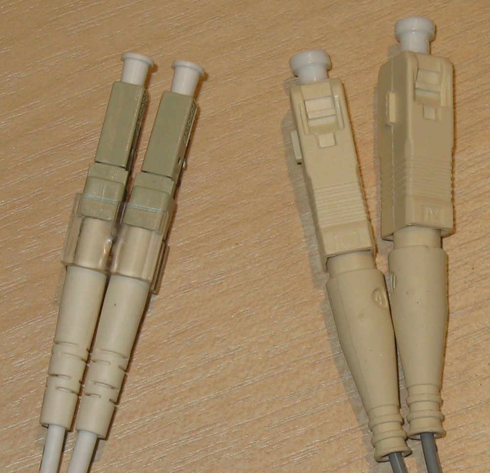
*Fig. — I connettori LC e SC sono i due standard dominanti per la fibra ottica: LC per l'alta densità nei rack, SC per i cablaggi metropolitani.*

> [!tip] La direzionalità della fibra ottica
>
> A differenza dei cavi in rame, un singolo filo di fibra ottica trasporta la luce in una sola direzione. Per avere una comunicazione full-duplex è sempre necessaria una **coppia di cavi**: uno per trasmettere (TX) e uno per ricevere (RX). I connettori LC vengono spesso accoppiati tramite una clip meccanica in plastica che può essere sfilata per invertire i due connettori quando è necessario far coincidere correttamente i canali TX e RX sui due estremi della connessione.

---

## Cavi in Rame e Standard Ethernet

### Il Dominio del Rame

Sebbene esistano reti dedicate all'HPC come **InfiniBand**, lo standard Ethernet su cavi in rame ricopre ancora un ruolo dominante, con oltre 70 miliardi di metri di cavo installati nel mondo. I moderni cavi Ethernet utilizzano il connettore **RJ45**, che circa trent'anni fa ha sostituito l'antico RJ11 telefonico. All'interno della guaina si trovano 8 fili intrecciati a formare 4 coppie: le reti a 10 e 100 Megabit ne utilizzavano solo due, rendendo storicamente semplice il passaggio a 1 Gigabit — fu sufficiente abilitare le due coppie rimaste inutilizzate all'interno dello stesso cavo.

L'assemblaggio manuale avviene inserendo i fili secondo uno schema cromatico preciso all'interno del plug RJ45 e utilizzando una pressa crimpatrice, che forza piccoli contatti metallici "a lama" a tagliare la guaina dei singoli fili, stabilendo la connessione elettrica.

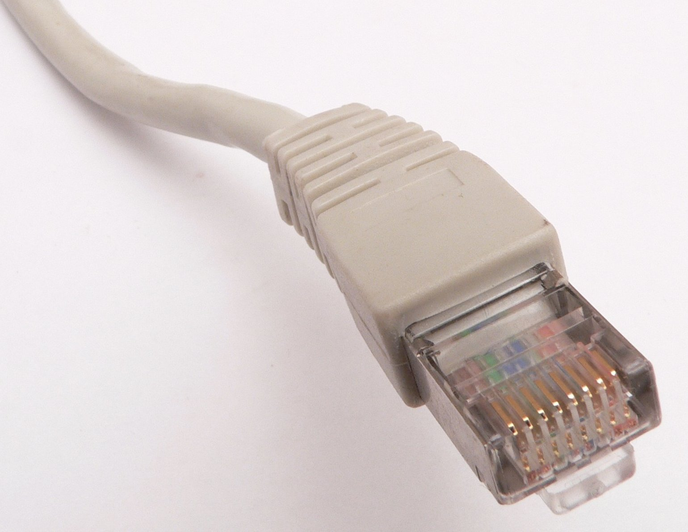
*Fig. — Il connettore RJ45 con i suoi 8 pin; le 4 coppie di fili intrecciati sono visibili all'interno della guaina.*

### La Sfida dei 10 Gigabit

Il superamento del muro di 1 Gigabit su rame si è rivelato una titanica sfida ingegneristica, legata alle interferenze elettromagnetiche e alle alte frequenze necessarie. La tabella seguente riassume l'evoluzione degli standard:

| **Categoria** | **Capacità Max Pratica** | **Frequenza Max** | **Note** |
|---|---|---|---|
| **Cat 5 / 5e** | 1 Gbps | 100 MHz | Standard storico e diffusissimo |
| **Cat 6** | 1 Gbps (10G a corto raggio) | 250 MHz | Il più installato; i 10G su Cat 6 sono sconsigliati |
| **Cat 6A** | 2.5 / 5 / 10 Gbps | 500 MHz | Massima evoluzione pratica; raccomandato per i 10G in rame |
| **Cat 7 / Cat 8** | Oltre 10 Gbps | Oltre 600 MHz | Raramente adottati; cavi estremamente spessi e rigidi |

> [!warning] Il costo della ridondanza e i limiti del Cat 7/8
>
> Cat 7 e Cat 8 sono teoricamente disponibili ma praticamente inutilizzabili: la rigidità dei cavi li rende simili a "tubi di ferro", rendendo il cablaggio fisicamente impraticabile in ambienti affollati. Sul piano economico, due cavi in rame ad alte prestazioni — necessari per garantire la ridondanza vitale di un server ed eliminare il *single point of failure* — possono pesare sul budget fino a 300 dollari: un costo non trascurabile moltiplicato per centinaia di server.

---

## Gestione del Cablaggio

Gestire razionalmente il cablaggio (*cable management*) non è una questione estetica: è una necessità funzionale critica con impatto diretto sull'efficienza energetica. La tendenza ad aggregare la larghezza di banda ha portato ad avere fino a 4 cavi per server. In un armadio contenente 30 server, ciò si traduce in oltre 120 cavi. Se si aggiunge la prassi comune di ordinare cavi di lunghezze standard — per esempio 2 metri — per uniformare il magazzino, il risultato è un significativo accumulo di cavo in eccesso.

Se i cavi non vengono instradati in percorsi ordinati, formano una barriera fisica sul retro del rack che ostruisce le bocchette di estrazione dell'aria calda prodotta dai server. Il sistema di raffreddamento rileva l'innalzamento anomalo delle temperature e costringe le ventole ad accelerare drasticamente, con conseguente spreco energetico e usura prematura dell'hardware. Il cablaggio disordinato, in altre parole, degrada le prestazioni termiche dell'intero rack.

> [!abstract] Sintesi della lezione
>
> Il data center moderno è un sistema strettamente integrato in cui le scelte di cablaggio, raffreddamento e distribuzione elettrica si condizionano a vicenda. La transizione dal raffreddamento ad aria al liquid cooling segue la crescita della densità di potenza per rack. La fibra ottica è il medium di trasmissione dominante per distanze superiori ai pochi metri, con la scelta tra monomodale e multimodale che dipende dalla distanza e dal budget. Il rame rimane rilevante per i collegamenti finali, ma Cat 6A è oggi il limite pratico oltre il quale la fibra diventa obbligata. Il cable management, infine, non è un dettaglio: un cablaggio disordinato degrada le prestazioni termiche dell'intero rack.

```{=latex}
\newpage
```

# Lezione 6 — Fabric di un Datacenter

## Il Cablaggio Fisico nel Data Center

### Perché il cablaggio è una scelta progettuale

Quando si stende un cavo in un data center, non si esegue un'operazione meccanica neutra: si sta prendendo una decisione architetturale. Il cablaggio fisico determina la geometria della comunicazione tra i rack, e quella geometria diventa poi un limite duro per le performance delle applicazioni che girano sopra.

I motivi per cui il cablaggio è rilevante sono essenzialmente tre.

**Perdita di segnale.** Ogni connettore introdotto causa una piccola attenuazione. All'interno del data center, dove i percorsi sono brevi, questa perdita è trascurabile e non rappresenta un vincolo pratico.

**Numero di hop.** Ogni switch attraversato da un pacchetto introduce latenza. Un singolo switch Ethernet moderno introduce circa **600 nanosecondi** di latenza. Sembra poco, ma ci sono workload — condivisione di memoria tra GPU, accesso a modelli AI distribuiti — in cui anche pochi microsecondidi aggiunta rendono il sistema inutilizzabile.

**Flessibilità topologica.** La geometria del cablaggio determina quanti percorsi fisici esistono tra due rack, quanto traffico est-ovest può scorrere, e quanto è difficile riconfigurare la rete in caso di aggiunta o rimozione di macchine.

> [!tip] La latenza end-to-end: il gap nascosto
> 
> Un singolo switch Ethernet introduce ~600 ns, ma appena si sale al livello TCP/IP la latenza può arrivare a **70 microsecondi**. Per contesto: un accesso DRAM locale è nell'ordine dei 60–100 ns. Attraversare anche un solo hop TCP introduce una penalità equivalente a centinaia di accessi in memoria. Per workload come i modelli LLM distribuiti su GPU — in lezione è citato GLM-4 con 750 miliardi di parametri in architettura Mixture of Experts — questa latenza diventa il collo di bottiglia dell'intero sistema.

### Patch panel e zone funzionali

Dato che non è pratico — né riconfigurabile — tirare cavi diretti da ogni rack a ogni altro rack, la soluzione standard è il **patch panel**: un pannello passivo che funge da punto di smistamento intermedio, permettendo di "teletrasportare" logicamente una connessione da una zona del data center all'altra semplicemente spostando un cordone, senza rifare il cablaggio strutturale.

Il cablaggio strutturale presuppone una divisione in **zone funzionali** del data center. Poiché collegare tutto con tutto è fisicamente impraticabile (un grafo completo su N rack richiederebbe $\binom{N}{2}$ cavi), si assegnano ruoli alle aree: zona telco per i link verso l'esterno, zone compute, zone storage, e così via.

> [!warning] Conseguenze di un cablaggio sbagliato
> 
> Se la geometria del cablaggio non rispecchia il reale pattern di comunicazione dei workload, i pacchetti saranno costretti a percorsi subottimali: più hop, più latenza, meno banda. Questo si traduce in limitazioni di performance visibili sulle VM, anche su cloud pubblici come AWS o Azure — sono il risultato diretto delle scelte fisiche fatte da Microsoft o Amazon al momento dell'installazione del data center.

### Organizzazione fisica dei rack: pod e corridoi

In un data center, i rack vengono tipicamente organizzati in **pod di distribuzione**: insiemi di rack fisicamente adiacenti, disposti su due file che si affacciano su un corridoio freddo confinato per il raffreddamento. La prossimità fisica rende accettabile, in alcuni casi, collegare rack adiacenti direttamente senza patch panel, eliminando le pareti laterali dei rack e facendo passare i cavi internamente da un rack al successivo.

La distinzione fondamentale rimane tra traffico **est-ovest** (server-a-server all'interno del data center) e traffico **nord-sud** (server verso l'esterno): hanno pattern e requisiti di latenza radicalmente diversi, e ogni scelta di cablaggio li impatta in modo diverso.

---

## I Transceiver: dal Cavo allo Switch

### Il problema dei connettori ottici

Quando le velocità di rete hanno superato la soglia in cui RJ45 e doppino rame sono sufficienti, si è passati alla fibra ottica. Ma qui emerge un problema economico: la fibra monomodale OS2 consente distanze fino a **40 km**, ma all'interno di un data center non si superano i 300 metri. Acquistare laser di potenza industriale pensati per decine di chilometri è uno spreco enorme.

La soluzione è stata separare il trasmettitore ottico dallo switch attraverso un **transceiver modulare**: un piccolo modulo attivo che si inserisce in uno slot dedicato dello switch, converte il segnale elettrico in ottico e viceversa, e determina il tipo di fibra, la lunghezza d'onda e la distanza massima supportata.

> [!definition] Transceiver (modulo SFP/QSFP)
> 
> Modulo attivo hot-pluggable che si inserisce in uno slot del backplane dello switch. Converte segnali elettrici in ottici e viceversa. Il firmware del modulo espone allo switch le proprie caratteristiche (velocità, tipo di fibra, range). Questo consente il **mix and match**: slot 1 con fibra multimodale corto raggio, slot 3 con monomodale lungo raggio, slot N con rame per debug — tutto sullo stesso switch.

### La famiglia SFP: evoluzione degli standard

L'ecosistema dei transceiver si organizza intorno a famiglie standardizzate. Conoscere questi nomi è competenza operativa fondamentale in un data center.

**SFP28** è lo standard dominante per le porte server-facing nei leaf switch. Supporta **25 Gbps** per lane e viene declinato in varianti per distanza: _SR (Short Range)_ a 850 nm su fibra multimodale per distanze fino a ~100 m, _LR (Long Range)_ a 1310 nm su fibra monomodale per distanze fino a ~10 km, e _ER (Extended Range)_ per portate ancora maggiori.

Quando l'SFP28 ha raggiunto il suo limite fisico (la densità di segnale non scalava oltre 25 Gbps con quel form factor), si è passati a **QSFP** (_Quad SFP_): stesso concetto ma con **4 lane interne**. Le varianti della famiglia QSFP sono:

|Standard|Banda totale|Struttura interna|Note|
|---|---|---|---|
|QSFP+|40 Gbps|4×10G NRZ|Prima generazione|
|QSFP28|100 Gbps|4×25G NRZ|Standard attuale per uplink leaf↔spine|
|QSFP56|200 Gbps|4×50G PAM4|Uplink spine-to-spine|
|QSFP-DD|fino a 800 Gbps|8×100G PAM4|Ultima generazione, double density|

> [!note] Il salto a PAM4 e la logica dell'incremento
> 
> Il passaggio da QSFP28 a QSFP56 non aumenta il numero di lane (rimangono 4), ma cambia la modulazione da NRZ a PAM4: invece di codificare 1 bit per simbolo, PAM4 codifica 2 bit per simbolo, raddoppiando la banda a parità di frequenza. Il QSFP-DD raddoppia ulteriormente le lane da 4 a 8, mantenendo le stesse dimensioni fisiche esterne ma con una scheda di contatti più profonda.

### Codici colore e decodifica del modulo

I transceiver usano **codici colore** convenzionali: il blu identifica tipicamente la fibra monomodale, il nero o grigio la multimodale. Sul corpo del modulo è inciso il codice completo: tipo (es. SFP28), velocità (25G), lunghezza d'onda (850 nm → multimodale, 1310 nm → monomodale), range (SR/LR/ER).

**Perché la multimodale domina il data center?** Perché le distanze interne raramente superano i 100–300 metri, e la fibra multimodale è significativamente più economica sia nei cavi che nei laser. In lezione è stato fatto un confronto pratico: un modulo SFP28 SR (multimodale) costa circa €45; ne servono due (uno per estremo) più il cavo ottico (~€10), per un totale di ~€100. Un cavo DAC (_Direct Attach Cable_) in rame ha un costo simile, ma la soluzione a transceiver offre modularità: si sostituiscono i moduli per aggiornare la velocità senza cambiare il cavo.

> [!tip] Evoluzione della banda per transceiver nel tempo
> 
> 2005: 1 Gbps → 2010: 10 Gbps → 2015: 25–40 Gbps → 2020: 100–200 Gbps → 2024: 400–800 Gbps. In vent'anni, un fattore 800×. Ogni generazione ha richiesto nuovi form factor e nuovi laser, ma il principio di modularità degli slot è rimasto invariato.

---

## Gli Switch: dai Chassis Modulari al Form Factor Fisso

### L'era dei chassis

Fino ai primi anni 2000, lo switch tipico di un data center era un **chassis modulare**: un armadio di grandi dimensioni nel quale si inserivano _line card_ — schede con più porte Ethernet — e un modulo **RPM** (_Routing Processing Module_) responsabile del coordinamento attraverso un _backplane_ condiviso.

Questi switch erano costosissimi, quindi tipicamente un data center ne aveva **due** per ridondanza, e tutti i cavi del data center confluivano verso questi due switch centrali. Da questa architettura fisica nacque naturalmente una topologia a stella: un unico punto di smistamento centrale attorno al quale tutto era organizzato.

> [!note] Eredità nella nomenclatura delle porte
> 
> La notazione `X/Y` delle porte Ethernet (es. `0/1` = _line card 0, porta 1_) è una diretta eredità della struttura bidimensionale del chassis. Sugli switch moderni a form factor fisso non esiste più la line card, ma la convenzione è rimasta in tutto il software di gestione di rete.

### La crisi del backplane e la transizione

Il modello a chassis aveva senso economico finché la banda cresceva lentamente. Ma quando la velocità Ethernet ha cominciato a raddoppiare ogni pochi anni — da 1G a 10G a 25G — il **backplane** del chassis non riusciva più a stare al passo. Progettare un backplane capace di supportare la velocità attuale significava che tra due anni sarebbe già obsoleto, e il chassis costoso acquistato aveva già schede mezze vuote.

La risposta è stata la transizione agli **switch a form factor fisso**: switch compatti, tipicamente 1U, con un numero fisso di porte, montabili direttamente top-of-rack. Questi switch sono più economici, più facili da sostituire, e avvicinano il punto di switching ai server riducendo la lunghezza dei cavi e il numero di hop.

---

## Topologia di Rete: da 3-Tier a Spine-and-Leaf

### Architettura 3-tier

Il concentrare lo switching in pochi chassis centrali produsse la topologia **3-tier**: _access layer_ vicino ai server, _distribution layer_ di aggregazione intermedia, _core layer_ con i grandi chassis centrali. Tutto il traffico doveva passare per il core. Questo era accettabile finché il traffico dominante era nord-sud.

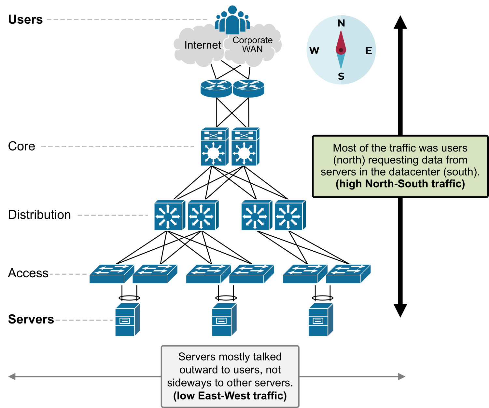 _Fig. 1 — In architettura 3-tier il traffico tipico è nord-sud: i client accedono ai server dall'esterno. Core e distribution switch gestiscono questi flussi in modo efficiente._

Con l'avvento dei microservizi, del cloud e dell'AI, il traffico est-ovest è diventato dominante: ogni richiesta applicativa coinvolge decine di servizi che si parlano tra loro all'interno del data center.

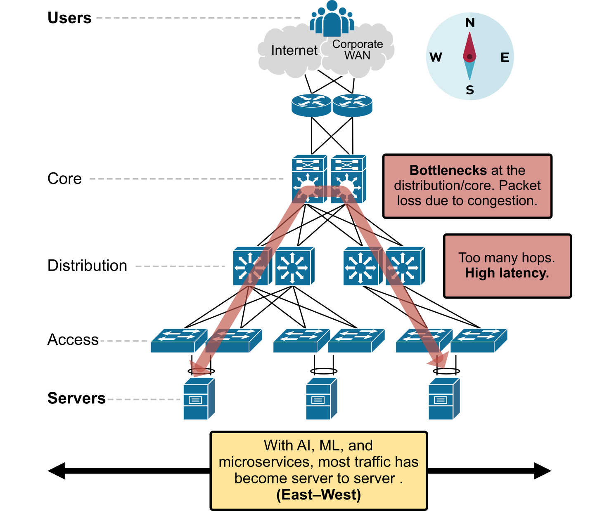 _Fig. 2 — Con traffico east-west dominante, ogni comunicazione server-a-server deve risalire access → distribution → core → distribution → access: latenza variabile, colli di bottiglia sugli uplink._

### STP: soluzione necessaria ma costosa

Per garantire ridondanza occorrono percorsi fisici multipli, ma più percorsi creano loop in Ethernet.

> [!warning] Loop e broadcast storm
> 
> In Ethernet, un loop causa un **broadcast storm**: un frame broadcast rimbalza all'infinito amplificandosi, satura tutta la banda e rende la rete inutilizzabile in pochi secondi. È un problema concreto che si presenta ogni volta che un cavo crea accidentalmente un ciclo nella topologia.

> [!definition] Spanning Tree Protocol (STP / RSTP)
> 
> Protocollo di livello 2 (IEEE 802.1D / 802.1W) che costruisce dinamicamente un albero di copertura della rete, **disabilitando i link che formerebbero cicli**. In caso di guasto di un link attivo, ricalcola l'albero e riabilita un link precedentemente disabilitato. STP converge in decine di secondi; RSTP in qualche secondo.

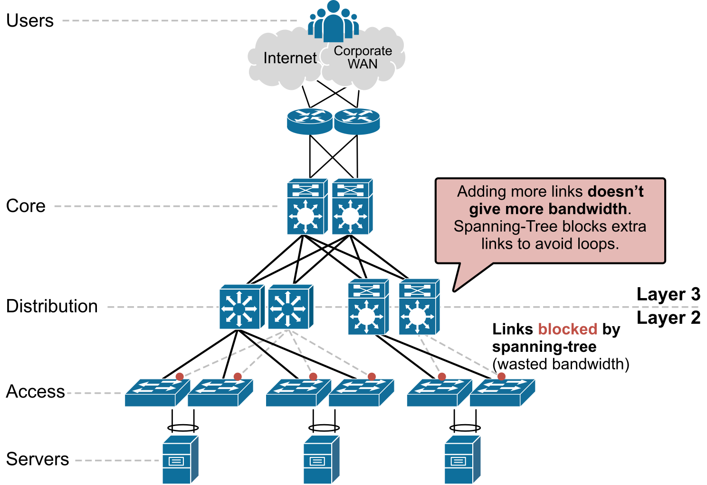 _Fig. 3 — STP in azione: i link ridondanti (tratteggiati/rossi) vengono disabilitati per eliminare i loop. Il cavo fisico è presente e pagato, ma non trasporta traffico._

Il costo di STP è duplice. Primo: **spreco di risorse** — il link ridondante è fisicamente presente e pagato (cavo, transceiver, porta dello switch), ma non trasporta traffico. Secondo: **lentezza di convergenza** — STP originale impiega fino a **50 secondi** per convergere dopo un guasto, RSTP qualche secondo. Un'interruzione di 50 secondi è accettabile per traffico web a basso carico; è un disastro se il fabric collega VM alle proprie unità di storage virtuali (la VM perderebbe il disco per tutta la durata).

### Spine-and-Leaf: la topologia dominante oggi

> [!definition] Spine-and-Leaf
> 
> Topologia di rete a due livelli in cui i **leaf switch** raccolgono i server (tipicamente top-of-rack, uno per rack) e i **spine switch** interconnettono i leaf. Ogni leaf è collegato a ogni spine, producendo un grafo bipartito regolare. Il cammino tra qualsiasi coppia di server è costante: leaf → spine → leaf, ovvero **2 hop fisici, 1 hop logico**.

I leaf switch non si parlano mai direttamente: tutto il traffico est-ovest passa obbligatoriamente per uno spine. Questo garantisce latenza **uniforme e predicibile** indipendentemente da dove si trovano i due server.

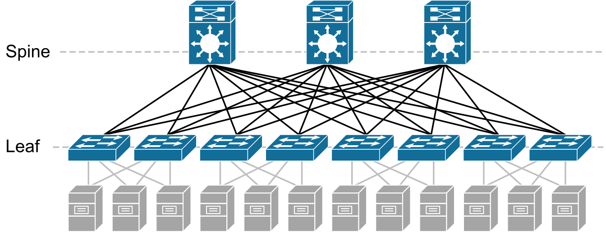 _Fig. 4 — Spine-and-leaf: ogni leaf si connette a tutti gli spine. Qualunque comunicazione server-a-server attraversa esattamente uno spine, con latenza costante. Aggiungere capacità significa aggiungere leaf (scale-out orizzontale)._

### Ridondanza senza STP: link aggregation active-active

Con spine-and-leaf la ridondanza si ottiene tramite **link aggregation**: due spine switch fisicamente distinti vengono fatti operare come un singolo switch logico (tramite protocolli come vPC di Cisco, MLAG di Arista, o il protocollo standard LACP). Ogni leaf vede due cavi verso lo spine ma li tratta come un'unica interfaccia logica ad alta banda. Lo schema è **active-active**: entrambi i link trasportano traffico contemporaneamente.

> [!example] Aggregazione di banda con spine pair
> 
> Se ogni link leaf↔spine è da 25 Gbps, aggregando due spine si hanno 50 Gbps di banda disponibile tra un leaf e lo strato spine. Un singolo stream TCP rimane limitato a 25 Gbps (non si può dividere un flusso su due link), ma due stream paralleli possono usare link diversi, sommando a 50 Gbps totali. Se uno spine cade, la banda degrada da 50 a 25 Gbps ma la connettività non si interrompe — nessun STP da aspettare.

### Confronto 3-tier vs Spine-and-Leaf

|Dimensione|3-tier / Chassis|Spine-and-Leaf|
|---|---|---|
|Latenza|Variabile (dipende dal path)|Fissa e bassa (1 hop logico)|
|Banda|Limitata dalla gerarchia|Aggregata e scalabile|
|Link ridondanti|Disabilitati da STP (sprecati)|Attivi — active-active|
|Traffico est-ovest|Subottimale|Nativo e ottimizzato|
|Convergenza dopo guasto|Secondi (RSTP)|Istantanea (degradazione banda)|
|Scalabilità|Verticale (upgrade chassis)|Orizzontale (aggiungere leaf)|

> [!abstract] Perché spine-and-leaf ha vinto
> 
> Tre ragioni sintetizzano il dominio di spine-and-leaf nei data center moderni. Prima: **latenza a 1 hop** — qualunque server raggiunge qualunque altro con latenza predicibile. Seconda: **banda aggregata** — nessun costo per link inutilizzati, tutto l'hardware lavora. Terza: **east-west friendly** — il traffico interno al data center, fondamentale per microservizi, storage distribuito e GPU cluster AI, non deve più risalire gerarchie di switch lente.

---

## Data Center vs Campus Network

Spine-and-leaf è pensata per il traffico **est-ovest** dominante nei data center. Nelle **reti campus** — università, uffici, reti Wi-Fi — il traffico è prevalentemente **nord-sud**: gli utenti accedono a risorse esterne. Per questo le reti campus continuano a usare architetture gerarchiche tipo 3-tier con STP: la convergenza lenta è accettabile, e lo spreco dei link ridondanti non è critico.

> [!note] La rete Wi-Fi del campus
> 
> La rete wireless universitaria è un'architettura north-south, non spine-leaf. Questo spiega perché in Wi-Fi spesso non si riesce a pingare altri dispositivi collegati alla stessa access point: il traffico non è ottimizzato per la comunicazione laterale.

---

## Conclusioni e Punti Chiave

Questa lezione ha tracciato il percorso dal cavo fisico all'architettura di rete, mostrando come ogni scelta a basso livello si rifletta in caratteristiche osservabili ad alto livello. Capire queste scelte fisiche è essenziale per comprendere perché una VM su AWS ha certi limiti di banda, o perché un'applicazione distribuita su rack diversi si comporta diversamente da una co-locata sullo stesso rack.

Il corso proseguirà con le infrastrutture **convergenti e iperconvergenti** — tecnologie che dipendono direttamente dalla capacità del fabric spine-and-leaf di gestire traffico est-ovest con latenza controllata e banda prevedibile.

> - In quale contesto si usa ancora un'architettura 3-tier? Perché è accettabile lì ma non in un data center?

```{=latex}
\newpage
```

# Lezione 7 — Switching

## Il Contesto: Perché il Network è Cambiato

Per capire l'architettura attuale degli switch è necessario capire _perché_ è cambiata rispetto al passato. Il docente traccia una periodizzazione sintetica ma illuminante dell'evoluzione dei workload in ambito IT.

Per quasi tre decenni, il panorama applicativo era diviso in due categorie: l'**HPC** (High Performance Computing), dove il calcolo superava la capacità del singolo nodo e si ricorreva a cluster, e le **applicazioni enterprise** — web server, database, middleware — dove la capacità di calcolo disponibile superava di gran lunga quanto necessario e si preferiva concentrare più servizi su un singolo nodo denso di core. In entrambi i casi, la rete era un fattore secondario: le applicazioni enterprise vivevano prevalentemente di traffico Nord-Sud (client verso server), mentre in HPC i nodi comunicavano su interconnessioni specializzate.

Tutto cambia intorno al **2013**, con l'esplosione del paradigma Big Data (Hadoop e simili). L'adozione massiva di SSD, che abbassano la latenza di accesso allo storage da millisecondi a microsecondi, rende conveniente muovere grandi quantità di dati all'interno del data center. Nasce così il cosiddetto traffico **East-West**: comunicazione da server a server all'interno dello stesso datacenter. Questo tipo di traffico esige reti a bassa latenza e alta banda tra i nodi, requisiti molto diversi rispetto al traffico tradizionale.

Il colpo finale al vecchio ordine arriva con l'**AI generativa**. Per la prima volta emerge un workload che richiede simultaneamente: molto calcolo, molta memoria veloce, molte GPU e interconnessioni ad altissima banda. Il bilanciamento del sistema si rompe, e tutti i componenti — CPU, memoria, storage, rete — devono essere ripensati.

> [!tip] Il principio del bilanciamento
> 
> Un sistema è efficiente solo quando tutti i suoi componenti sono dimensionati in modo coerente. Avere una rete da 200 Gbps con CPU che processano al massimo 80 Gbps è uno spreco. La progettazione del data center è sempre un esercizio di bilanciamento.

### La Fine dei Chassis e il Fixed Form Factor

Sul lato networking, un ulteriore cambiatore è stata la velocità di evoluzione della tecnologia. In passato era conveniente investire in chassis modulari costosi (uno switch chassis con schede sostituibili), poiché la vita utile dell'investimento era lunga. Ma quando la capacità dei port ASIC raddoppia ogni pochi anni, il chassis diventava obsoleto prima delle sue schede. Il costo di un chassis a lunga vita non si giustificava più.

La risposta è stata il **fixed form factor switch**: 1 o 2 unità rack, non modulare, ma aggregabile via software in topologie spine-leaf. Questo approccio rende il traffico East-West più prevedibile — sia in latenza che in banda — e consente di aggiornare la rete sostituendo interi switch (commodity hardware) invece di investire in chassis proprietari.

---

## Architettura Interna dello Switch

Uno switch moderno da data center non è un appliance speciale: è fondamentalmente un **computer general purpose** a cui è stato affiancato hardware specializzato per il forwarding dei pacchetti. Il professore insiste su questo punto perché rompe la percezione comune dello switch come "scatola nera" di rete.

> [!definition] Control Plane e Data Plane
> 
> Lo **switch di rete** — come qualsiasi dispositivo di comunicazione complesso — si divide in due piani funzionali distinti:
> 
> - Il **Control Plane** (piano di controllo) è responsabile della _configurazione_, della _gestione_ e del _monitoraggio_. Qui risiedono la logica delle policy, i protocolli di routing, i contatori delle porte, il sistema operativo di rete.
> - Il **Data Plane** (piano dati) è responsabile dell'_esecuzione_: riceve i pacchetti sulle porte ingress, determina la porta egress consultando le tabelle popolate dal control plane, e li instrada alla velocità del silicio.

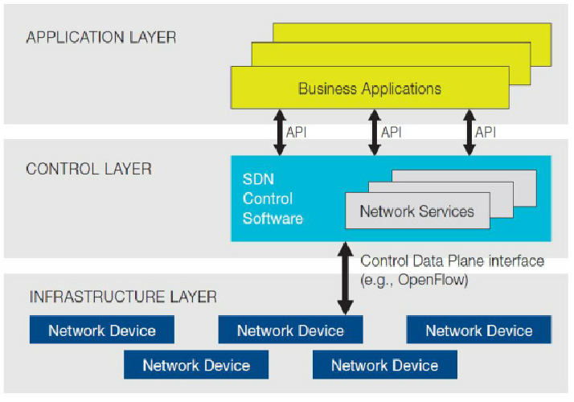
*Fig. — La separazione funzionale tra i piani di rete secondo l'Open Networking Foundation: application layer (policy e gestione), control plane (logica di routing) e infrastructure layer (forwarding a linerate nel silicio). Nello switch da data center moderno il management coincide tipicamente con il control plane.*

### Il Data Plane: Silicon Commodity

Il data plane è dove si esegue il vero lavoro di forwarding, e oggi è dominato da **ASIC** (Application-Specific Integrated Circuit) forniti da un numero ristretto di vendor. Broadcom è il nome più citato in questo settore: chip come il **Jericho** sono progettati per memorizzare la tabella di routing completa dell'Internet pubblico (e il doppio, stando alle specifiche) e per forwarding a linerate di terabit per secondo. Chiunque voglia costruire uno switch compra il catalogo Broadcom, sceglie il chip in base alle prestazioni desiderate e progetta la scheda attorno ad esso.

Questo ha una conseguenza fondamentale: **il data plane è diventato commodity**. La differenziazione tra vendor non sta più nel silicio ma nel software del control plane e nell'ecosistema di gestione.

> [!note] Non-blocking switching
> 
> Uno switch si dice **non-blocking** quando può commutare simultaneamente tutto il traffico su tutte le sue porte senza che nessun flusso debba aspettare. Con 48 porte da 25 Gbps + 8 uplink da 100 Gbps, il backplane deve reggere: $(48 \times 25 + 8 \times 100) \times 2 = 3.6 \text{ Tbps}$ Il fattore $\times 2$ è perché ogni porta lavora in full-duplex (RX + TX). Gli switch da data center moderni sono progettati per essere non-blocking, e il costo di questa capacità si riflette nell'alimentazione: sono macchine da 700 W, contro i 200 W di una volta.

### Il Control Plane: Linux dentro lo Switch

Al di sopra del data plane c'è il control plane, che è — sorprendentemente per chi non ci ha mai lavorato — un **Linux** che gira su una CPU Intel Celeron o equivalente. Ci sono RAM, storage flash, e una connessione PCIe verso l'ASIC del data plane. Il bus PCIe in uno switch non ha la stessa larghezza di banda di quello di un server: la sua funzione è inviare comandi di configurazione all'ASIC (aggiornare le tabelle di forwarding, cambiare le policy delle porte), non trasportare i dati dei pacchetti.

> [!warning] PCIe tra control e data plane: non è una pipe di dati
> 
> Il bus PCIe che collega control plane e data plane in uno switch è dimensionato per la _configurazione_, non per il _forwarding_. In linea di principio si potrebbero far processare i pacchetti dalla CPU del control plane, ma la banda disponibile non è sufficiente per reggere il volume di traffico che l'ASIC gestisce. Questo limita il tipo di funzioni implementabili nel software rispetto all'hardware.

---

## SONiC e l'Open Networking

Il fatto che il silicio sia commodity ha aperto la porta alla disaggregazione hardware/software, un trend che in ambito server è avvenuto decenni fa (BIOS + OS generico) e che nella rete stava tardando per ragioni miste: tecniche e commerciali.

**ONIE** (Open Network Install Environment) è il bootloader standard per switch che supporta questa disaggregazione. Esattamente come GRUB carica un OS su un PC, ONIE carica un'immagine di Network Operating System sullo switch. Chi compra uno switch ONIE-compatibile può scegliere quale NOS installare, come si fa con un server.

**SONiC** (Software for Open Networking in the Cloud) è il NOS open source sviluppato originariamente da Microsoft per i propri data center Azure e poi donato alla comunità tramite la Linux Foundation. È costruito su Linux, basato su container Docker per la modularità, e utilizza Redis come database in-memory per la comunicazione tra i componenti. Oggi è co-mantenuto da Microsoft, Arista, Dell e molti altri vendor.

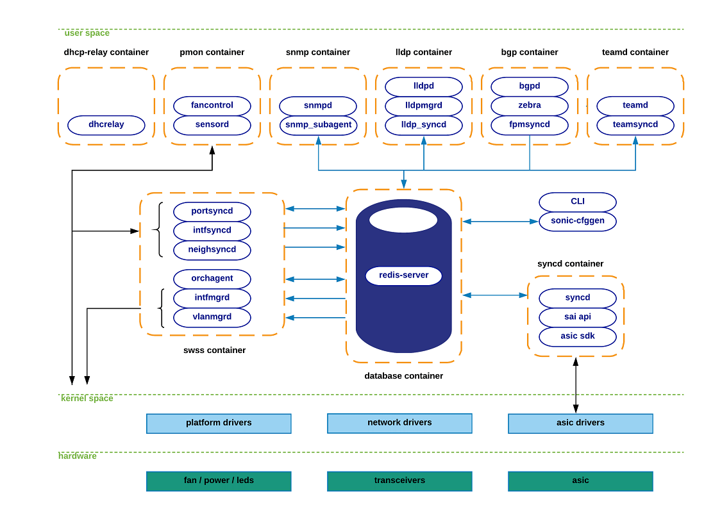 _Fonte: Azure/SONiC (GitHub) — Architettura di SONiC: ogni funzione di rete (BGP, LLDP, SNMP, DHCP relay) gira in un container Docker separato e comunica tramite Redis DB._

> [!note] Due immagini OS sullo switch
> 
> Gli switch moderni mantengono due immagini del sistema operativo sul disco: quella _corrente_ in esecuzione e una di _riserva_. Quando si aggiorna il NOS, si scarica la nuova immagine nella slot di riserva, si riavvia il dispositivo, e se qualcosa va storto si torna all'immagine precedente con un comando. Questo pattern di rollback è fondamentale per la resilienza della rete.

Il docente ricorda di aver contribuito personalmente a **Dell Networking OS 10** nel 2014, quando fu introdotta la possibilità di aprire una bash shell direttamente sul control plane. È arrivato a compilare software direttamente sulla CPU dello switch usando Visual Studio Code — il che dà un'idea concreta di cosa significhi "il control plane è un PC".

Sul mercato esiste un ecosistema di NOS: oltre a SONiC (open source), ci sono EOS di Arista, DNOS di Dell, e NOS proprietari di altri vendor. Alcuni vendor offrono SONiC con un layer proprietario opzionale, venduto come licenza aggiuntiva per chi vuole supporto professionale.

---

## La CLI dello Switch: un Linguaggio Modale

La configurazione di uno switch avviene tramite una **CLI modale** — un'interfaccia a riga di comando in cui i comandi disponibili dipendono dal _contesto_ (modalità) corrente. Questo design nasce da esigenze pratiche: i primi switch si configuravano collegando fisicamente un laptop al serial port nella sala server, in ambienti rumorosi, e quindi la CLI doveva essere il più efficiente possibile da digitare. La convenzione nata in casa Cisco è diventata de facto standard, imitata da quasi tutti i vendor successivi.

Le modalità principali sono tre, in ordine gerarchico:

1. **User EXEC** (prompt `>`): sola lettura. Si può ispezionare ma non modificare.
2. **Privileged EXEC** (prompt `#`): si accede con il comando `enable`. Permette operazioni di diagnostica avanzate.
3. **Global Configuration** (prompt `(config)#`): si accede con `configure` o `conf`. Permette la modifica della configurazione.

Da Global Configuration si scende in contesti specifici digitando un identificatore (es. `interface Ethernet 1/1/3` porta nel contesto di quella porta), e si torna al padre con `exit`.

> [!example] Sessione CLI tipica su uno switch
> 
> ```
> Switch> enable
> Switch# configure
> Switch(config)# interface Ethernet 1/1/3
> Switch(config-if-Et1/1/3)# no shutdown
> Switch(config-if-Et1/1/3)# switchport
> Switch(config-if-Et1/1/3)# exit
> Switch(config)# do show interface status
> Switch(config)# do write
> ```
> 
> Il prefisso `do` permette di eseguire comandi del contesto padre senza uscirne. La CLI accetta anche abbreviazioni non ambigue: `conf` per `configure`, `sh run` per `show running-configuration`.

### Running Configuration e Startup Configuration

Uno degli aspetti più peculiari della gestione degli switch — e che sorprende chi arriva dal mondo server — è la separazione tra **running configuration** (configurazione in memoria, attiva) e **startup configuration** (configurazione salvata su disco, caricata al boot).

Ogni modifica sulla CLI agisce _solo sulla RAM_. Se si riavvia lo switch senza aver scritto la configurazione su disco, tutte le modifiche sono perse. Il comando per persistere è `write` (o `copy running-config startup-config`). Questa separazione è voluta: garantisce che lo switch torni sempre in uno stato deterministico al riavvio. Non è possibile che un'installazione incrementale di software (come accade su un OS desktop) lasci lo switch in uno stato inconsistente: si riavvia e si ottiene esattamente la configurazione salvata.

> [!warning] Perdita di configurazione al reboot
> 
> Se si modificano porte, VLAN o routing su uno switch e non si esegue `write`, al successivo riavvio (pianificato o causato da un guasto) _tutte le modifiche saranno perse_. In produzione è prassi comune emettere `write` (o `copy run start`) dopo ogni modifica verificata.

### Naming delle Porte

I nomi delle porte negli switch moderni seguono uno schema **a tre livelli**:

```
<stack_unit>/<slot>/<port>
```

- Il primo numero identifica il **membro dello stack**: quando si aggregano due o più switch fisici in un singolo switch logico (stacking), ogni unità ha il suo numero.
- Il secondo numero identifica lo **slot** o il modulo nella chassi (per switch modulari) o è sempre 1 per switch fixed.
- Il terzo numero è il **numero di porta fisica**.

Esiste anche un quarto livello opzionale per i breakout: una porta QSFP (es. 100 Gbps) può essere spezzata in 4 porte SFP28 (25 Gbps ciascuna), in tal caso si aggiunge un suffisso `/1`, `/2`, `/3`, `/4`. Il nome del tipo di porta include la velocità per ragioni storiche (es. `Ethernet` per 1G, `TenGigabitEthernet` per 10G, semplificato in CLI con abbreviazioni).

---

## VLAN: Broadcast Domain Virtuali

Uno dei concetti più importanti della lezione riguarda le **VLAN** (Virtual LAN). Per capire cosa sia una VLAN occorre prima aver chiaro cosa sia una LAN.

> [!definition] LAN come Broadcast Domain
> 
> Una **LAN** (Local Area Network) è un **dominio di broadcast**: tutti i dispositivi connessi ricevono i pacchetti broadcast inviati da qualsiasi membro. Il meccanismo di accesso al mezzo (CSMA/CD) implica che tutti i nodi "ascoltino" il canale. Questo è ciò che definisce una LAN a livello fisico e di Layer 2.

Una **VLAN** estende questo concetto in modo virtuale: consente di creare **più domini di broadcast indipendenti** sulla stessa infrastruttura fisica. Invece di avere uno switch per segmento di rete, un unico switch può servire N segmenti logicamente separati grazie al VLAN tagging.

### Il Tag IEEE 802.1Q

L'implementazione delle VLAN si basa sullo standard **IEEE 802.1Q**, che introduce un campo aggiuntivo di **12 bit** nell'header del frame Ethernet per trasportare il **VLAN ID** (VID). Con 12 bit si possono rappresentare $2^{12} = 4096$ valori, di cui 4094 utilizzabili (il VID 0 è riservato e il VID 1 è il default).

$$ \text{VLAN ID} \in [1, 4094], \quad \text{bits: } 12 $$

> [!definition] Tagged vs Untagged Port
> 
> - Una porta **untagged** (o _access port_) si connette a dispositivi end-host che non conoscono le VLAN. Lo switch aggiunge il tag quando il frame entra e lo rimuove quando esce. La VLAN assegnata è configurata per porta.
> - Una porta **tagged** (o _trunk port_) si connette a un altro switch o a un host VLAN-aware. I frame transitano con il tag 802.1Q intatto. Una trunk port può trasportare frame di VLAN multiple.

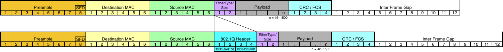 _Fonte: Wikimedia Commons — Il tag 802.1Q (4 byte, TPID 0x8100) viene inserito nell'header Ethernet tra Source MAC e EtherType. I 12 bit del VLAN ID consentono fino a 4094 VLAN distinte._

Internamente allo switch, ogni pacchetto è _sempre_ taggato: se arriva untagged, il primo passo dell'ASIC è assegnarlo alla VLAN di default della porta ingress. I pacchetti viaggiano internamente con il tag, e solo all'uscita su una porta untagged il tag viene rimosso.

> [!example] Comportamento del forwarding VLAN
> 
> Un frame entra su porta `Eth1/1/1` configurata come untagged VLAN 10 → lo switch aggiunge tag VID=10. L'ASIC cerca la MAC destination nella tabella di forwarding filtrando per VID=10 → trova porta `Eth1/1/5` configurata come trunk (tagged). Il frame esce con il tag 802.1Q intatto. Se la MAC destination fosse invece su una porta untagged VLAN 10, il frame uscirebbe senza tag.

### Perché le VLAN sono Critiche

Le VLAN risolvono due problemi fondamentali del data center:

**Sicurezza e segregazione**: le VLAN separano il traffico come se fossero reti fisicamente distinte. Per questo motivo persino le forze militari — che tradizionalmente usavano tre reti fisiche separate (confidenziale, riservato, top secret) — hanno accettato l'uso di tre VLAN su una stessa infrastruttura. La garanzia è che un pacchetto in VLAN A non può mai, per come funziona l'ASIC, raggiungere un host in VLAN B, a meno di una decisione esplicita di routing.

**Flessibilità della topologia**: il cablaggio fisico è costoso e difficile da modificare. Le VLAN permettono di ridisegnare la segmentazione logica della rete semplicemente riconfigurando il tagging delle porte, senza toccare un solo cavo. Questo è stato determinante per rendere i data center agili: si possono creare o eliminare sottoreti in pochi minuti.

> [!note] VLAN e VRF
> 
> Nelle configurazioni avanzate, le VLAN si associano a **VRF** (Virtual Routing and Forwarding) per creare anche tabelle di routing virtuali distinte. Questo completa la separazione logica all'intero Layer 3, non solo Layer 2.

---

## Resilienza e Complessità del Debug di Rete

La lezione si conclude con una riflessione sul perché la rete sia progettata così com'è — funzionale, deterministica, resistente — e sul perché il debug di rete sia particolarmente difficile.

Il docente porta due aneddoti dalla propria esperienza diretta con la rete dell'Università di Pisa:

1. Un **network loop** (ciclo nella topologia di Layer 2) aveva causato un'interruzione. Il loop coinvolgeva migliaia di dispositivi e porte, rendendo il processo di individuazione estremamente lungo — al momento della lezione il loop era ancora presente e in fase di ricerca.
    
2. Un **guasto intermittente** su un collegamento in fibra ottica da 15 km tra due sedi aveva causato un downtime di due-tre giorni. La causa era probabilmente un danno fisico alla fibra (una macchina agricola aveva transitato sopra il cavo interrato). Il link LACP usava due fibre: una funzionante e una degradata. Il risultato era un comportamento intermittente difficilissimo da diagnosticare — metà del traffico funzionava, metà generava errori — con l'apparenza di un problema software o di configurazione.
    

Questi esempi illustrano un principio generale:

> [!tip] La rete è semplice ma i suoi comportamenti emergenti sono complessi
> 
> Un singolo switch fa una cosa sola: ricevere un pacchetto e decidere su quale porta inoltrarlo (store-and-forward). L'algoritmo è banale. Ma quando miliardi di pacchetti al secondo attraversano decine di switch, i comportamenti emergenti sono di una complessità enorme. Non esiste un "debugger" per la rete perché fermare l'esecuzione _cambia_ il comportamento della rete stessa. Per questo tutto in networking — dal design del software alla CLI al doppio boot image — è pensato per ridurre la probabilità di stati inconsistenti.

---

## Conclusioni e Punti Chiave

Questa lezione ha coperto l'intera catena dall'hardware al software negli switch di rete moderni:

- Lo switch è un **computer general purpose** con una CPU x86 (control plane, Linux) e un ASIC specializzato (data plane, silicon commodity da Broadcom et al.) collegati via PCIe.
- La distinzione **control plane / data plane** è il framework concettuale fondamentale per capire qualsiasi dispositivo di rete.
- **SONiC** e **ONIE** rappresentano la direzione del mercato verso la disaggregazione hardware/software, con NOS open source intercambiabili come gli OS sui server.
- La **CLI modale** — heritage Cisco — è ancora lo strumento primario di configurazione, con il meccanismo running/startup config che garantisce il determinismo allo stato di boot.
- Le **VLAN** (IEEE 802.1Q, 12 bit di VLAN ID, 4094 VLAN possibili) sono lo strumento fondamentale per creare broadcast domain virtuali su una stessa infrastruttura fisica, abilitando sia la sicurezza che la flessibilità topologica.
- Il debug della rete è intrinsecamente difficile a causa del volume di traffico e della natura dinamica del sistema: l'approccio funzionale (switch che tornano sempre nello stesso stato al riavvio) è la risposta architettuale a questo problema.

> - Spiega il naming `1/1/3` di una porta su uno switch stack.

```{=latex}
\newpage
```

# Lezione 8 — Switch e Fabric continua

## Ethernet come standard de facto

Il punto di partenza è riconoscere il ruolo attuale dello switch di rete: non è più semplicemente un modo per connettere computer a Internet, ma è il meccanismo con cui si aggregano elementi computazionali in blocchi più grandi. In questo contesto, il traffico dominante nei data center è il cosiddetto **east-west traffic** — cioè il traffico tra server all'interno dello stesso data center — anziché il tradizionale traffico north-south verso l'esterno.

Ethernet è diventato lo standard di connessione locale non perché fosse tecnicamente il migliore, ma perché era il più adottato. La diffusione di massa ha generato economie di scala che hanno abbassato i costi dell'hardware e stimolato lo sviluppo di un ecosistema software enormemente ricco. Originariamente Ethernet era progettato per un singolo cavo coassiale condiviso — un bus fisico — ma questa architettura fisica non esiste più: oggi si emula virtualmente, e tutta l'infrastruttura software costruita su di essa è il vero motivo per cui continuiamo a usarla.

> [!tip] Intuizione chiave
> 
> Ethernet non ha vinto per meriti tecnici assoluti, ma per effetto di rete: più utenti → più volumi → costi più bassi → ancora più utenti. Questa dinamica si ripete in molte tecnologie informatiche.

Quando i requisiti cambiano, lo standard viene esteso anziché rimpiazzato. Le VLAN ne sono l'esempio più importante: aggiungono un tag all'header Ethernet per consentire la segmentazione logica della rete.

---

## MTU e dimensione dei pacchetti

> [!definition] MTU — Maximum Transmission Unit
> 
> La dimensione massima di un frame (pacchetto) che un dispositivo di rete è configurato ad accettare. Il valore di default in Ethernet è **1,5 KB** (più precisamente 1500 byte).

Sapere quanto è grande un pacchetto di rete è fondamentale per capire le prestazioni. Ogni unità di elaborazione di rete implementa un loop del tipo _"per ogni pacchetto, fai qualcosa"_: se i pacchetti sono molti e piccoli, il numero di iterazioni cresce, aumentando il carico sulla CPU. Se i pacchetti sono grandi, diminuisce il numero di iterazioni ma si richiede più memoria per i buffer.

Questo compromesso ha una conseguenza pratica: **i frame Jumbo**. Nei data center è possibile configurare switch per accettare frame da **9 KB** (fattore 6 rispetto al default). Questo è stato introdotto quando si iniziò a usare Ethernet per il traffico di storage, dove trasferire molti dati con un overhead basso è critico.

> [!warning] Attenzione: consistenza dell'MTU nella rete
> 
> In una rete a più switch (es. topologia a tre livelli), tutti i dispositivi lungo un percorso devono avere lo stesso MTU configurato. Se un frame da 9 KB arriva su un link con MTU 1,5 KB, il ricevente deve frammentarlo in 6 pacchetti più piccoli — vanificando il vantaggio del jumbo frame e aggiungendo lavoro inutile. L'MTU è uno dei parametri di configurazione più sottovalutati e fonte di problemi difficili da diagnosticare.

---

## Control plane, CLI e filosofia delle command line

I parametri come l'MTU si configurano attraverso il **control plane** dello switch, tipicamente tramite una **CLI** (Command Line Interface). La CLI degli switch di rete ha una struttura modale: si entra in un contesto (es. `vlan 3`), si emettono comandi specifici, poi si esce. Questa filosofia si è diffusa ben oltre il networking: il comando `ip` di Linux, `netsh` di Windows, e persino `docker` e altri strumenti moderni adottano lo stesso paradigma di _verbo + sottocomando_.

> [!note] Nota filosofica: Unix vs CLI moderna
> 
> La filosofia Unix tradizionale prevedeva comandi piccoli e atomici (`cp`, `ls`, `sort`) composti tramite pipe per costruire comportamenti complessi. La filosofia moderna, nata probabilmente con Docker, preferisce un singolo comando "grasso" con molti sottocomandi (`docker ps`, `docker image`, `docker exec`). Questo riduce la componibilità ma semplifica la gestione e il versionamento quando il numero di risorse da gestire è molto elevato.

---

## VLAN: segmentazione logica del broadcast domain

> [!definition] VLAN — Virtual LAN
> 
> Una VLAN è un tag inserito nell'header Ethernet che identifica il **broadcast domain** di appartenenza di un frame. Permette di dividere logicamente una rete fisica in più reti separate, senza modificare il cablaggio.

Il meccanismo è semplice: quando un frame non taggato arriva su una porta configurata come _untagged_ di una certa VLAN, lo switch lo riscrive aggiungendo il VLAN ID corrispondente. Tutti i frame all'interno dello switch vengono quindi trattati con il loro VLAN ID, garantendo isolamento tra broadcast domain diversi.

### Porte access e trunk

Quando una porta è associata a un unico VLAN ID con traffico non taggato, si parla di porta in **modalità access**: tipicamente usata per connettere un singolo host che non deve preoccuparsi del tagging. Quando invece una porta è associata a più VLAN ID (con traffico taggato), si parla di porta in **modalità trunk**: è usata per i collegamenti tra switch, dove è necessario trasportare il traffico di più broadcast domain sullo stesso cavo fisico.

> [!example] Esempio pratico
> 
> Un data center ha due rack connessi da un singolo cavo tra i rispettivi leaf switch. Quel cavo deve trasportare il traffico di VLAN 2 e VLAN 3 simultaneamente. La porta su entrambi gli switch viene configurata come trunk con VLAN 2 e 3 tagged. In questo modo non è necessario un cavo per ogni VLAN.

### VLAN nella topologia spine-leaf

In un'architettura spine-leaf, le porte sui leaf switch che si collegano verso la spine vengono configurate con tutti i VLAN ID in uso. Ogni frame che arriva su un leaf taggato con un certo VLAN ID viene inoltrato verso la spine solo se la porta di uplink include quel VLAN ID nel trunk. Questo permette di avere una rete logicamente ricca su una topologia fisica molto regolare.

> [!warning] Limite fondamentale delle VLAN
> 
> Lo standard 802.1Q supporta al massimo **4096 VLAN ID** (12 bit). Per una cloud pubblica con milioni di tenant, questo numero è assolutamente insufficiente.

---

## VXLAN e overlay network

Il limite delle 4096 VLAN, combinato con la difficoltà di gestire manualmente la configurazione di ogni switch, ha portato allo sviluppo del **VXLAN** (_Virtual Extensible LAN_).

> [!definition] VXLAN
> 
> VXLAN è un protocollo di **overlay network**: incapsula il traffico di layer 2 (Ethernet) all'interno di pacchetti UDP di layer 3 (IP). Questo permette di simulare reti layer 2 arbitrarie su un'infrastruttura layer 3 esistente.

### Perché conviene lavorare a layer 3

Operare a livello IP (layer 3) offre vantaggi critici rispetto al layer 2 puro:

- **Debug molto più semplice**: a layer 3 ogni pacchetto ha sorgente e destinazione ben definite; è possibile tracciare il percorso e isolare i problemi. A layer 2, un loop di broadcast può abbattere interi domini broadcast senza che sia facile capire dove si trova il problema.
- **Scalabilità**: i VXLAN network identifier sono a 24 bit, ovvero circa **16 milioni** di segmenti virtuali — ordini di grandezza superiori alle 4096 VLAN.
- **Automazione**: i segmenti virtuali vengono creati e gestiti via software, senza intervento manuale su ogni switch fisico.

> [!example] Esempio reale: università di Pisa
> 
> Il core network dell'università usa VXLAN per collegare i diversi dipartimenti. Quando c'è stato un incidente alla facoltà di ingegneria, fu necessario ripristinare rapidamente la connettività creando link layer 2 temporanei. Questo introdusse un loop che causò l'interruzione del servizio. La lezione appresa: reti layer 2 estese sono difficili da debuggare; lavorare a layer 3 con VXLAN riduce drasticamente questo rischio.

### Architettura VXLAN in produzione

In Azure (e provider simili), ogni rack del data center è un dominio layer 2. Tutto il traffico che esce dal rack viene immediatamente incapsulato in layer 3. Questo rende il troubleshooting molto più efficace: ogni flusso ha un identificatore IP univoco e può essere tracciato indipendentemente.

> [!abstract] Sintesi VLAN vs VXLAN
> 
> Le VLAN segmentano un dominio broadcast fisico usando tag nell'header Ethernet (layer 2). VXLAN crea reti layer 2 virtuali incapsulando il traffico in UDP/IP (layer 3). VXLAN richiede un control plane: questo è svolto da **EVPN** (_Ethernet VPN_), il protocollo che gestisce la distribuzione delle informazioni di raggiungibilità tra i nodi VXLAN.

---

## Protocolli implementati da uno switch

Uno switch moderno è molto più di un semplice dispositivo di forwarding. Implementa decine di protocolli, tra cui:

**Switching e VLAN:** IEEE 802.1Q (VLAN tagging), 802.1ad (Q-in-Q, per incapsulare VLAN dentro altre VLAN), Spanning Tree Protocol e varianti (per prevenire loop).

**Quality of Service:** ETS (_Enhanced Transmission Selection_) per il controllo di flusso, PFC (_Priority Flow Control_) per la prioritizzazione del traffico. Questi standard, nati per il traffico storage (dove i dischi non possono aspettare), permettono di suddividere la banda tra fino a 16 classi di traffico con diverse priorità.

> [!note] Il mito di Ethernet senza QoS
> 
> Si sente spesso dire che Ethernet non supporta Quality of Service. Non è vero: il puro standard IEEE 802.3 non ha flow control, ma le estensioni ETS e PFC, presenti in tutti gli switch data center moderni, forniscono proprio questo. Quello che è "lento" non è Ethernet, ma TCP.

**Overlay e virtualizzazione:** VXLAN, EVPN, MAC-in-UDP per il tunneling layer 2 su layer 3.

**Routing:** OSPF, BGP, ARP, protocolli multicast.

**Gestione:** SNMP per il monitoring, syslog, NetFlow per l'analisi del traffico, LLDP/CDP per la discovery della topologia.

---

## OpenFlow e Software Defined Networking

### Il problema della ricerca in rete

Intorno al 2008, ricercatori di Stanford identificarono un problema: i network administrator non permettevano di sperimentare su switch reali perché troppo critici. La ricerca in networking era bloccata.

### La flow table

Per capire OpenFlow occorre capire come funziona internamente uno switch: i dispositivi moderni mantengono una **flow table**, una struttura dati che associa pattern di traffico ad azioni. Anziché rieseguire ogni volta tutta la logica di configurazione per ogni pacchetto, lo switch costruisce regole del tipo:

> Se (source MAC = X) AND (destination IP = Y) AND (VLAN = Z) → output porta 2

Una volta che un flusso è noto, questa regola viene eseguita direttamente in hardware, senza ricalcolare tutto da capo. La flow table include anche contatori, utili per il debugging e il monitoring.

> [!definition] OpenFlow
> 
> OpenFlow è un'**API standard** che permette a un controller esterno di leggere e modificare la flow table di uno switch. Il controller — un processo software su un server normale — può aggiungere, modificare o rimuovere regole in risposta a eventi di rete.

### Applicazioni pratiche

**Firewall sandwich:** si inserisce un firewall L7 tra due switch. Il primo switch reindirizza ogni nuovo flusso attraverso il firewall; quando il firewall approva il flusso, il controller OpenFlow aggiorna la flow table dello switch per far bypassare il firewall ai pacchetti successivi dello stesso flusso. Risultato: si ispeziona solo l'inizio del flusso, il resto transita alla massima velocità.

**Mirroring e honeypot:** OpenFlow permette di copiare selettivamente il traffico su una porta di monitoraggio (per un sistema IDS) o di redirigere traffico sospetto verso un honeypot — un sistema esca che simula un target reale per catturare e studiare gli attaccanti.

> [!note] Stato attuale di OpenFlow
> 
> Nato con grandi ambizioni di "open networking", 15 anni dopo OpenFlow è principalmente uno strumento di ricerca e viene usato in casi specifici. La maggior parte dei professionisti non lo usa mai. È comunque importante conoscerne l'esistenza e il principio.

---

## Latenza in Ethernet

Bandwidth e latenza sono i due parametri fondamentali che governano le prestazioni di rete. La latenza si misura in diversi modi:

- **Serialization latency**: tempo per mettere i bit sul cavo. Con 1 Gigabit era ~12 µs; con le tecnologie moderne siamo nell'ordine di **300 ns**.
- **Propagation latency**: tempo di propagazione del segnale sul cavo. A 10 metri siamo ~50 ns, trascurabile nella maggior parte dei casi.
- **Switch latency** (cut-through): tempo di attraversamento di uno switch. I chipset Broadcom Trident/Tomahawk sono tipicamente tra **400 e 700 ns**.
- **End-to-end con TCP**: il protocollo TCP aggiunge overhead di framing, finestre di congestione, ACK, ecc. La latenza tipica di uno stream TCP è di circa **70 µs** — ordini di grandezza superiore al solo hardware.

> [!tip] Intuizione chiave
> 
> Ethernet in sé è **low latency**. TCP non lo è. Quando si sente dire che "Ethernet non è adatto all'HPC perché ha troppa latenza", il problema è quasi sempre il protocollo TCP sopra, non il mezzo fisico.

---

## InfiniBand e RDMA: introduzione

### Perché InfiniBand

Quando il 1 Gigabit Ethernet aveva latenza di 12 µs, era chiaramente inadeguato per applicazioni HPC (High Performance Computing) dove il pattern computazionale è _calcola → comunica → calcola → comunica_ in cicli molto stretti. InfiniBand è nato per rispondere a questa esigenza.

> [!definition] InfiniBand
> 
> InfiniBand è uno standard di interconnessione progettato per HPC, con latency di **1-2 µs** end-to-end (confrontare con i 70 µs di TCP su Ethernet). La MTU di un pacchetto InfiniBand è di **2 GB** — enormemente più grande rispetto ai 9 KB dei jumbo frame Ethernet. Molte funzioni che in Ethernet sono software sono implementate direttamente in silicio.

InfiniBand è stato a lungo dominato da **Mellanox**, un'azienda israeliana acquisita da **Nvidia** nel 2020. Nvidia ora usa questa tecnologia per la connessione ad alta velocità tra GPU nei cluster di training AI (fabric NVLink/NVSwitch).

### RDMA e RoCE

> [!definition] RDMA — Remote Direct Memory Access
> 
> RDMA permette a un host di rete di scrivere direttamente nella memoria di un altro host **senza coinvolgere la CPU del destinatario**. Analogo alla DMA locale (il meccanismo con cui un disco scrive in RAM senza impegnare la CPU), ma attraverso la rete.

Questo elimina drasticamente la latenza software: non c'è interrupt, non c'è context switch, non c'è copia di dati. La latenza risultante è paragonabile a quella dell'hardware di rete.

Poiché InfiniBand era costoso e richiedeva hardware dedicato, Mellanox ha proposto **RoCE** (_RDMA over Converged Ethernet_):

> [!definition] RoCE — RDMA over Converged Ethernet
> 
> RoCE implementa RDMA su Ethernet, sfruttando le estensioni di QoS (ETS e PFC) per garantire l'affidabilità necessaria. È supportato nativamente su Linux e Windows, ed è oggi lo standard per HPC su Ethernet.

> [!abstract] Dove siamo oggi
> 
> InfiniBand rimane in uso nei cluster HPC tradizionali per la latenza e per la sua topologia ottimizzata (fat tree senza oversubscription). RoCE/RDMA ha eroso parte del suo vantaggio portando latenze simili su Ethernet. Nella prossima lezione si esaminerà più in dettaglio la topologia **fat tree** (_full fat tree_) usata in InfiniBand, che garantisce banda costante indipendentemente dal numero di hop nella rete.

---

## Roadmap delle prossime lezioni

Dopo InfiniBand e le topologie HPC, il corso proseguirà con:

- Storage, drive e ridondanza (RAID e storage distribuito)
- Risalita sullo stack verso virtualizzazione e hypervisor
- Sicurezza di rete e firewall L7

> - Cos'è RoCE e in quale contesto è stato introdotto?

```{=latex}
\newpage
```

# Fabric Avanzato e Introduzione allo Storage

## Workload e architettura del datacenter

Prima di parlare di fabric ad alte prestazioni, è necessario capire *perché* esistono. La scelta dell'architettura di rete di un datacenter — larghezza di banda, latenza, topologia — non è universale: è guidata dal tipo di workload che il sistema deve eseguire. Il professore distingue quattro categorie fondamentali.

**HPC** (*High Performance Computing*) è la categoria più antica: si tratta di problemi computazionalmente enormi — simulazioni fisiche, fluidodinamica, modellazione sismica — che un singolo computer non può risolvere in tempo utile. La soluzione è decomporre il problema in sotto-problemi assegnati a nodi omogenei (tutti con le stesse risorse), che collaborano comunicando frequentemente. Il classico esempio è ENI che simula la propagazione delle onde sismiche nel sottosuolo tramite elementi finiti per individuare giacimenti petroliferi senza trivellare: il risultato arriva in sei mesi usando migliaia di CPU, mentre con un singolo computer richiederebbe secoli.

**Cloud** è il modello inverso: qui il problema è piccolo — una singola applicazione web, un microservizio — e il server è talmente potente da poter ospitare decine o centinaia di macchine virtuali contemporaneamente. La relazione è uno-a-molti: un computer, molti problemi. Questo modello è stato possibile perché per vent'anni la potenza computazionale è cresciuta molto più velocemente della domanda software.

**Big Data** è orientato all'elaborazione di quantità enormi di dati, tipicamente con dischi meccanici: la latenza d'accesso allo storage (millisecondi) è così dominante che la latenza di rete diventa irrilevante. Non ha senso ottimizzare la rete se il collo di bottiglia è il disco.

**AI/ML** è la categoria che ha recentemente rotto l'equilibrio del cloud: si tratta di workload che, come l'HPC, richiedono uno o più server dedicati per un singolo calcolo. Il professore distingue due sotto-categorie con requisiti molto diversi — **training** e **inference** — e sottolinea che anche i laptop moderni montano oggi un NPU (*Neural Processing Unit*) ottimizzato per l'inferenza locale.

> [!tip] Intuizione chiave
>
> La latenza di rete conta solo quando la computazione è *memory-bound* e *sincronizzata*. In HPC e AI training ogni nodo deve aspettare gli altri a ogni passo: anche 2 ms di latenza di rete moltiplicati per milioni di iterazioni diventano il collo di bottiglia. In Big Data il disco è così lento (ms) che la rete smette di importare.

---

## InfiniBand

### Contesto storico e motivazione

Quando InfiniBand fu introdotto, Ethernet era ancora a 1 Gigabit per secondo. Per aggregare 5 Gbps su un server si usavano 4-5 cavi Ethernet. InfiniBand offriva in un singolo cavo ~80 Gbps — da qui il nome, che richiamava la *larghezza di banda infinita*. Oggi il confronto con Ethernet è molto meno netto dal punto di vista della banda, ma InfiniBand mantiene un vantaggio significativo in **latenza**.

> [!definition] InfiniBand
>
> Fabric di rete ad alte prestazioni progettata per ambienti HPC. Fisicamente simile a Ethernet (connettori SFP/QSFP), radicalmente diversa a livello di protocollo. Originariamente sviluppata da Mellanox, oggi di proprietà NVIDIA.

### Caratteristiche del protocollo

La differenza cruciale rispetto a Ethernet non è nei cavi, ma nel protocollo:

- **Pacchetti fino a 2 GB**: dal punto di vista del software host, si può inviare un pacchetto da 2 gigabyte come unità atomica. Il fabric si occupa internamente della segmentazione e riassemblaggio, ma l'applicazione non deve preoccuparsene.
- **16 classi di priorità** (*QoS* nativo): è possibile classificare il traffico con granularità fine.
- **IP over IB**: esiste un adattatore per far girare TCP/IP sopra InfiniBand, utile per la comunicazione *north-south* verso l'esterno, ma nessuno lo usa per comunicazioni interne al cluster.

La topologia tipica di un cluster InfiniBand è: **east-west su InfiniBand** (comunicazione tra nodi del cluster), **north-south su Ethernet** (comunicazione con l'esterno). Il nodo di testa del cluster (*head node*) è l'unico connesso a entrambe le reti.

Uno switch InfiniBand può arrivare a 128 porte in un singolo chassis: questo permette di implementare in hardware un'interconnessione completamente piatta con latenza garantita sotto i 3 microsecondi tra qualsiasi coppia di porte.

### Top500: lo stato dell'arte

Il *Top500* è la classifica dei 500 supercomputer più potenti al mondo. Tutti i sistemi nelle prime posizioni usano InfiniBand o Slingshot. Il professore cita come esempi:

| Sistema | Potenza | Note |
|---------|---------|------|
| Frontier | ~29 MW, ~11M core | AMD + GPU Instinct, Slingshot (HPE) |
| Eagle | — | Microsoft Azure, NVIDIA H100, InfiniBand — architettura di riferimento per AI |
| Leonardo | — | Italia, top 10 |
| Jupiter | — | Germania, primo sistema europeo exascale |

**Slingshot** (HPE/Cray) è Ethernet "su steroidi": compatibile Ethernet a livello fisico, ma con ottimizzazioni di protocollo per bassa latenza. **InfiniBand** (NVIDIA) è il protocollo nativo per HPC. I due dominano il segmento dei supercomputer.

---

## MPI e RDMA

### MPI: Message Passing Interface

Prima di parlare di RDMA, è fondamentale capire il contesto del software HPC. Quasi tutto il codice HPC distribuito è scritto usando **MPI** (*Message Passing Interface*), una libreria C di ~35 anni che esprime la computazione distribuita come scambio di messaggi tra nodi identificati da un numero progressivo (non da indirizzi di rete).

> [!tip] Intuizione chiave
>
> MPI astrae completamente il fabric sottostante. L'applicazione invia "un messaggio al nodo 4" e MPI si occupa di tradurre questo in chiamate alle primitive di rete specifiche del fabric disponibile — InfiniBand, Slingshot, Ethernet. Questo è il motivo per cui la community HPC ha potuto cambiare fabric multiple volte senza riscrivere il codice applicativo.

### RDMA: Remote Direct Memory Access

**RDMA** estende il concetto di DMA (*Direct Memory Access*) — il meccanismo che permette a una periferica di leggere/scrivere direttamente in RAM senza coinvolgere la CPU — attraverso la rete.

Il meccanismo sfrutta le schede di rete *converged NIC*, collegate al bus PCIe: queste schede possono leggere e scrivere nella RAM del server remoto direttamente, senza passare per il sistema operativo del destinatario.

> [!warning] Implicazioni di sicurezza
>
> RDMA bypassa il sistema operativo: la scheda di rete ha accesso diretto alla memoria. Questo introduce rischi di sicurezza non banali che vanno considerati nel design del sistema.

RDMA è diventato lo standard *de facto* per la comunicazione a bassa latenza in ambienti distribuiti. Dal 2016, anche Windows implementa **RoCE** (*RDMA over Converged Ethernet*), portando RDMA anche su Ethernet standard.

### Confronto di latenza

| Tecnologia | Latenza tipica |
|-----------|---------------|
| InfiniBand nativo (RDMA) | 1–3 μs |
| RoCE (RDMA over Converged Ethernet) | 1.3–5 μs |
| IP over InfiniBand | 5–15 μs |
| TCP/IP su Ethernet | 20–70+ μs |

Il dato più significativo: aggiungere il protocollo IP sopra InfiniBand **moltiplica per 4-5x la latenza** rispetto a RDMA nativo. TCP/IP è ulteriormente peggiore. Questo spiega perché per HPC nessuno usa TCP/IP interno al cluster.

> [!note] L'inventore di TCP/IP e i buffer
>
> Il professore cita un aneddoto: uno degli autori di TCP/IP, analizzando la lentezza della propria rete domestica, scoprì che il problema era il buffering introdotto in ogni switch e router. TCP/IP era stato progettato per essere *adattivo* e senza buffer: l'accumulo di buffer nella rete moderna ne snatura il comportamento. L'autore commentò che, se dovesse progettare il protocollo oggi, lo farebbe diversamente.

---

## Overbooking e topologia Full Fat Tree

### Overbooking

In qualsiasi rete commutata esiste il concetto di **overbooking**: il traffico aggregato generabile dai nodi di accesso supera la capacità del collegamento verso lo strato superiore.

> [!example] Esempio concreto
>
> Uno switch con 48 porte da 25 Gbps e 6 porte uplink da 100 Gbps. Traffico massimo east-west: 48 × 25 = 1.200 Gbps. Uplink totale: 6 × 100 = 600 Gbps. Il rapporto di overbooking è **2:1**: i nodi possono generare il doppio di quanto il fabric possa trasmettere verso lo spine. Questo è normale e atteso — la rete si adatta.

### Full Fat Tree

Per applicazioni HPC dove la latenza e il throughput non-bloccante sono requisiti, esiste una topologia specifica: il **Full Fat Tree**.

> [!definition] Full Fat Tree
>
> Topologia di rete ad albero in cui la banda dell'uplink di ogni nodo è uguale alla *somma* delle bande dei link del sottoalbero che connette. Il risultato è una rete **non-bloccante**: ogni nodo può trasmettere a piena velocità verso qualsiasi altro nodo senza contesa.

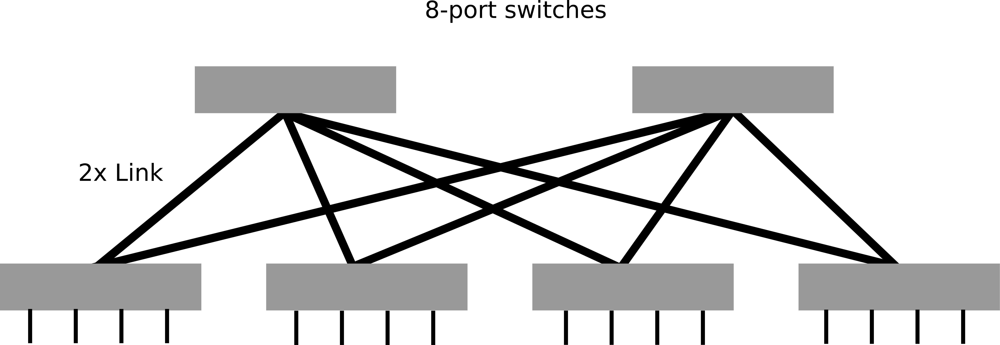
*Fonte: Wikimedia Commons — Topologia Fat Tree: ogni nodo intermedio ha una banda uplink pari alla somma delle bande dei link verso le foglie. Nessun punto di strozzatura nella rete.*

In pratica, con link aggregation moderna, si implementa sommando più cavi standard in un link logico. La regola è semplice: se voglio che metà delle porte serva i server (east-west) e metà vada verso lo spine (north-south), la banda dei due lati è identica — nessun overbooking.

Il Full Fat Tree ha un costo elevato (gli switch agli strati superiori devono gestire bande crescenti), ma è la topologia usata per supercomputer e cluster HPC dove il throughput non-bloccante è non negoziabile.

> [!note] Fat Tree vs Spine-and-Leaf
>
> L'architettura Spine-and-Leaf vista nelle lezioni precedenti *ricorda* il Fat Tree, ma tipicamente introduce overbooking. Il Fat Tree è la versione non-bloccante dello Spine-and-Leaf, applicata quando il costo è giustificato dalle prestazioni richieste.

---

## Fibre Channel: il fabric per lo storage

Oltre a Ethernet e InfiniBand, nei datacenter esiste un terzo tipo di fabric dedicato allo storage: il **Fibre Channel**.

> [!definition] Fibre Channel
>
> Fabric di rete ottico dedicato alla connessione host-storage. Fisicamente simile a Ethernet e InfiniBand (fibra ottica, connettori analoghi), ma con protocolli completamente diversi orientati all'accesso allo storage.

L'architettura tipica è: server con scheda **HBA** (*Host-Based Adapter*, l'equivalente Fibre Channel della NIC) → fabric Fibre Channel (switch FC) → storage array (un sistema con molti dischi interni). L'HBA emula un disco locale, ma i dati risiedono sullo storage array.

Il protocollo trasportato da Fibre Channel è **SCSI** (o più precisamente FCP — Fibre Channel Protocol che incapsula SCSI), che porta a una curiosità storica importante.

Esiste anche **FCoE** (*Fibre Channel over Ethernet*), pensato come meccanismo di transizione per evitare di mantenere una rete FC separata. Il professore lo definisce "terrible" — non funziona bene ed è stato sostanzialmente abbandonato.

Il Fibre Channel è oggi **legacy**: molte installazioni esistenti lo usano ancora, ma i nuovi progetti preferiscono Ethernet o InfiniBand anche per lo storage.

---

## La storia dei protocolli di storage

Per capire perché Fibre Channel usa ancora SCSI, occorre ripercorrere la storia dei protocolli di accesso ai dischi.

### SCSI: 1979

**SCSI** (*Small Computer System Interface*) nasce nel 1979 come bus parallelo (cavo flat multi-connettore) per collegare più dispositivi di storage a un singolo controller, condividendo il costo del controller tra più dischi. La logica master/slave permetteva di gestire 2 dischi per controller (ATA) o molti di più (SCSI).

Sebbene la tecnologia fisica sia cambiata radicalmente, il **protocollo SCSI è sopravvissuto per 40 anni** grazie al principio di non dover riscrivere il software: ogni nuova tecnologia ha implementato SCSI come adattatore sopra nuovi mezzi fisici.

| Variante | Mezzo fisico | Note |
|---------|-------------|------|
| SCSI parallelo | Cavo flat | Originale 1979 |
| SAS | Seriale | Serial Attached SCSI |
| iSCSI | Ethernet/TCP | SCSI sopra Internet — alto overhead |
| FCP | Fibre Channel | SCSI sopra fibra ottica |
| SRP | InfiniBand | SCSI sopra RDMA |

### ATA → SATA

In parallelo a SCSI, il mondo PC sviluppò **ATA** (più economico) e poi **SATA** (Serial ATA), dominante nei dischi consumer fino a pochi anni fa.

### NVMe: la rivoluzione

**NVMe** (*Non-Volatile Memory Express*) rompe il paradigma: non è un protocollo di bus, è un protocollo direttamente sopra **PCIe** (*PCI Express*). Un SSD NVMe non è "un disco connesso a un controller" — è una scheda PCIe che si comporta come qualsiasi altra periferica del sistema.

> [!tip] Perché NVMe ha cambiato tutto
>
> Per decenni il software — database, filesystem, sistemi operativi, reti — è stato progettato con il presupposto che il disco fosse **lento** (millisecondi). Con NVMe la latenza scende a microsecondi. Il collo di bottiglia si sposta: SCSI, TCP/IP e altri protocolli che introducevano latenza trascurabile rispetto a un disco meccanico diventano improvvisamente il fattore limitante. Questo ha richiesto di ripensare quasi tutto il software di storage.

---

## Gerarchia dello storage

Il datacenter moderno mantiene un'architettura a livelli, in cui ogni livello è un compromesso tra velocità, capacità, costo e durabilità.

| Livello | Tecnologia | Latenza tipica | Uso |
|---------|-----------|---------------|-----|
| Primario | SSD NVMe | Microsecondi | Dati attivi, cache |
| Secondario | HDD meccanici | Millisecondi | Dati caldi, backup primario |
| Terziario | Nastri magnetici | Secondi | Disaster recovery, archivio |
| Futuro | Vetro (Project Silica) | Secondi+ | Long-term storage |

### Nastri magnetici: perché ancora in uso

I nastri sembrano anacronistici, ma hanno proprietà uniche:
- Possono essere fisicamente rimossi e conservati in luoghi sicuri (resistono ad attacchi fisici, EMP, disastri).
- Non richiedono alimentazione per conservare i dati.
- Il costo per GB è molto inferiore ai dischi.

I moderni archivi su nastro usano **robot** che gestiscono automaticamente l'inventario, il recupero e l'inserimento delle cassette nelle unità di lettura. L'aspetto ricorda la fantascienza, ma è tecnologia consolidata.

### Il problema della durabilità dei dati

Tutti i supporti di storage hanno una vita finita. Il professore introduce un problema poco conosciuto anche sugli SSD: ogni blocco di NAND deve essere **riscritto ogni ~2 settimane** da un thread interno del firmware del drive, altrimenti i dati si corrompono per dissipazione della carica.

> [!note] Project Silica (Microsoft)
>
> Microsoft sta sperimentando la scrittura di dati su **vetro** tramite impulsi laser, con lettura tramite microscopia ottica e decodifica AI. I dati stimati durano da mille a un milione di anni, resistono all'EMP e all'acqua. La densità attuale è ~75 GB per pezzetto di vetro (si prevede scala a TB), la latenza è nell'ordine dei secondi. Adatta solo a *cold storage* di lungo termine.

---

## Dove siamo nel corso

> [!abstract] Prossimi argomenti
>
> La prossima lezione (**Lezione 10**) approfondirà lo storage: cosa è successo all'architettura dei server con l'avvento degli SSD NVMe, come è cambiata la gerarchia di memoria, e come il software si è adattato. Seguiranno le architetture server, e poi la parte software del datacenter.

```{=latex}
\newpage
```

# Storage — Tecnologie e Principi Fondamentali

Questa lezione apre il secondo grande pilastro di un datacenter: lo **storage**. Dopo aver studiato il fabric (il networking interno), e prima di affrontare il compute, il professore dedica questa sessione a capire come sono costruiti i drive, come si è evoluta la tecnologia, e quali sono i principi fondamentali che guidano la progettazione di sistemi di storage affidabili.

---

## I Tre Pilastri di un Datacenter

Un datacenter è definito dall'aggregazione flessibile di tre risorse fondamentali:

1. **Networking** (il fabric) — già trattato
2. **Storage** — argomento di questa lezione
3. **Compute** — lezione futura

Il fabric è la colla che tiene insieme tutto: se si interrompe, il sistema è giù. Lo storage è invece il luogo dove i dati sopravvivono alla perdita di corrente. Questa caratteristica — la **persistenza** — è al centro di ogni scelta architetturale nel dominio dello storage.

---

## HDD vs SSD: La Rivoluzione Silenziosa

### Il disco meccanico e i suoi limiti fisici

Per decenni, il termine generico "disco" ha designato gli **HDD** (*Hard Disk Drive*): dispositivi con piatti magnetici rotanti, testine di lettura/scrittura, settori e cilindri. La fisica impone un limite invalicabile: il tempo di accesso dipende dal movimento meccanico, sia rotazionale (il piatto deve portare il settore corretto sotto la testina) sia lineare (la testina deve spostarsi sul traccia giusta). Questo tempo, detto *seek time* e *rotational latency*, porta la latenza totale nell'ordine dei **3–5 millisecondi**.

> [!tip] Perché la latenza HDD è un muro fisico
>
> Non importa quanto sofisticata sia l'elettronica: finché il sistema dipende da un motore che fa ruotare un piatto a 7.200 o 15.000 giri al minuto, la latenza minima è imposta dalla meccanica. Non c'è algoritmo che elimini il tempo di rotazione.

L'interfaccia dominante per gli HDD è stata per anni **SATA** (*Serial ATA*), nata per i PC desktop e poi adottata anche nei server per il minor costo. In ambito server esisteva anche **SAS** (*Serial Attached SCSI*): un protocollo più performante, tipicamente usato con drive a 15.000 RPM, con latenza leggermente inferiore e supporto multipath. Oggi, con gli HDD relegati prevalentemente allo storage freddo (backup e archivi), SAS ha perso gran parte della sua rilevanza pratica: si preferisce SATA per ragioni di costo, visto che la performance non è più l'obiettivo primario di un HDD moderno.

> [!note] Capacità degli HDD oggi
>
> I drive meccanici moderni raggiungono capacità di **30–36 TB** (Samsung, Seagate, Western Digital, 2024). Questo progresso riflette esclusivamente l'uso come *cold storage*: la densità è massimizzata perché il throughput non è critico.

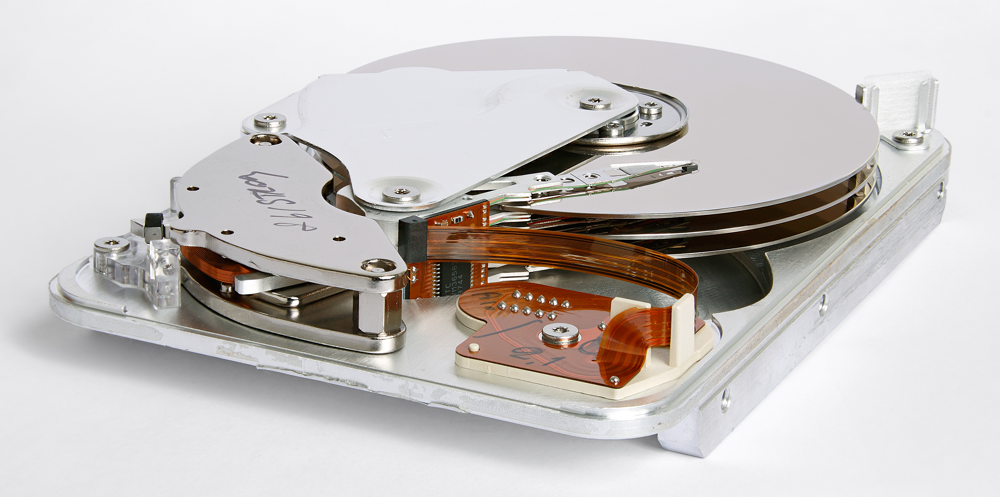
*Fig. — Anatomia interna di un HDD Seagate: i piatti magnetici rotanti e il braccio con le testine rendono visibile il vincolo meccanico che limita la latenza a 3–5 ms.*

---

### La transizione all'SSD: 30x in un solo salto

Gli SSD entrarono nel mercato consumer intorno al **2010**, inizialmente come dispositivi costosi e di piccola capacità, nella forma fattore di un disco da 2,5" per poter usare la stessa infrastruttura meccanica degli HDD. Il cambio non fu graduale: le prime generazioni di SSD su interfaccia SATA offrirono una riduzione della latency di circa **30x** rispetto agli HDD — da millisecondi a centinaia di microsecondi. Il risultato fu una "rivoluzione silenziosa" che pochi compresero appieno all'epoca.

> [!warning] Impatto a catena sull'intero stack
>
> L'accelerazione dello storage non rimase confinata all'hardware. Il sistema operativo Linux (e altri) nascondeva bug di concorrenza latenti da oltre vent'anni nel sottosistema di I/O, mai scatenati perché il disco era troppo lento. Con l'arrivo degli SSD, alcune race condition diventarono manifeste. Bisognò riscrivere parti del kernel e rivedere decenni di assunzioni sulla lentezza del disco.

---

### NVMe: un protocollo, non un dispositivo

La seconda grande svolta fu lo spostamento degli SSD dal controller SATA alla connessione diretta al bus **PCIe** (*PCI Express*) tramite il protocollo **NVMe** (*Non-Volatile Memory Express*).

È fondamentale capire che **NVMe non è un componente hardware**: è uno **standard di protocollo** che definisce come un dispositivo di storage a blocchi deve comportarsi sul bus PCIe. In pratica, un drive NVMe si presenta al sistema esattamente come qualsiasi altra scheda PCIe — una scheda di rete, una GPU — e il sistema operativo lo riconosce automaticamente senza driver proprietari.

L'effetto sul collo di bottiglia fu immediato:

| Interfaccia | Latenza tipica | Bandwidth tipico |
|---|---|---|
| HDD SATA/SAS | 3–5 ms | 100–250 MB/s |
| SSD SATA (2015) | 50–200 µs | 500–550 MB/s |
| SSD NVMe Gen 3 (2016+) | 20–100 µs | ~3,5 GB/s |
| SSD NVMe Gen 4 (2019+) | 10–50 µs | ~7 GB/s |
| SSD NVMe Gen 5 (2022+) | 5–20 µs | 10–14 GB/s |

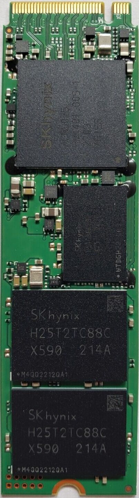
*Fig. — Un SSD NVMe in formato M.2 2280: la connessione diretta al bus PCIe elimina il controller SATA e porta la bandwidth a oltre 7 GB/s.*

> [!tip] Il controller come collo di bottiglia
>
> Il controller SATA/SAS era un chip hardware interposto tra il drive e la CPU, utile quando il drive era lento e aveva bisogno di buffering e command queuing. Con l'SSD, il controller divenne il **bottleneck**: rimuovendolo e collegando il drive direttamente al bus PCIe, si ottenne un guadagno di **4–5x in bandwidth** e **3–4x in latenza** a parità di tecnologia flash.

Ogni drive NVMe usa tipicamente **4 corsie PCIe** (*lanes*). La latenza attuale dei drive NVMe enterprise più veloci — circa 5 µs — è a un passo dai 2 µs di InfiniBand, la migliore fabric HPC. Lo storage, da componente lento, sta diventando "memoria persistente lenta".

---

## La Conseguenza Sistemica: PCIe come Collo di Bottiglia

Con la rimozione del controller e la connessione diretta al bus PCIe, l'intero ecosistema dovette adeguarsi. PCIe Gen 3 aveva retto per circa 10 anni, ma improvvisamente divenne il nuovo collo di bottiglia.

La risposta fu una rapida evoluzione degli standard:

- **PCIe Gen 4** (2019): raddoppia la bandwidth rispetto a Gen 3
- **PCIe Gen 5** (2021): raddoppia ancora — ~14 GB/s per drive
- **PCIe Gen 6 e 7**: in sviluppo

> [!example] AMD EPYC "Naples" (2017) e le corsie PCIe
>
> Quando AMD tornò competitiva nel segmento server con la serie EPYC, una delle sue proposte di valore chiave fu l'offerta di **128 corsie PCIe** per socket. La scelta non era casuale: il settore aveva già compreso che la CPU doveva poter alimentare direttamente i drive NVMe senza intermediari, e più corsie significava più drive operativi in parallelo.

Un server tipico con 24 drive NVMe (24 × 4 corsie = 96 corsie) richiede un numero di corsie PCIe che solo le CPU moderne riescono a fornire. Ciò ha spinto i produttori a integrare direttamente il controller PCIe nel die della CPU, eliminando il chip bridge che aggiungeva latenza.

---

## Gerarchia della Memoria e la Nuova Posizione dello SSD

La tradizionale gerarchia della memoria è sempre stata:

```
Cache L1/L2/L3 (ns) → DRAM (50–100 ns) → Disco (ms)
```

Con gli SSD NVMe moderni, la gerarchia si è trasformata:

```
Cache L1/L2/L3 (ns) → DRAM (50–100 ns) → SSD NVMe (5–20 µs) → HDD (3–5 ms)
```

Il salto tra DRAM e SSD non è più di 6 ordini di grandezza (come tra ns e ms), ma di **2 ordini di grandezza**. Questo ha conseguenze algoritmiche profonde: strutture dati che prima dovevano risiedere interamente in memoria — perché la serializzazione su disco era proibitiva — ora possono essere mantenute direttamente sull'SSD.

> [!example] RocksDB come caso paradigmatico
>
> RocksDB (Facebook/Meta) è una libreria che implementa una *persistent hash table* ottimizzata per SSD. Prima degli SSD veloci, qualsiasi dato che doveva sopravvivere al riavvio richiedeva serializzazione su disco con buffer intermedi in memoria. Con RocksDB su NVMe, si scrivono coppie chiave-valore direttamente su storage persistente senza gestire esplicitamente buffer o strutture doppie. Le performance sono abbastanza buone da rendere il pattern accettabile.

---

### Intel Optane (3D XPoint): La Memoria Persistente che Non Fu

Intel Optane è una tecnologia **non NAND** che merita menzione, nonostante Intel l'abbia cancellata nel 2022. Utilizzava una struttura tridimensionale a giunzioni (*3D Cross-Point*) che permetteva di memorizzare un bit a ogni incrocio di un reticolo 3D. Le proprietà che la distinguevano dalle NAND flash:

- **Latenza quasi simmetrica**: lettura e scrittura avevano tempi paragonabili (fattore 3–10x, contro i 6–100x delle NAND)
- **Endurance molto superiore**: milioni di cicli PE contro i migliaia delle NAND TLC
- **Connessione alla memoria bus**: installabile su slot DIMM (*NVDIMM*), non solo su PCIe

> [!definition] NVDIMM — Non-Volatile DIMM
>
> Standard elettrico introdotto da Intel intorno al 2015 per permettere l'installazione di moduli di memoria persistente sullo stesso bus dei moduli DRAM standard. Optane era disponibile in moduli da 512 GB per slot, consentendo server con **terabyte di RAM persistente**.

La tecnologia permetteva al processore di fare *tiering* automatico: i dati caldi residevano in DRAM, quelli tiepidi migrando su Optane. In termini di latenza, Optane NVMe era intorno ai **10 µs** con variazione minima tra lettura e scrittura — il miglior avvicinamento alla DRAM come storage persistente mai commercializzato.

I motivi del fallimento furono due:
1. **Intel attraversava una crisi interna** e dovette tagliare progetti costosi
2. **Il software non era pronto**: i sistemi operativi non sapevano sfruttare il memory tiering con sufficiente efficienza, e l'NVMe SSD nel frattempo stava migliorando rapidamente

> [!note] Il problema di sicurezza della memoria persistente
>
> La persistenza nei DIMM introduce un vettore di attacco imprevisto: un attaccante fisico che rimuove i moduli può leggerne il contenuto offline. Intel risolse generando una chiave crittografica casuale all'avvio, memorizzata in un registro volatile. Tutti i dati scritti sull'Optane erano cifrati con quella chiave. Se il modulo veniva rimosso, il registro veniva perso, rendendo inutilizzabile il contenuto — simulando il comportamento della DRAM tradizionale.

---

## Asimmetria Lettura/Scrittura negli SSD

Tutti i dispositivi basati su tecnologia NAND (a differenza di Optane) presentano una **asimmetria fondamentale** tra latenza di lettura e latenza di scrittura.

> [!definition] Ciclo PE — Program/Erase
>
> Una cella NAND non può essere riscritta direttamente: prima deve essere **cancellata** (*erase*) e poi **programmata** (*program*). La cancellazione avviene a livello di blocco (migliaia di celle), mentre la scrittura avviene a livello di pagina. Questo genera amplificazione di scrittura e latenza asimmetrica.

| Tecnologia | Latenza lettura | Latenza scrittura | Rapporto |
|---|---|---|---|
| DRAM | ~50–100 ns | ~50–100 ns | ~1x (simmetrica) |
| Intel Optane | ~6–10 µs | ~6–10 µs | ~1–3x |
| SSD NVMe Gen 5 | ~20–50 µs | ~50–200 µs | ~2–7x |
| SSD SATA (2015) | ~50–100 µs | ~500 µs–5 ms | ~10–100x |
| HDD | ~3–5 ms | ~3–5 ms | ~1x (simmetrica, ma lenta) |

Questa asimmetria è rilevante nelle scelte architetturali: workload write-intensive richiedono drive con migliore endurance (SLC o MLC), e i sistemi di storage devono prevedere buffer di scrittura appropriati.

---

## Tipologie di Celle NAND e Endurance

Non tutti gli SSD sono uguali: la densità delle celle NAND — misurata in bit per cella — determina un trade-off tra capacità, costo, prestazioni e vita utile.

> [!definition] Cicli PE (Program/Erase)
>
> Ogni cella NAND può essere cancellata e riscritta un numero finito di volte. Questo numero, detto *PE cycles* o *endurance*, diminuisce all'aumentare dei bit per cella: più stati da distinguere significano margini elettrici più stretti e usura più rapida.

| Tipo | Bit/cella | PE Cycles tipici | Latenza scrittura | Costo/GB | Caso d'uso |
|---|---|---|---|---|---|
| **SLC** | 1 | ~50.000–100.000 | ~200 µs | Molto alto | Cache, storage ad alta frequenza di scrittura |
| **MLC (eMLC)** | 2 | ~10.000–30.000 | ~600 µs | Alto | Enterprise, workload misto lettura/scrittura |
| **TLC** | 3 | ~1.000–3.000 | ~1–3 ms | Medio | Standard consumer e enterprise oggi |
| **QLC** | 4 | ~100–1.000 | ~5–10 ms | Basso | Storage freddo, archivio |
| **PLC** | 5 | <100 | ~10–20 ms | Molto basso | Archiviazione pura (*write once*) |

> [!warning] SLC come cache interna
>
> Molti drive TLC e QLC includono una porzione di celle configurate in modalità SLC come **buffer di scrittura** interno. Le scritture iniziali vanno nella cache SLC (molto veloce), poi vengono migrata nel TLC/QLC in background. Quando il buffer SLC si esaurisce (drive quasi pieno), le prestazioni di scrittura crollano bruscamente.

---

### Over-provisioning e precondizionamento

Un SSD da 4 TB potrebbe internamente contenere 6–8 TB di celle NAND. La capacità "nascosta" oltre quella esposta serve a due scopi:

1. **Wear leveling**: il controller distribuisce le scritture uniformemente su tutte le celle per evitare che alcune si esauriscano prima di altre. Avere celle di riserva moltiplica la vita effettiva del drive.
2. **Performance**: il controller usa lo spazio libero per ottimizzare le operazioni di garbage collection e riorganizzazione interna.

> [!warning] Il "precondizionamento" e la barra rossa
>
> Quando un drive supera circa il **90% di riempimento**, le prestazioni degradano significativamente. Il controller ha meno spazio libero per fare wear leveling e ottimizzazione. macOS e Windows mostrano la barra di utilizzo in rosso proprio a questo punto — non per indicare che il disco è quasi pieno in senso assoluto, ma per segnalare che le **prestazioni stanno per peggiorare**. Regola pratica: mantenere un drive SSD sotto il 75–80% per preservare le prestazioni.

---

## Il Peccato Imperdonabile: Perdere i Dati

Prima di affrontare le soluzioni tecniche, il professore pone il principio cardine di tutto il dominio storage:

> [!warning] La regola fondamentale dello storage
>
> In IT esistono eventi gravi ma recuperabili — un server che si rompe, una rete che cade. Esiste però **un solo peccato imperdonabile**: **perdere i dati**. Tutto il resto si ripristina; i dati persi non tornano.

Questo non è un fatto tecnologico, è un fatto organizzativo e culturale. Qualsiasi sistema di storage deve essere progettato partendo da questo assioma: il disco *può* e *prima o poi* **fallirà**. La domanda non è "se" un drive si romperà, ma "quando".

> [!example] Il datacenter di Bruxelles
>
> Un cloud provider installò due datacenter nello stesso isolato di Bruxelles, in edifici separati con linee elettriche indipendenti. I due datacenter erano configurati come backup l'uno dell'altro. Un incendio di proporzioni eccezionali distrusse entrambi gli edifici. Risultato: perdita totale dei dati. La normativa europea richiede oggi una distanza minima di **11–12 km** tra datacenter usati per la replica dei dati, proprio per mitigare rischi di questo tipo (inondazioni, incendi, guasti di rete elettrica locali).

---

## RAID: Ridondanza attraverso l'Aggregazione

**RAID** (*Redundant Array of Inexpensive Disks*) nacque negli anni '80 non come soluzione di backup, ma come risposta a un problema economico: un drive di grande capacità costava molto più di due drive più piccoli. L'idea era aggregare drive economici in un unico volume logico, compensando la loro minore affidabilità con la ridondanza.

Il meccanismo comune a tutti i livelli RAID è il **parallelismo**: se ho due drive e devo scrivere due blocchi, posso inviarli contemporaneamente ai due drive, eseguendo due scritture al costo temporale di una.

---

### RAID 0 — Striping (nessuna ridondanza)

Il **RAID 0** non è propriamente un RAID nel senso di ridondanza: si tratta di **striping**, cioè della distribuzione dei dati su più drive per presentare al sistema un singolo volume logico più grande. I blocchi vengono alternati tra i drive: blocco 0 → drive A, blocco 1 → drive B, blocco 2 → drive A, ecc.

Il vantaggio è doppio: capacità aggregata e potenziale di leggere/scrivere in parallelo dai due drive. Lo svantaggio è totale assenza di protezione: la perdita di un qualsiasi drive causa la perdita dell'intero volume.

---

### RAID 1 — Mirror (specchio)

Il **RAID 1** è la forma più intuitiva di ridondanza: ogni blocco è scritto identicamente su due drive. In caso di guasto di un drive, si opera sul secondo senza interruzioni. Il prezzo da pagare è la **capacità effettiva dimezzata**: due drive da 4 TB danno 4 TB utilizzabili.

In compenso, le letture possono essere distribuite sui due drive, migliorando il throughput in lettura. La fase di *rebuild* (copia del drive funzionante sul nuovo drive) non richiede di portare il volume offline.

---

### RAID 5 — Parità distribuita con XOR

Il **RAID 5** usa un meccanismo matematico elegante per ottenere ridondanza con un overhead di **1/N** anziché del 50% del RAID 1.

> [!theorem] La proprietà XOR che rende possibile RAID 5
>
> L'operazione **XOR** (*OR esclusivo*) ha una proprietà fondamentale: se $A \oplus B = C$, allora conoscendo due qualsiasi dei tre valori si può ricostruire il terzo: $A = B \oplus C$, $B = A \oplus C$.
>
> In RAID 5 con 3 drive, si memorizzano i dati sui drive A e B, e il loro XOR sul drive C (chiamato blocco di parità). Se uno dei tre drive fallisce, si ricostruisce il suo contenuto calcolando lo XOR degli altri due.

Con $N$ drive in RAID 5:
- **Capacità utile**: $(N-1)/N$ del totale (con 3 drive: 66%, con 6 drive: 83%)
- **Tolleranza**: perdita di **1 drive**
- **Rebuild**: richiede di portare il volume offline, ricalcolare tutti i blocchi di parità

Il costo nascosto del RAID 5 è il **degraded mode**: quando un drive fallisce e si aspetta la sostituzione, il sistema deve eseguire la ricostruzione di ogni blocco mancante on-the-fly, aumentando la latenza di lettura. Se un secondo drive fallisce durante il rebuild, si perde tutto.

---

### RAID 6 — Doppia parità

Il **RAID 6** estende il RAID 5 con **doppia parità** (usando algoritmi matematici più sofisticati dell'XOR semplice, basati sui campi di Galois). Questo permette di:

- Tollerare la perdita di **2 drive** simultaneamente
- Rimanere **online** in modalità degradata con 1 drive guasto durante il rebuild

Il costo in capacità è leggermente superiore al RAID 5 (overhead di 2/N anziché 1/N), ma il guadagno in affidabilità è significativo.

**RAID 6 è oggi lo standard de facto** nei sistemi di storage, preferito al RAID 5 perché il rischio di guasto di un secondo drive durante il lungo processo di rebuild di un array moderno (ore su drive da decine di TB) è concreto.

---

### Confronto riepilogativo RAID

| Livello | Drive minimi | Capacità utile | Drive tollerati | Online con 1 guasto | Meccanismo |
|---|---|---|---|---|---|
| RAID 0 | 2 | 100% | 0 | No | Striping |
| RAID 1 | 2 | 50% | 1 | Sì | Mirroring |
| RAID 5 | 3 | $(N-1)/N$ | 1 | Degraded | Parità XOR |
| RAID 6 | 4 | $(N-2)/N$ | 2 | Sì (con 1) | Doppia parità |

> [!note] Chi implementa il RAID?
>
> Storicamente, il RAID era implementato dal **controller hardware** del disco: il chip interposto tra i drive e la CPU esponeva un singolo volume logico al sistema operativo. Con la transizione a NVMe (che elimina il controller), il RAID deve essere implementato dal **sistema operativo** (Linux `mdadm`, Windows Storage Spaces) o da software dedicato. L'OS è perfettamente in grado di farlo, ma la transizione ha richiesto adattamento nei workflow di amministrazione.

---

## Verso le Architetture di Storage Distribuite

La lezione si chiude con un'anticipazione: il singolo server con RAID non è sufficiente per le esigenze dei datacenter moderni. L'evoluzione naturale porta alle **architetture di storage centralizzato e distribuito**, che saranno trattate nelle lezioni successive:

- **SAN** (*Storage Area Network*): storage condiviso accessibile via rete dedicata
- **NAS** (*Network Attached Storage*): file system condiviso via rete standard
- **HCI** (*Hyper-Converged Infrastructure*): storage distribuito che usa i drive locali dei server, con replicazione software a **3 copie** (overhead 3x, ma proprietà di disponibilità superiori)

> [!abstract] Sintesi della lezione
>
> La transizione da HDD a SSD NVMe è una delle rivoluzioni più sottovalutate dell'informatica degli ultimi 15 anni. Ha ridotto la latenza di storage da millisecondi a microsecondi, trasformando il disco da componente lento a quasi-memoria persistente. Questa trasformazione ha costretto a riprogettare controller, bus PCIe, CPU, sistemi operativi e architetture software. Il principio guida di tutto lo storage rimane invariato: **perdere i dati è imperdonabile**, e ogni scelta tecnologica — dal tipo di cella NAND al livello RAID — ruota attorno alla massimizzazione dell'affidabilità al minor costo possibile.

```{=latex}
\newpage
```

# Storage: Architetture e Servizi

La lezione parte da un'osservazione apparentemente banale: il termine *disk drive* è ormai un anacronismo. I moderni dispositivi di storage non contengono più dischi rotanti, eppure continuiamo a chiamarli così — esattamente come l'icona del floppy disk campeggia ancora sul pulsante "Salva" di moltissime applicazioni. Questo è un caso esemplare del **principio di sostituzione**: quando si evolve una tecnologia, spesso si mantiene il form factor precedente per compatibilità con l'infrastruttura esistente, anche quando il nuovo dispositivo non ne ha più bisogno.

---

## Form Factor e Densità dello Storage

### Il form factor nel datacenter

Nei server enterprise il form factor più diffuso rimane quello da **2.5 pollici**, pensato originariamente per contenere un disco rotante. Oggi in quello stesso alloggiamento si inserisce un SSD, che non ha alcun bisogno di quella forma. Il motivo è semplice: tutta l'infrastruttura dei server — backplane, connettori, cage — è stata progettata attorno a quel formato e sostituirla ha un costo elevato.

> [!tip] Il principio del calesse e dell'auto
>
> Le prime automobili avevano le stesse dimensioni dei calessi a cavallo, non per necessità tecnica, ma perché strade, rimesse e abitudini erano calibrate sul vecchio standard. Lo stesso vale per i disk drive nei server.

### Il form factor Ruler

L'evoluzione verso lo storage solid state ha però spinto a progettare form factor nativi per gli SSD. Il più rilevante è il **Ruler** (*righello*), un dispositivo lungo e stretto che ottimizza:

- **Dissipazione del calore**: il form factor circolare del disco era efficiente per far ruotare un piatto, ma è subottimale per dissipare il calore generato dai chip flash. Il ruler ha superfici laterali maggiori che migliorano il flusso d'aria.
- **Densità**: più ruler possono essere impilati verticalmente in un singolo rack unit. Intel aveva dimostrato già circa otto anni fa un sistema nell'ordine del **petabyte in 1U** usando circa 24 moduli ruler (numero citato a memoria dal professore, da prendere come ordine di grandezza).

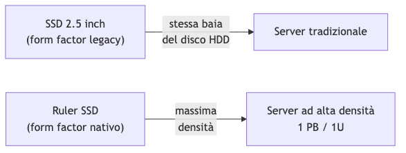
*Fig. — Confronto tra form factor legacy (2.5") e Ruler per storage solid state.*

Il ruler può essere installato con o senza dissipatore integrato: la versione con dissipatore (*wing*) è leggermente più spessa ma garantisce prestazioni termiche superiori. La stessa logica è già presente nei laptop sotto forma di moduli **M.2**, che sono essenzialmente dei ruler in miniatura.

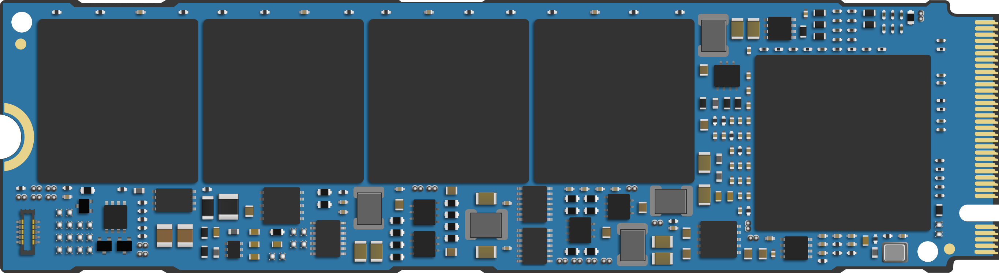
*Fonte: Wikimedia Commons — Un modulo SSD M.2: forma allungata identica al principio del Ruler, progettata per massimizzare la densità nei laptop.*

---

## Aggregare lo Storage: RAID e File System

### Riepilogo RAID

Il punto di partenza per costruire uno storage di livello datacenter è **aggregare più dischi fisici** in un'unità logica più capace e resiliente. La tecnologia alla base è il [[RAID]] (*Redundant Array of Inexpensive Disks*).

> [!warning] La perdita di dati è il peccato imperdonabile
>
> In un datacenter la perdita di dati è inaccettabile. Un utente può tollerare un'interruzione del servizio — il dato è irraggiungibile per un po', è fastidioso ma forgivable. Ma se il dato viene distrutto, la responsabilità legale e reputazionale è enorme. Ogni scelta architetturale sullo storage deve partire da questa premessa.

Il **RAID 6** è oggi la scelta più comune in ambito enterprise, perché permette di perdere un disco e **sostituirlo a caldo** (*hot swap*) mentre il sistema continua a operare, ricostruendo i dati in background. Con RAID 5, invece, la perdita di un disco richiede di portare offline lo storage per la ricostruzione.

Il costo dello storage in RAID non è solo il costo dei dischi fisici: include anche lo **spazio ridondante** necessario alla protezione, e tutta l'infrastruttura di gestione.

### File system e RAID

Una domanda ricorrente: aggregare più dischi via RAID richiede un file system speciale? La risposta è no. Su Linux, si può configurare RAID con **LVM** e formattare il volume risultante con un qualsiasi file system standard (ext4, XFS, ecc.). Il RAID opera a livello di blocco, trasparente al file system.

Tuttavia, se il sistema deve gestire **accessi altamente concorrenti** da molti processi paralleli — come in ambito HPC (*High Performance Computing*) — il file system standard diventa il collo di bottiglia. In quel caso si usano **file system paralleli**: GFS, GPFS, Lustre e simili, progettati per supportare concorrenza massiva. Per uso aziendale ordinario (document sharing, email) un file system standard è sufficiente.

---

## Servizi Richiesti allo Storage Moderno

Prima di scegliere un'architettura, è fondamentale capire quali servizi uno storage di livello datacenter deve offrire. Non si tratta solo di esporre blocchi su una rete.

### Deduplicazione

Se invio un allegato da 10 MB a 1000 persone nella stessa organizzazione, uno storage intelligente non conserva 1000 copie identiche: ne mantiene **una sola**, registrando solo i riferimenti. La deduplicazione riduce drasticamente lo spazio occupato, perché gli utenti tendono a duplicare i file molto più di quanto si pensi.

### Compressione

La compressione non serve solo a risparmiare spazio: i dati compressi sono più piccoli, quindi il trasferimento da disco a memoria richiede **meno I/O**. Anche con i moderni SSD veloci, la compressione migliora il throughput, con un piccolo overhead CPU per la decompressione. Il trade-off è quasi sempre favorevole alla compressione.

### Sicurezza

Uno storage enterprise deve offrire:
- **Encryption at rest**: i dati sono cifrati quando scritti sul disco, ma decifrati in memoria durante l'uso.
- **ACL** (*Access Control List*): controllo di accesso a livello di volume o file.
- **Secure erase**: quando un file viene cancellato, i blocchi vengono effettivamente sovrascritti per impedire recupero non autorizzato.

### Snapshot

Uno **snapshot** è una fotografia dello stato di un volume in un preciso istante. Se qualcosa va storto — un aggiornamento software rovinato, un ransomware, un errore umano — si può ripristinare il volume a quel punto esatto. Nei sistemi enterprise questa operazione avviene senza interrompere il servizio (tecnica copy-on-write).

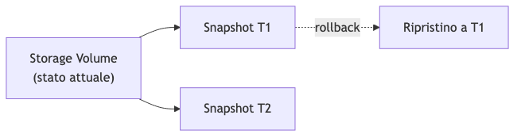
*Fig. — Meccanismo di snapshot: il volume può essere ripristinato a qualsiasi stato precedente catturato.*

Tutti questi servizi — deduplicazione, compressione, sicurezza, snapshot, e altri — rendono la gestione dello storage complessa. Per questo ha senso **centralizzare** lo storage, svincolarlo dai singoli server, e affidarlo a un sistema specializzato che li offra in modo uniforme a tutta l'infrastruttura.

---

## Storage Area Network (SAN)

### Architettura

La **SAN** (*Storage Area Network*) è l'architettura di storage più diffusa nei datacenter enterprise. L'idea è separare fisicamente lo storage dai server di calcolo e collegarli tramite una rete dedicata ad alte prestazioni.

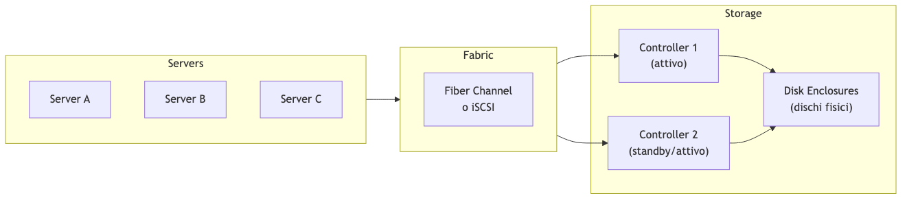
*Fig. — Architettura SAN: i server accedono allo storage tramite fabric dedicato verso controller ridondanti.*

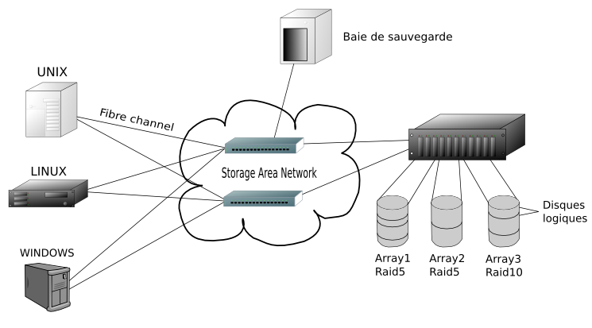
*Fonte: Wikimedia Commons — Esempio di architettura SAN con server, switch Fiber Channel e array di storage.*

I componenti chiave sono:

- **Fabric**: rete dedicata allo storage. Il protocollo tradizionale è **Fiber Channel** (FC), che trasporta blocchi di dati su fibra ottica. In alternativa si usa **iSCSI**, che incapsula il protocollo SCSI su Ethernet.
- **HBA** (*Host Bus Adapter*): scheda nel server che annuncia al sistema operativo un disco locale, anche se fisicamente quel disco si trova nello storage remoto. Per il SO è trasparente.
- **Controller**: il cervello dello storage. Riceve le richieste di blocchi dai server, gestisce la mappatura sui dischi fisici e restituisce i dati. Viene tipicamente duplicato (active/active o active/passive) per resistenza ai guasti.
- **Disk Enclosure**: lo chassis fisico che contiene i dischi, collegato ai controller.

### LUN — Logical Unit Number

Lo storage fisico viene "affettato" in unità logiche chiamate **LUN** (*Logical Unit Number*), o *logical units*. Una LUN è un disco virtuale: ha una certa dimensione, è mappata su blocchi fisici interni allo storage (sopra uno strato RAID), e viene esposta ai server come se fosse un disco locale.

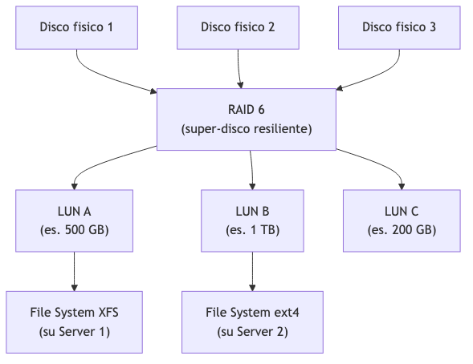
*Fig. — Gerarchia SAN: dai dischi fisici al RAID, dalle LUN ai file system sui server.*

### Vantaggi e limitazioni della SAN

Il vantaggio principale della SAN è la **centralizzazione**: un team dedicato gestisce tutto lo storage per l'intera infrastruttura, con backup, ridondanza e servizi avanzati in un solo punto.

> [!warning] Il collo di bottiglia con SSD ad alte prestazioni
>
> La SAN classica nasce con i dischi meccanici, dove la rete Fiber Channel era sempre più veloce del disco. Con gli SSD NVMe moderni, capaci di 16 GB/s ciascuno, l'equazione si capovolge: se si aggregano decine di SSD nello stesso storage, la banda del fabric diventa il collo di bottiglia. Questo ha spinto allo sviluppo di architetture alternative.

---

## NAS — Network Attached Storage

### Differenze fondamentali da SAN

La **NAS** (*Network Attached Storage*) adotta un approccio diverso: invece di esporre blocchi grezzi ai server, espone direttamente **file e directory** tramite protocolli di file system remoti.

| Caratteristica | SAN | NAS |
|---|---|---|
| Livello di astrazione | Blocchi (raw) | File e directory |
| Protocollo | Fiber Channel, iSCSI | NFS, SMB |
| Rete | Fabric dedicato | Rete Ethernet standard |
| File system | Gestito dal server | Gestito dallo storage |
| Memory mapping | Supportato | Non supportato |
| Latenza | Bassa | Media |

I due protocolli NAS più comuni sono:
- **NFS** (*Network File System*): standard Unix/Linux, ancora dominante nei datacenter.
- **SMB** (*Server Message Block*): nato in ambito Microsoft, oggi disponibile su tutte le piattaforme.

### Memory Mapping e perché conta

> [!definition] Memory Mapping
>
> Il *memory mapping* è una tecnica che sfrutta il meccanismo di paginazione della CPU: un file viene "mappato" nello spazio di indirizzamento del processo, e gli accessi ai byte del file vengono gestiti direttamente dalla MMU hardware come page fault. Il kernel carica automaticamente i blocchi necessari dal disco in memoria.

Il memory mapping è oggi dominante — Windows e Linux lo usano entrambi come base del loro I/O su file. È enormemente più efficiente rispetto alle API tradizionali (`open`/`seek`/`read`) per accessi casuali, perché sfrutta il supporto hardware anziché chiamate di sistema ripetute.

Ebbene, **il memory mapping funziona su SAN, ma non su NAS**. Un file system remoto NAS non supporta `mmap()`. Questo rende la SAN l'unica scelta per applicazioni che richiedono accesso casuale ad alta performance (database, algoritmi analitici, virtual machine).

### Quando usare NAS

La NAS è adatta per:
- **Backup** e archiviazione
- **Document store** (analoga a OneDrive/SharePoint interno)
- Qualsiasi workload con accesso prevalentemente sequenziale

> [!warning] Complessità di integrazione degli ACL
>
> Il principale problema pratico della NAS è integrare il modello di sicurezza: gli ACL del file system remoto devono essere mappati sull'identità degli utenti del dominio (LDAP, Active Directory). Quando coesistono più directory, la sincronizzazione diventa complicata e spesso genera limitazioni nel modello di permessi.

---

## Object Storage

### L'origine: il problema di Amazon

Circa quindici anni fa Amazon si trovò di fronte a un problema che SAN e NAS non sapevano risolvere: fornire storage a scala di **exabyte** a milioni di utenti e applicazioni contemporaneamente. Con le architetture tradizionali, aggiungere sempre più SAN e NAS aveva costi di gestione insostenibili e bottleneck di scalabilità.

La soluzione fu un nuovo paradigma: l'**object storage**.

### Cos'è l'object storage

L'object storage è un sistema di storage **distribuito**, orientato alle applicazioni, che espone i dati tramite una semplice API **HTTP/REST**. Ogni dato è un *oggetto* identificato da un **ID univoco** e opzionalmente corredato da metadati.

> [!definition] Object Storage
>
> Sistema di storage che rappresenta i dati come oggetti immutabili, identificati da un ID univoco, accessibili tramite REST API (tipicamente S3-compatible). Non esiste una gerarchia di cartelle, solo contenitori piatti chiamati **bucket**.

Non esistono cartelle annidate: solo **bucket** (contenitori flat) che raggruppano oggetti. L'organizzazione logica è responsabilità dell'applicazione, che tipicamente usa un database per tenere traccia degli ID degli oggetti.

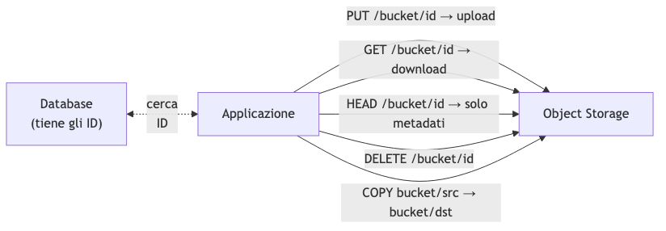
*Fig. — Le operazioni fondamentali dell'object storage S3: PUT, GET, HEAD, DELETE, COPY.*

### L'API S3

L'API standard de facto dell'object storage è **S3** (*Simple Storage Service*), proposta e implementata da Amazon. Le operazioni core sono:

- **PUT Object**: carica un oggetto in un bucket.
- **GET Object**: scarica l'intero oggetto. Non esiste `seek`: non si può richiedere un range di byte interno senza scaricare tutto.
- **DELETE Object**: elimina un oggetto.
- **HEAD Object**: recupera solo i metadati senza scaricare il payload — utile prima di decidere se scaricare un oggetto da gigabyte.
- **COPY Object**: copia un oggetto internamente allo storage, operazione che il sistema esegue in modo ottimizzato senza richiedere download + upload.

### Scalabilità tramite Consistent Hashing

Il problema di un object storage distribuito su molti nodi è: dato un ID oggetto, su quale server si trova? Mantenere un registro centralizzato (database) creerebbe un bottleneck immediato.

La soluzione adottata da implementazioni come **RIAK** (citato dal professore come esempio di object storage distribuito; l'attribuzione a GitHub non è verificata — RIAK è un key-value store distribuito di Basho Technologies usato da vari provider, ma non risulta essere il backend principale di GitHub) è il **consistent hashing**:

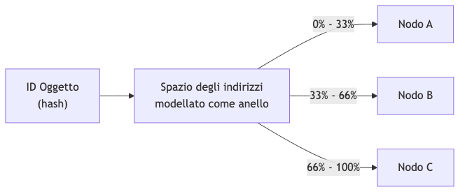
*Fig. — Consistent hashing: l'ID dell'oggetto viene mappato deterministicamente su un nodo senza consultare un registro centralizzato.*

Lo spazio degli indirizzi viene trattato come un anello circolare e diviso tra i nodi. Aggiungere un nodo richiede un algoritmo di **ribilanciamento**, ma una volta completato ogni client può determinare il nodo corretto direttamente dall'ID, senza interrogare alcun registry.

### Vantaggi, limiti e casi d'uso

| Caratteristica | Object Storage | NAS | SAN |
|---|---|---|---|
| Accesso | HTTP REST | NFS / SMB | Fiber Channel / iSCSI |
| Struttura | Flat (bucket) | Gerarchica (cartelle) | Blocchi grezzi |
| Scalabilità | Massiva (exabyte+) | Media | Media |
| Latenza | Alta (HTTP overhead) | Media | Bassa |
| Memory Mapping | No | No | Sì |
| Casi d'uso | Backup, media, IoT, ML datasets | Document share | VM disk, database |

L'object storage è la soluzione ideale per **healthcare** (archiviazione di scan e immagini diagnostiche: si scrive una volta, si rilegge integralmente, non si modifica), **media storage**, **backup**, e qualsiasi scenario con **scrittura massiva e lettura infrequente**.

> [!note] File system sull'object storage
>
> È possibile costruire un file system sopra l'object storage: gli oggetti diventano blocchi, e la struttura gerarchica viene implementata a livello applicativo. Questo permette di scalare fino a miliardi di oggetti, ma le prestazioni non sono paragonabili a un file system nativo su SAN.

---

## HCI — Hyperconverged Infrastructure

### Il problema con SAN e SSD ad alte prestazioni

Circa tredici anni fa, mentre la virtualizzazione VMware era al suo apice, si osservò un problema strutturale nella SAN classica: la topologia *a stella* (tutti i server connessi a un controller centrale) soffre di un collo di bottiglia fisico nel controller stesso. Con un solo head node da 8 porte da 400 Gbit/s, si ottengono al massimo 3.2 Tbit/s aggregati — e quando decine di SSD veloci sono dall'altro lato, quella capacità finisce subito.

La startup **Nutanix** propose un approccio radicalmente diverso.

### Il paradigma HCI

L'idea centrale è **trasporre la matrice**: invece di separare compute, storage e network in strati orizzonali, si costruiscono **nodi** che contengono un po' di tutto. Ogni nodo è un server standard con CPU, RAM, dischi locali e schede di rete. Il software li fa sembrare una SAN.

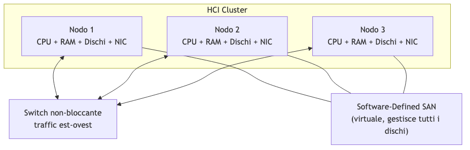
*Fig. — HCI: i nodi collaborano via switch per formare una SAN virtuale software-defined.*

Il **software HCI** (Nutanix AOS, VMware vSAN, Microsoft Storage Spaces Direct) aggrega i dischi di tutti i nodi in un unico pool storage, esponendolo come una SAN tradizionale alle virtual machine.

### Prestazioni: il vantaggio della locality

Il guadagno principale dell'HCI è la **data locality**: il software può collocare il disco virtuale di una VM sullo stesso nodo fisico che esegue quella VM. L'accesso va sul bus PCIe locale — non attraversa nessuna rete — il che consente di sfruttare tutto il bandwidth di un NVMe locale (decine di GB/s).

> [!tip] Traffico est-ovest
>
> In HCI la replica dei dati genera traffico *est-ovest* (nodo → nodo), non *nord-sud* (server → controller centrale). Grazie agli switch non-bloccanti dei datacenter moderni, questo traffico non interferisce tra nodi diversi — se N1 replica su N2, N3 non è disturbato.

### Resilienza: replication factor

Se un nodo cade, i dati che vi risiedevano non devono andare persi. La soluzione è il **replication factor**:

- Con RF=2: ogni blocco scritto localmente viene replicato anche su un secondo nodo.
- Con RF=3: replicato su altri due nodi (perdita di qualsiasi nodo è tollerata).

La scrittura funziona così: il nodo locale scrive sul proprio disco, poi trasmette i dati al nodo remoto. Quando il nodo remoto conferma che i dati sono in memoria (non necessariamente scritti su disco), il writer viene sbloccato. Questo permette latenze di scrittura competitive con la SAN.

> [!warning] Costi di licensing
>
> Tecnicamente, HCI è l'architettura con le migliori prestazioni assolute oggi disponibile. Purtroppo, i vendor (Nutanix, VMware vSAN, Microsoft Storage Spaces Direct) applicano licenze molto costose, che spesso fanno riemergere la convenienza delle SAN tradizionali per molti contesti.

### Scale-up vs Scale-out

> [!definition] Scale-up e Scale-out
>
> **Scale-up** (*vertical scaling*): si aumenta la capacità di un singolo nodo aggiungendo risorse (più RAM, più dischi). Limite fisico: prima o poi il nodo non può crescere ulteriormente.
>
> **Scale-out** (*horizontal scaling*): si aggiungono nodi al cluster. La capacità aggregata aumenta linearmente. HCI è un'architettura scale-out.

Con HCI, aggiungere un nodo al cluster aumenta simultaneamente compute, storage e network bandwidth in modo proporzionale e senza colli di bottiglia centrali.

---

## Servizi Avanzati della SAN Enterprise

Sia che si usi una SAN fisica tradizionale o un HCI software-defined, il set di servizi gestiti è simile. Vediamoli nel dettaglio.

### Thin Provisioning

Quando si alloca una LUN da 2 TB a un utente, costui la percepisce come un disco da 2 TB. Ma nella realtà, il sistema può **allocare fisicamente solo una porzione** (es. 200 GB), espandendo lo spazio fisico riservato man mano che il dato cresce.

> [!example] Thin provisioning in pratica
>
> Il prof. Cisternino racconta di un progetto universitario per un database di scan botanici. Stima iniziale: 75 TB. A distanza di dieci anni, usano ancora meno di 10 TB. Grazie al thin provisioning, i ricercatori hanno ricevuto 75 TB logici ma il sistema ha fisicamente allocato solo lo spazio effettivamente usato, risparmiando decine di migliaia di euro in storage.

Il rischio è l'**overcommitment**: se si promettono 4 TB quando se ne hanno 2 fisici e gli utenti li riempiono tutti, il sistema va in crisi. È necessario monitorare l'utilizzo reale e agire prima che lo spazio fisico finisca.

> [!note] Overcommitment reale
>
> Nel cluster HCI dell'Università di Pisa, 725 VM credono di avere 1.5 PB di storage. Fisicamente il cluster ha circa 1 PB. Questo è un esempio reale di thin provisioning e overcommitment in produzione.

### Multipath I/O

Il multipath connette un server allo storage tramite **più percorsi paralleli** (più fibre ottiche, più HBA). I vantaggi sono:

- **Ridondanza**: se un percorso si guasta, il traffico viene automaticamente indirizzato sugli altri.
- **Bandwidth aggregato**: i percorsi possono essere bilanciati per moltiplicare la banda disponibile.

Con gli SSD NVMe moderni da 16 GB/s ciascuno, il multipath è quasi indispensabile: un singolo link da 100 Gbit/s (~12 GB/s) non basta a saturare un solo SSD.

### Zoning e LUN Masking

Questi due meccanismi implementano il **controllo degli accessi** a livello di storage:

- **Zoning**: definito nel fabric (switch Fiber Channel), determina quali server possono "vedere" quali parti dello storage. È una configurazione di rete: questo WWN (World Wide Name, l'identificatore del server) può comunicare con questo target.
- **LUN Masking**: definito nel controller dello storage, determina quale LUN specifica è esposta a quale server. Anche se il server vede lo storage (per via dello zoning), potrebbe vedere solo alcune LUN.

### Snapshot, Clone e Replicazione

**Snapshot**: fotografia point-in-time di una LUN. Implementato tipicamente con copy-on-write: la snapshot è inizialmente vuota e registra solo i blocchi che cambiano dopo la sua creazione, occupando pochissimo spazio inizialmente.

**Clone**: copia completa e indipendente di una LUN. Utile per testare un aggiornamento critico: si clona la LUN di produzione, si esegue l'aggiornamento sul clone, e se tutto funziona si promuove il clone a produzione.

**Replicazione**: copia dei dati verso un secondo sito geografico. Fondamentale per il **disaster recovery**. Esistono due modalità:

- **Sincrona**: ogni scrittura è confermata solo quando è stata scritta su entrambi i siti. Nessuna perdita di dati, ma latenza aggiuntiva = limite di distanza.
- **Asincrona**: le scritture vengono replicate con un certo ritardo. Nessun impatto sulle prestazioni, ma in caso di disastro si perde l'ultima finestra temporale.

### Metro Cluster

Un **metro cluster** estende un cluster attivo-attivo tra **due datacenter geograficamente vicini**. La soglia di circa **300 km / <15 ms** citata dal professore è una linea guida di vendor (Nutanix, VMware vSAN) per i loro algoritmi di clustering sincrono, non un limite fisico: la latenza fisica su fibra a 300 km è ~3 ms round-trip, ma i protocolli applicano threshold più conservativi. Gli algoritmi di clustering non si accorgono che i nodi sono in edifici separati: vedono solo la latenza di rete aggiuntiva, che rimane tollerabile.

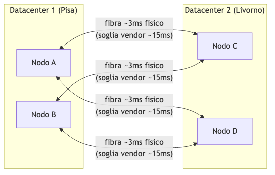
*Fig. — Metro cluster: i nodi del cluster sono distribuiti su due datacenter distinti ma vicini geograficamente.*

Oltre i 300 km (es. Milano-Napoli), la latenza supera la soglia tollerabile per i protocolli sincroni. In quel caso si usa la replicazione asincrona: si perde un po' di dati in caso di disastro, ma almeno il sito remoto ha una copia recente.

### Tiering e Caching

**Tiering**: lo storage viene diviso in livelli (*tier*) con caratteristiche diverse. I dati *caldi* (frequentemente acceduti) stanno su SSD, i dati *freddi* (raramente acceduti) su HDD. Il sistema **sposta automaticamente** i dati tra i tier in base ai pattern di accesso (*auto-tiering*).

**Caching**: i dati più caldi possono essere tenuti in **RAM** del controller, eliminando completamente la latenza di accesso al disco per le operazioni ripetute.

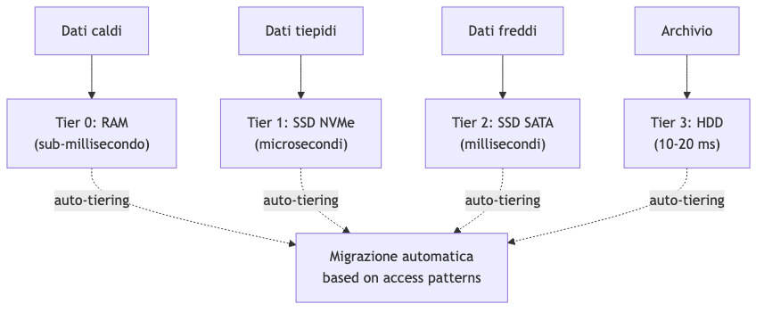
*Fig. — Gerarchia di tiering: i dati migrano automaticamente verso il tier più adatto in base alla frequenza di accesso.*

### Quality of Service (QoS)

La SAN può assegnare **priorità diverse** a LUN diverse: in un momento di contesa, i blocchi della LUN A (database critico) vengono serviti prima di quelli della LUN B (backup). Questo evita che un processo I/O-intensivo (es. backup notturno) degradi le prestazioni di un servizio di produzione.

### Sicurezza

- **Encryption at rest**: i dati vengono cifrati prima di essere scritti sui dischi. In memoria operativa sono in chiaro. Se un disco viene fisicamente sottratto, i dati sono illeggibili.
- **Secure erase**: quando uno spazio viene liberato, i blocchi vengono sovrascritti per prevenire recupero non autorizzato di dati residui.
- **Access control e autenticazione**: integrazione con sistemi di identità per controllare chi può accedere a quali LUN.
- **Data integrity**: checksum dei blocchi per rilevare corruzioni silenti.

---

## Scelta dell'Architettura: non esiste "la migliore"

> [!warning] Non esiste un'architettura universalmente superiore
>
> SAN, NAS, Object Storage e HCI hanno ciascuno casi d'uso ottimali. La scelta dipende sempre dal bilanciamento di performance, scalabilità, costo e natura del workload.

| Scenario | Architettura consigliata |
|---|---|
| VM in produzione con accessi random intensi | SAN o HCI |
| Molte VM, budget limitato, buone prestazioni | HCI (se licensing sostenibile) |
| Document store, backup, OneDrive aziendale | NAS |
| Archiviazione massiva (scan medici, dataset ML) | Object Storage (S3) |
| Big data, HPC, accessi paralleli | File system parallelo (Lustre, GPFS) |
| Disaster recovery geograficamente distribuito | Replicazione asincrona SAN |
| Ridondanza metropolitana (stesso provider) | Metro cluster |

> [!example] Dimensionamento: calcolo back-of-envelope
>
> Scenario: ingestire 1 TB/s di dati da sensori.
> - Un server con NIC da 100 Gbit/s = ~12 GB/s di banda in ingresso.
> - Per sostenere 1 TB/s: 1000/12 ≈ 84 server.
> - Con 100 server si ha margine sufficiente.
> - I server processano localmente e inviano il risultato alla SAN centrale.
> Non è necessario che tutta la banda in ingresso passi per la SAN — si fa buffer locale e trasferimento asincrono.

---

## Caso Reale: il Cloud Privato dell'Università di Pisa

Il prof. Cisternino ha mostrato l'infrastruttura reale del datacenter UniPi come esempio concreto:

- **2 cluster HCI ibridi** (acquisiti ~2019): storage con tier SSD + HDD, con auto-tiering automatico.
- **1 cluster HCI all-flash** (più recente): tutto solid state, CPU più moderne, densità circa tre volte superiore rispetto ai cluster del 2019 — dimostrazione dell'andamento del costo dei dischi nel tempo.
- **Server NAS per cold storage**: circa 1 petabyte di hard disk meccanici per archiviazione a lungo termine.
- **Nessun Fiber Channel**: l'infrastruttura usa iSCSI su Ethernet ad alte prestazioni.

> [!example] Overcommitment in produzione
>
> Il cluster HCI gestisce **725 virtual machine**. Le VM credono collettivamente di avere **1.5 petabyte** di storage. Il cluster ha fisicamente circa **1 petabyte**. Il thin provisioning permette questo overcommitment perché la maggior parte delle VM non usa tutto lo spazio che le è stato assegnato.

---

```{=latex}
\newpage
```

# Storage Avanzato e Introduzione al Compute

La lezione riprende dal tema dello storage per completare alcuni concetti rimasti aperti, introduce due nuove forme di storage emergenti legate all'AI, approfondisce le metriche di performance e resilienza dei dati, e apre il terzo grande pilastro del datacenter: il compute.

---

## Specializzazione hardware per workload

Prima del 2008 circa, il paradigma dominante era quello del server generico: si comprava hardware e poi si decideva quale workload farci girare. Questo approccio era sostenibile finché tutti i carichi di lavoro erano sufficientemente simili. A partire dall'era della virtualizzazione, e poi con il big data (intorno al 2013), ci si è resi conto che **le prestazioni reali si ottengono solo specializzando l'hardware al workload**.

Questa evoluzione vale per tutti i livelli dello stack: a livello di storage, i vendor iniziarono a differenziare le proprie offerte per workload specifici — per il big data, ad esempio, i dischi SATA da alta capacità diventarono preferibili ai dischi SAS più veloci ma costosi, perché quel workload privilegia il rapporto capacità/prezzo rispetto alla latenza unitaria. A livello di CPU, i produttori oggi offrono configurazioni diverse dello stesso die, ottimizzate per high-frequency single-thread oppure per il throughput parallelo massivo.

Questa specializzazione si riflette anche nelle architetture di storage: SAN, NAS, HCI e object storage non sono intercambiabili, ma rispondono in modo ottimale a classi di workload ben definite.

---

## Nuove forme di storage

### Stream-based storage

Il progetto **Nautilus** di Dell/EMC introdusse il concetto di *stream-based storage*: uno strato di persistenza pensato specificamente per flussi di dati derivanti da sensori IoT. Un flusso IoT è strutturalmente diverso da uno stream video: non trasmette fotogrammi sequenziali di un'unica sorgente, ma campiona nel tempo lo **stato del mondo** (temperatura, pressione, corrente) da molti dispositivi in parallelo.

L'interesse computazionale di questo modello non è necessariamente l'intera serie storica, ma spesso la misura corrente o aggregazioni su finestre temporali. Il problema del *store-and-forward* tradizionale è che produce copie multiple dello stesso dato lungo la catena di nodi, senza una politica chiara di ownership. Nautilus risolveva questo garantendo che, in qualsiasi istante, ogni informazione esistesse **in un'unica copia** nella rete di storage, con un modello computazionale coerente sopra i flussi.

Il progetto non ha avuto un grande successo commerciale, ma l'ecosistema open source ha risolto il problema in modo più pragmatico con framework come **Apache Kafka** e simili. Il principio di base — *store, process, forward* applicato a dati di serie temporali — è comunque centrale nella gestione di workload IoT e di edge computing.

### Vector database

I **vector database** sono la forma di storage più rilevante emersa negli ultimi anni, diretta conseguenza della diffusione dell'AI generativa.

La ricerca testuale era già storicamente basata su vettori: dal modello *bag of words* degli anni '90, ogni documento veniva rappresentato come un vettore nello spazio delle parole, con una dimensione per ogni termine del vocabolario. La similarità tra un documento e una query si calcolava con la **distanza coseno** tra i rispettivi vettori — base del funzionamento di motori di ricerca come Google. Il limite fondamentale di questo approccio è la sua natura *sintattica*: la parola "Python" produce lo stesso vettore indipendentemente dal contesto, rendendo impossibile distinguere il serpente dal linguaggio di programmazione.

> [!definition] Embedding
>
> Un **embedding** è un vettore denso ad alta dimensionalità prodotto dalla prima parte di una rete neurale di un Large Language Model. A differenza dei vettori bag-of-words (sparsi, binari), un embedding cattura la **rappresentazione semantica** del testo nel suo contesto. L'embedding di "Python" sarà diverso a seconda che la parola appaia in un contesto di programmazione o zoologico, perché la rete ha appreso la semantica durante il training.

OpenAI produce embedding di **3000 dimensioni** con valori floating-point, uno spazio semantico molto ricco rispetto ai vettori classici. Un risultato scientifico notevole (Cornell University) ha dimostrato che esiste una **funzione di conversione** tra gli embedding di modelli diversi: modelli addestrati su dati differenti tendono a produrre rappresentazioni dello stesso significato che sono mappabili l'una nell'altra, a meno di una trasformazione lineare. Questo suggerisce l'esistenza di uno spazio latente universale del significato, e giustifica l'investimento in architetture basate su embedding indipendentemente dal modello specifico.

Un **vector database** combina la flessibilità dei database NoSQL (collezioni di oggetti eterogenei, senza schema rigido) con la capacità di indicizzare gli oggetti tramite i loro embedding e di rispondere a query semantiche trovando i vettori più vicini nello spazio ad alta dimensionalità.

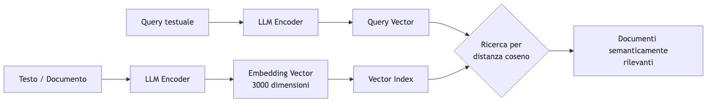
*Fig. — Pipeline di un vector database: i documenti vengono indicizzati tramite embedding, e le query vengono risolte per similarità semantica nello spazio vettoriale.*

> [!tip] RAG — Retrieval Augmented Generation
>
> La tecnica **RAG** (Retrieval Augmented Generation) è l'architettura dominante dei sistemi AI moderni. Quando l'utente invia un prompt, il sistema esegue prima una ricerca semantica su un database di documenti (tramite vector search), inserisce i testi più rilevanti nel contesto della richiesta, e solo poi il modello genera la risposta. Questo riduce drasticamente le *allucinazioni*: secondo lo Stanford AI Index, anche i modelli migliori producono informazioni false nel 30% dei casi in modalità pura; il RAG riduce questo problema ancorando la risposta a dati verificati.

L'impatto sul datacenter è concreto: i sistemi di storage moderni (come VAS DATA) stanno integrando capacità di esecuzione di reti neurali per computare embedding direttamente durante l'ingestion dei dati. Lo storage non è più solo un luogo dove i dati risiedono passivamente, ma una componente attiva capace di costruire rappresentazioni semantiche e rispondere a ricerche intelligenti.

---

## Misure di performance dello storage: IOPS

**Latenza** e **bandwidth** sono metriche insufficienti da sole per caratterizzare le prestazioni di uno storage, perché dipendono fortemente dal pattern di accesso.

> [!definition] IOPS
>
> **IOPS** (Input/Output Operations Per Second) è il numero di operazioni di I/O che uno storage riesce a completare in un secondo. Non è una metrica assoluta: va sempre accompagnata dal tipo di accesso (sequenziale o casuale), dalla dimensione del blocco, dal numero di thread concorrenti e dal numero di code.

Il motivo della necessità di IOPS come metrica separata è intuitivo: uno storage ottimizzato per leggere file video in streaming (dove l'obiettivo è saturare la pipeline con dati contigui, con prefetching aggressivo) si comporta in modo radicalmente diverso da uno storage che serve il paging della memoria (accessi casuali a blocchi di 4 KB). Se si misura solo la bandwidth in quest'ultimo caso, si ottiene un valore molto inferiore rispetto a una lettura sequenziale dello stesso storage.

> [!tip] Analogia del supermercato
>
> - **IOPS** = clienti serviti al secondo
> - **Latenza** = tempo di servizio per cliente
> - **Code** = clienti in attesa
> - **Parallelismo** = numero di casse aperte
>
> L'analogia spiega perché con una singola coda e un singolo cassiere, il throughput è esattamente `1 / latenza`. Con più casse in parallelo, il throughput scala.

La relazione matematica fondamentale con una singola coda è:

$$\text{IOPS} \approx \frac{1}{\text{latenza}}$$

Con più code o thread, il throughput scala proporzionalmente. Esempi pratici:
- HDD meccanico (latenza ~5 ms): ~200 IOPS per coda
- NVMe SSD (latenza ~20 μs): ~50.000 IOPS per coda

Lo storage è intrinsecamente asincrono: la CPU emette un'operazione di lettura e viene sbloccata mentre l'operazione è in corso, permettendo l'interleaving di più richieste da un singolo thread tramite code multiple.

---

## Perdita di dati e resilienza

### Tipologie di data loss

Concentrarsi solo sul guasto hardware come causa di perdita dati è un errore comune. Le cause reali includono:

| Causa | Descrizione | Contromisura |
|---|---|---|
| Guasto hardware | Disco rotto, controller danneggiato | RAID, replica |
| Corruzione software | Bug che sovrascrive dati validi | Checksum, backup |
| Errore umano | File cancellati per sbaglio, misconfiguration | Backup, snapshot |
| Ransomware/crittografia | Dati cifrati da malware | Backup offline, snapshot |
| Perdita di chiavi crittografiche | BitLocker/encryption senza backup della chiave | Key management |

L'**errore umano** è statisticamente la prima causa di perdita dati, largamente superiore a hardware e software combinati. Un sistema di storage con replica perfetta non protegge da una cancellazione accidentale: la cancellazione viene immediatamente replicata.

### Replica vs Backup

La **replica** è una copia sincrona o asincrona dei dati su un secondo storage, pensata per garantire disponibilità in caso di guasto hardware. Il suo limite strutturale è che è una copia *live* dello stato corrente: qualsiasi corruzione o cancellazione si propaga istantaneamente alla replica. La replica non protegge da errori logici.

Il **backup** è invece una copia *puntuale nel tempo* dei dati, conservata separatamente. Permette di ripristinare lo stato precedente a un evento di corruzione o cancellazione. Il backup è indispensabile indipendentemente dal livello di ridondanza dello storage.

### Data breach secondo il GDPR

> [!warning] Il GDPR definisce tre pilastri della sicurezza dei dati
>
> Un **data breach** non è solo la perdita di confidenzialità (dati pubblicati o rubati). Il GDPR riconosce tre forme di violazione, ciascuna con implicazioni legali:
> 1. **Confidenzialità**: dati accessibili a soggetti non autorizzati
> 2. **Disponibilità**: storage offline, dati irraggiungibili quando necessari
> 3. **Integrità**: dati corrotti o modificati in modo non autorizzato
>
> Un sistema che non può garantire la disponibilità dei propri dati è soggetto a sanzioni esattamente come uno che subisce una fuga di informazioni.

### RPO e RTO

> [!definition] RPO — Recovery Point Objective
>
> L'**RPO** definisce la quantità massima di dati che si è disposti a perdere in caso di failure, misurata in tempo. Un backup giornaliero implica un RPO di 24 ore: in caso di incidente, si possono perdere fino a un giorno di modifiche. L'RPO non può essere zero: se un software malevolo corrompe i dati attivamente, anche i backup frequenti conterranno dati corrotti a partire da un certo punto.

> [!definition] RTO — Recovery Time Objective
>
> L'**RTO** definisce il tempo massimo tollerabile di downtime durante un ripristino. Ripristinare un petabyte di dati può richiedere più di un giorno anche con la migliore infrastruttura: questo deve essere considerato nella progettazione del backup (più grande è il backup unitario, maggiore è l'RTO).

La scelta dell'RPO è un bilanciamento economico: backup più frequenti costano di più (bandwidth, storage, CPU). In certi casi il costo della compliance supera il costo della sanzione, e l'organizzazione sceglie consapevolmente di accettare un RPO meno stringente. Questa è una decisione di risk management, non tecnica.

L'RPO e l'RTO si combinano con le politiche di replica: se si dispone già di replica sincrona, il rischio residuo si riduce agli scenari in cui entrambe le copie vengono perse simultaneamente, rendendo l'RPO rilevante solo per quegli scenari estremi.

### Backup differenziale

Per gestire il costo del backup su dataset di grandi dimensioni, si usa il **backup differenziale**:

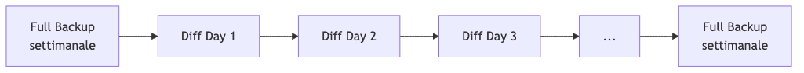
*Fig. — Schema di backup differenziale: un full backup periodico viene completato da backup incrementali giornalieri che conservano solo i blocchi modificati.*

Il ripristino richiede di applicare in sequenza il full backup e tutti i diff successivi fino al punto desiderato, aumentando la complessità ma riducendo drasticamente il volume di dati trasferiti.

---

## Snapshot dello storage

Lo snapshot è una delle tecniche più potenti e versatili della gestione dello storage.

### Meccanismo Copy-on-Write

> [!definition] Snapshot (Copy-on-Write)
>
> Uno **snapshot** è una fotografia logica dello stato di un volume in un istante preciso, ottenuta senza copiare fisicamente i dati. Il meccanismo utilizzato è il **Copy-on-Write (COW)**: al momento dello snapshot, si registra semplicemente la mappatura corrente tra blocchi logici e blocchi fisici. Quando una scrittura successiva modifica un blocco, il nuovo dato viene scritto in un blocco fisico *nuovo*, mentre il blocco originale rimane intatto e viene referenziato dallo snapshot.

Il funzionamento passo per passo:

1. Volume logico: blocchi A, B, C, D → mappati ai blocchi fisici A, B, C, D
2. Si crea snapshot S1: S1 registra la mappatura A→A, B→B, C→C, D→D
3. Si modifica il blocco B: il nuovo contenuto viene scritto in B' (blocco fisico nuovo)
4. Il volume corrente punta a A, B', C, D; lo snapshot S1 punta ancora a A, B, C, D

In questo modo, con un minimo overhead di metadati, si mantengono due versioni logiche del volume condividendo i blocchi non modificati.

> [!tip] Casi d'uso pratici
>
> - **Aggiornamenti sicuri**: prima di un upgrade del database, si prende uno snapshot. Se l'upgrade fallisce, si ripristina istantaneamente lo stato precedente.
> - **Backup senza interruzione**: invece di fermare il database per fare il backup, si prende uno snapshot (operazione istantanea), e il sistema di backup copia i dati dallo snapshot mentre il database continua a operare.
> - **Test di aggiornamenti**: si crea un disco differenziale, si prova il cambiamento, e si scarta il diff se non soddisfacente.

> [!warning] Effetto sullo spazio disponibile
>
> Con snapshot attivi, la dimensione logica del volume non riflette più lo spazio fisico effettivamente disponibile: i blocchi referenziati dagli snapshot non possono essere considerati liberi. Se il 75% dei blocchi viene riscrit­to dopo uno snapshot, la dimensione fisica effettiva diventa 1,75 volte quella logica. Per questo motivo è sconsigliato mantenere snapshot per periodi prolungati, e lo storage può esaurirsi inaspettatamente.

### Esempi in sistemi reali

Il concetto di snapshot permea già i sistemi operativi comuni senza che gli utenti ne siano consapevoli:

- **Windows Shadow Volume Copy (VSS)**: permette il backup di file in uso (normalmente bloccati da Windows) creando uno snapshot del volume, copiando dall'istantanea mentre l'applicazione continua a scrivere sulla copia live
- **macOS Time Machine**: utilizza lo spazio libero del disco per mantenere snapshot automatici del filesystem, permettendo di "tornare nel tempo" a versioni precedenti dei file

### Backup application-consistent vs crash-consistent

Un backup può essere:

- **Crash-consistent**: si fotografa lo storage così com'è in un dato momento, senza sincronizzarsi con le applicazioni in esecuzione. I dati in memoria non ancora scritti su disco vengono persi. Al ripristino, il sistema si comporta come se avesse subito un crash improvviso, e le applicazioni applicano i loro meccanismi di recovery (WAL, journal). Accettabile per la maggior parte dei workload.
- **Application-consistent**: l'applicazione (tipicamente un DBMS) viene notificata prima del backup, esegue un flush dei dati in-memory su disco, segnala allo storage di procedere con l'acquisizione in uno stato consistente. Garantisce una copia perfettamente integra al costo di maggiore complessità di coordinamento.

La strategia più comune è combinare i due approcci: crash-consistent per le virtual machine generiche, application-consistent solo per i database.

---

## Introduzione al Compute

La lezione introduce brevemente il terzo pilastro del datacenter, che verrà approfondito nelle lezioni successive.

### La fine della scalabilità lineare del singolo core

Per quasi 40 anni, la **Legge di Moore** ha garantito che il numero di transistor raddoppiasse ogni due anni, producendo una progressione esponenziale delle prestazioni computazionali. Questo ha reso possibile l'AI moderna: i modelli neurali erano teoricamente noti dal 1989 (backpropagation), ma la quantità di dati e potenza computazionale necessaria per addestrarli su scala era semplicemente indisponibile.

A un certo punto, la scalabilità del singolo core si è stabilizzata: aumentare la frequenza di clock oltre certi limiti fisici diventa impossibile. La risposta dell'industria è stata la **replicazione**:

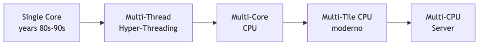
*Fig. — Evoluzione della gerarchia di replicazione computazionale: ogni livello replica l'unità precedente per aumentare il parallelismo gestendo la complessità a un livello di astrazione più alto.*

Il concetto di **tile** è il più recente: un tile è un blocco di core completo (con cache, controller, etc.) che può essere replicato sul die come un componente standard, riducendo la complessità di progettazione del fabric on-chip e permettendo configurazioni diverse dello stesso prodotto semplicemente variando il numero di tile.

### Economia della produzione di chip

La produzione di ASIC ha un'economia particolare: il costo fisso di progettazione e realizzazione dei mask è elevatissimo (milioni di dollari), e il software EDA per generare il layout dei transistor a partire dal Verilog costa ~$1M/anno di licenze. Il punto di breakeven si aggira sui 2 milioni di pezzi venduti. Questo spiega perché solo pochissimi attori possono permettersi di produrre chip custom, e perché i chip general-purpose come le CPU rimangono dominanti nonostante l'efficienza degli ASIC dedicati.

> [!note] Prossime lezioni
>
> Il ciclo sul compute continuerà con: architetture CPU e GPU in dettaglio, sistemi blade vs rack, formato OCP (Open Compute Project), layout delle schede madri server, e il perché queste scelte architetturali esistono.

---

```{=latex}
\newpage
```

# Architettura Compute: CPU, GPU e NPU

La lezione precedente aveva introdotto il tema del compute come terzo pilastro del datacenter, partendo dall'evoluzione della Legge di Moore e dalla necessità di replicare le unità computazionali in risposta ai limiti fisici del singolo core. In questa lezione si approfondisce l'architettura interna dei processori moderni — CPU, GPU e NPU — analizzando le scelte di progetto che ne determinano le prestazioni. Si introduce anche il contesto di sostenibilità energetica che vincola e orienta queste scelte a livello infrastrutturale.

---

## Sostenibilità Energetica dei Datacenter

### Il Report Annuale di Settore 2025

Uno dei temi di apertura della lezione riguarda il peso ambientale dei datacenter. Il settore pubblica ogni anno report che misurano il consumo energetico globale, l'impronta carbonica e l'utilizzo delle risorse idriche. I dati 2025 confermano un trend preoccupante: il consumo elettrico dei datacenter è in crescita esponenziale, trainato principalmente dalla diffusione dell'AI generativa, che richiede cluster di GPU sempre più grandi per l'addestramento e l'inferenza dei modelli.

Il consumo energetico va analizzato su due fronti distinti. Il primo è il costo dell'elettricità in sé, che incide direttamente sulla sostenibilità economica delle operazioni. Il secondo è l'**impronta carbonica**: un datacenter alimentato da fonti rinnovabili può avere lo stesso consumo in kWh di uno alimentato da carbone, ma un impatto sul clima radicalmente diverso. I grandi cloud provider comunicano i propri obiettivi di carbon neutrality, ma la metrica rilevante non è il consumo lordo bensì il **carbon intensity** dell'energia acquistata, che varia enormemente a seconda della zona geografica e dell'ora del giorno.

> [!note] Power Usage Effectiveness (PUE)
>
> Il **PUE** (Power Usage Effectiveness) è il rapporto tra l'energia totale consumata dal datacenter e quella assorbita dai soli apparati IT. Un PUE di 1,0 è il valore ideale (tutta l'energia va ai server); i datacenter moderni si attestano intorno a 1,2–1,4. I datacenter meno efficienti superano 2,0, il che significa che per ogni watt di computing si spreca più di un watt in overhead (soprattutto raffreddamento).

### Evaporazione dell'Acqua e WUE

Un tema emergente nei report 2025 riguarda il consumo idrico. I sistemi di raffreddamento a torre evaporativa — i più diffusi nei datacenter di grandi dimensioni — dissipano il calore attraverso l'**evaporazione dell'acqua**: il calore viene trasferito all'acqua, che evapora nell'atmosfera portando via l'energia termica. Questo processo è efficiente dal punto di vista energetico (basso consumo elettrico della torre) ma ha un costo idrico reale: un datacenter di grandi dimensioni può consumare milioni di litri d'acqua al giorno.

La metrica corrispondente è il **WUE** (Water Usage Effectiveness), analogo al PUE per l'acqua: litri d'acqua consumati per kWh di energia IT erogata. I report 2025 segnalano che, con il diffondersi di sistemi di raffreddamento a liquido più efficienti (liquid cooling diretto sui chip), il WUE sta migliorando nei nuovi datacenter, ma il parco installato resta prevalentemente a raffreddamento evaporativo. La tendenza è verso un bilanciamento tra PUE e WUE: ottimizzare solo il consumo elettrico del raffreddamento può significare scaricare il costo sull'acqua.

> [!tip] Sostenibilità come vincolo di progetto
>
> I grandi operatori di datacenter stanno incorporando PUE, WUE e carbon intensity tra i criteri di selezione del sito e di progettazione dell'impianto, non come requisiti facoltativi ma come vincoli contrattuali verso i clienti enterprise che hanno propri obiettivi di sostenibilità (scope 3 emissions).

---

## Architettura della CPU Moderna

### La Gerarchia di Cache

Per comprendere l'architettura interna di una CPU moderna, il punto di partenza è la **gerarchia di memoria**. L'accesso alla RAM principale ha latenze dell'ordine dei 60–100 ns — un'eternità per un processore che completa operazioni ogni nanosecondo. La soluzione è una cascata di cache on-chip, ognuna più lenta ma più grande della precedente:

| Livello | Latenza tipica | Dimensione tipica | Condivisione |
|---|---|---|---|
| Registro | < 1 ciclo | pochi byte | privato al core |
| L1 (dati + istruzioni) | ~4 cicli | 32–64 KB | privato al core |
| L2 | ~12 cicli | 256 KB – 1 MB | privato al core |
| L3 (LLC) | ~40 cicli | 8–256 MB | condiviso tra core |
| RAM | ~200 cicli | GB–TB | condivisa tra socket |

La L3 è condivisa e rappresenta il principale punto di contesa tra i core: ogni core che accede a dati non in L1/L2 deve attraversare l'interconnessione intra-chip per raggiungere la L3 o la memoria.

### La Crossbar: Interconnessione Intra-Chip

Il problema dell'interconnessione tra core diventa critico quando si scala a decine o centinaia di core sullo stesso die. L'approccio più semplice — un **bus condiviso** — non scala: solo un master alla volta può trasmettere, e con molti core il bus diventa immediatamente un collo di bottiglia.

La soluzione adottata nelle CPU server moderne è la **crossbar** (o *crossbar switch*): un'interconnessione a matrice che permette comunicazioni simultanee e indipendenti tra qualsiasi coppia sorgente–destinazione. Concettualmente, è come un centralino telefonico: più chiamate possono essere instradata contemporaneamente purché non condividano né la sorgente né la destinazione.

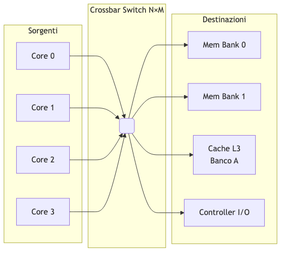
*Fig. — Schema di una crossbar N×M: ogni core può comunicare simultaneamente con qualsiasi destinazione, senza contesa, purché le coppie attive siano disgiunte.*

La crossbar garantisce **banda di bisection completa**: se ci sono N sorgenti e M destinazioni, la crossbar ha N×M incroci, ognuno un piccolo switch che viene attivato o meno. La complessità cresce come O(N×M), il che diventa molto costoso in area di silicio per N e M grandi. Per questo i progettisti di chip moderni spesso usano varianti intermedie — mesh 2D, ring bus, fabric gerarchici — che offrono un compromesso tra prestazioni e area occupata.

> [!example] Infinity Fabric di AMD
>
> AMD EPYC utilizza l'**Infinity Fabric** come interconnessione principale tra i die (chiplet) che compongono il processore. All'interno di ogni chiplet il fabric ha caratteristiche di crossbar; tra chiplet diversi opera come una rete a pacchetti ad alta velocità. Questo permette di assemblare CPU con molti core replicando die più piccoli e collaudabili, riducendo i costi di produzione.

### Tile: Modularità del Silicio

Il concetto di **tile** nasce dalla tendenza moderna a costruire processori complessi non da un unico die monolitico, ma aggregando più die specializzati tramite tecnologie di packaging avanzate. Ogni tile è un'unità di silicio autonoma — può contenere un gruppo di core, una porzione di cache L3, un controller di memoria o un'interfaccia I/O — progettata e prodotta indipendentemente, poi interconnessa alle altre tramite bus ad alta velocità integrati nel package.

Intel utilizza il termine *tile* nell'architettura **Meteor Lake** e nei processori Xeon **Sapphire Rapids**: il chip è composto da una *Compute Tile*, una *GPU Tile*, una *SoC Tile* e una *I/O Tile*, collegate tramite **EMIB** (*Embedded Multi-die Interconnect Bridge*) o **Foveros** (stacking 3D). AMD usa il termine equivalente *chiplet* per i die che compongono i processori EPYC.

> [!tip] Vantaggi dell'approccio a tile
>
> Ogni tile può essere prodotta nel nodo tecnologico più adatto al suo ruolo: la Compute Tile sul nodo più avanzato (dove il costo per transistor è minimo), la I/O Tile su un nodo maturo ed economico (dove la robustezza conta più della densità). Inoltre, un difetto di fabbricazione colpisce una singola tile anziché l'intero die, migliorando il **yield** — la percentuale di chip funzionanti sul totale prodotto — e riducendo il costo medio del processore.

### Hyperthreading e Multithreading Simultaneo

L'**Hyperthreading** (HT) è il nome commerciale Intel per il meccanismo architetturale noto come **SMT** (*Simultaneous Multithreading*). Il problema che risolve è l'idle time dei core: le unità di esecuzione interne — ALU, unità floating-point, unità di load/store — rimangono spesso inattive quando un thread è in stallo su un cache miss o su una dipendenza tra istruzioni.

L'Hyperthreading aggira questo spreco duplicando le risorse architetturali leggere — il **register file** (i registri visibili al software) e il **program counter** — mantenendo invece condivise le unità di esecuzione fisiche. Il risultato è che il sistema operativo vede **due core logici** per ogni core fisico e può schedulare due thread indipendenti: quando il primo è in stallo, il core esegue istruzioni del secondo, riducendo l'idle time complessivo. Il guadagno effettivo dipende fortemente dal workload: carichi con frequenti accessi a memoria beneficiano maggiormente; carichi computazionalmente densi e cache-friendly vedono vantaggi ridotti, poiché i due thread si contendono le stesse unità di esecuzione.

> [!warning] Hyperthreading e vulnerabilità side-channel
>
> La condivisione delle risorse fisiche tra due thread — cache L1, TLB, buffer di esecuzione — è la stessa ragione per cui l'Hyperthreading apre una superficie d'attacco per vulnerabilità side-channel come **Spectre** e **MDS** (*Microarchitectural Data Sampling*). In questi attacchi, un thread malevolo osserva le variazioni di timing nelle risorse condivise per inferire dati del thread vittima. Alcune configurazioni di sicurezza ad alta sensibilità disabilitano HT per eliminare completamente questa superficie.

---

## NUMA — Non-Uniform Memory Access

### Il Problema dei Server Multi-Socket

Nei server enterprise è comune installare due o quattro CPU fisiche sullo stesso sistema, condividendo un unico spazio di indirizzamento logico. Ogni socket (CPU fisica) dispone di canali di memoria dedicati a cui è direttamente connesso. Quando un core appartenente al socket 0 accede a un dato che risiede nei moduli DIMM del socket 1, la richiesta deve attraversare l'interconnessione inter-socket (Intel QPI/UPI, AMD Infinity Fabric cross-die) — un percorso fisicamente più lungo e con latenza significativamente maggiore rispetto all'accesso locale.

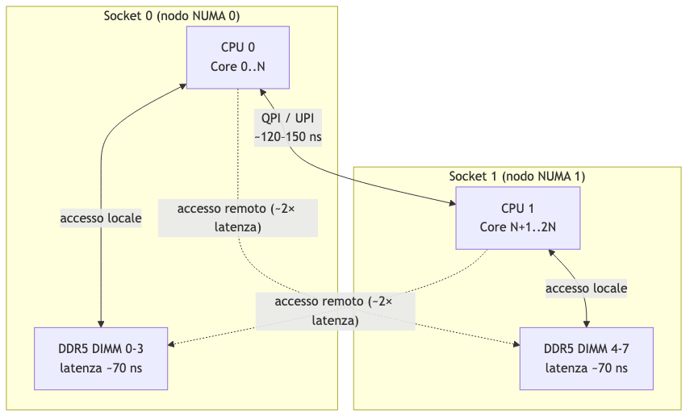
*Fig. — Architettura NUMA a due socket: l'accesso alla memoria locale è circa 2× più rapido rispetto all'accesso alla memoria del socket remoto.*

> [!definition] NUMA — Non-Uniform Memory Access
>
> **NUMA** è un'architettura di memoria in cui la latenza di accesso non è uniforme per tutti i processori: ogni CPU ha accesso preferenziale (a bassa latenza) alla propria memoria locale, e accesso a latenza maggiore alla memoria degli altri socket. Il sistema operativo gestisce i nodi NUMA come entità distinte e cerca di allocare memoria nel nodo a cui appartiene il thread che la utilizzerà.

### Implicazioni per il Software

Un'applicazione ignara di NUMA può soffrire degradazioni di prestazioni significative se i thread vengono schedulati su un socket mentre i dati risiedono nell'altro. Il kernel Linux espone le topologie NUMA attraverso il filesystem `/sys` e fornisce syscall (`mbind`, `set_mempolicy`) per il controllo esplicito dell'allocazione. Database e middleware ad alte prestazioni (PostgreSQL, Redis, DPDK) implementano politiche di affinità NUMA esplicita per minimizzare la latenza degli accessi.

> [!warning] Virtualizzazione e NUMA
>
> Gli hypervisor devono propagare la topologia NUMA alle VM per permettere al sistema operativo guest di ottimizzare. Se la VM è configurata con vCPU e memoria che attraversano un confine NUMA fisico, le prestazioni possono degradare silenziosamente senza un chiaro segnale di errore. I tuner di VM enterprise (VMware, Hyper-V) hanno funzioni di NUMA spanning che è importante configurare correttamente.

---

## CPU vs GPU: Due Filosofie di Calcolo

### Il Diverso Obiettivo di Progetto

La differenza fondamentale tra una CPU e una GPU non è di quantità ma di filosofia: le due architetture rispondono a obiettivi di ottimizzazione diametralmente opposti.

Una **CPU** è progettata per minimizzare la **latenza** della singola operazione. Per raggiungere questo obiettivo, integra meccanismi molto sofisticati: esecuzione fuori ordine (*out-of-order execution*), predizione dei branch, prefetching speculativo, pipeline profonde e grandi cache private. Ogni core è in grado di eseguire codice arbitrariamente complesso nel minor tempo possibile, gestendo dipendenze tra istruzioni, salti condizionali imprevedibili e accessi a memoria non sequenziali. Il prezzo di questa flessibilità è la dimensione: un core CPU con tutta la sua logica occupa molto silicio.

Una **GPU** è progettata per massimizzare il **throughput** su operazioni uniformi e parallele. I singoli core (chiamati *shader processor* o *CUDA core*) sono molto più semplici — pipeline corte, nessuna predizione di branch, cache minima — ma se ne integrano migliaia sullo stesso die. Il modello di esecuzione è **SIMT** (*Single Instruction Multiple Threads*): un singolo flusso di istruzione viene eseguito simultaneamente da centinaia di thread che operano su dati diversi.

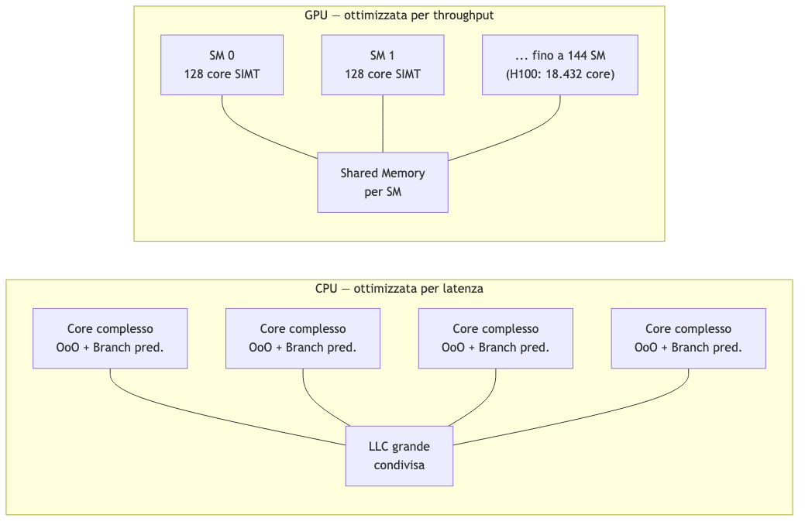
*Fig. — Confronto architetturale: la CPU dedica la maggior parte del silicio alla logica di controllo (cache, predittori, scheduler OoO), mentre la GPU lo dedica alle unità di esecuzione aritmetica in parallelo.*

### Calcoli Vettoriali e SIMD

Il punto di forza della GPU è il calcolo vettoriale. Un'operazione come la moltiplicazione matrice-vettore $\mathbf{y} = \mathbf{A}\mathbf{x}$ richiede di applicare la stessa operazione (prodotto scalare) a ogni riga di $\mathbf{A}$: sono migliaia di operazioni identiche su dati diversi, esattamente il pattern che il modello SIMT della GPU esegue in modo ottimale.

Le CPU moderne integrano anch'esse estensioni **SIMD** (*Single Instruction Multiple Data*) — AVX-512 su x86 permette di elaborare 16 float a 32 bit in parallelo con una singola istruzione — ma rimangono molto lontane dal parallelismo massivo di una GPU. La differenza è di scala: 16 elementi in parallelo su CPU contro decine di migliaia su GPU.

> [!tip] Perché l'AI ha bisogno della GPU
>
> Il training di un modello neurale consiste essenzialmente in milioni di moltiplicazioni matriciali (forward pass + backpropagation). Queste operazioni sono perfettamente adatte al modello SIMT della GPU: i dati del mini-batch sono elaborati in parallelo da migliaia di core, e il throughput scala quasi linearmente con il numero di core. Una GPU H100 di NVIDIA esegue circa 2.000 TFLOPS di operazioni fp8, circa 1.000× più di una CPU di fascia alta.

---

## NPU — Neural Processing Unit

### Definizione e Motivazione

Se la GPU è un acceleratore general-purpose per il calcolo parallelo, la **NPU** (*Neural Processing Unit*) è un acceleratore specializzato esclusivamente per le operazioni delle reti neurali — in particolare la moltiplicazione di matrici a bassa precisione numerica e le operazioni di attivazione.

> [!definition] NPU — Neural Processing Unit
>
> Una **NPU** è un circuito integrato (o un blocco IP all'interno di un SoC) progettato specificamente per eseguire inferenza di reti neurali con la massima efficienza energetica possibile. A differenza della GPU, che è flessibile ma relativamente energivora, la NPU è ottimizzata per un insieme ristretto di operazioni eseguite su dati a bassa precisione (INT8, INT4, FP8), raggiungendo prestazioni per watt molto superiori.

L'operazione dominante nelle reti neurali trasformer è la moltiplicazione tra matrici dense (*GEMM — General Matrix Multiply*). Una NPU integra tipicamente un grande array di moltiplicatori-accumulatori (**MAC** — Multiply-Accumulate) organizzato in una struttura **systolic array**: i dati scorrono attraverso la griglia di MAC senza tornare in memoria centrale ad ogni operazione, riducendo drasticamente il collo di bottiglia della bandwidth.

Le NPU sono ubique nei dispositivi edge moderni: il **Neural Engine** dei chip Apple M e A-series, la **Hexagon NPU** di Qualcomm, e il **Neural Processing Engine** di MediaTek sono tutti esempi di NPU integrate in SoC per smartphone e laptop. Nei datacenter, chip come il **Google TPU** (Tensor Processing Unit) applicano la stessa filosofia a scala datacenter.

| | CPU | GPU | NPU/TPU |
|---|---|---|---|
| Flessibilità | Massima | Alta | Bassa (solo NN) |
| Efficienza energetica | Bassa | Media | Massima |
| Latenza inferenza | Alta | Media | Bassa |
| Costo | Medio | Alto | Medio |
| Uso tipico | Preprocessing, logica | Training, inferenza batch | Inferenza edge/produzione |

### Groq e l'LPU

**Groq** è una startup fondata da ex ingegneri Google con l'obiettivo di costruire un'architettura radicalmente diversa per l'inferenza di modelli linguistici. Il loro prodotto principale è la **LPU** (*Language Processing Unit*), progettata specificamente per l'inferenza di modelli transformer a bassa latenza.

La differenza architetturale principale rispetto a una GPU è l'**esecuzione deterministica**: una GPU gestisce l'esecuzione dei thread con scheduler hardware dinamici, e le prestazioni dipendono dall'occupazione dei SM e dai pattern di accesso alla memoria. La LPU ha invece un modello di esecuzione completamente statico — il compilatore Groq pianifica ogni operazione a compile time, eliminando qualsiasi variabilità a runtime e i relativi overhead. Il risultato è un throughput di token generati per secondo significativamente superiore rispetto alle GPU per i modelli che entrano nella sua SRAM on-chip.

> [!note] Acquisizione da parte di NVIDIA
>
> Groq è stata acquisita da NVIDIA. L'acquisizione riflette l'interesse di NVIDIA nel consolidare la propria posizione nel mercato dell'inferenza AI, dove architetture alternative come la LPU rappresentavano una potenziale alternativa competitiva per workload di inferenza latency-sensitive.

---

## OCP — Open Compute Project

### Origini e Filosofia

Il **Open Compute Project (OCP)** è un'iniziativa di standardizzazione hardware avviata da **Meta (Facebook)** nel 2011. L'obiettivo originale era ambizioso: rendere open source le specifiche dell'hardware datacenter — server, alimentatori, rack, switch — nello stesso modo in cui il software open source aveva rivoluzionato lo sviluppo applicativo.

Il contesto che ha motivato questa scelta è economico: i server tradizionali di vendor come Dell, HP e Cisco incorporano margini elevati e una serie di funzionalità (luci di stato, pannelli LCD, logiche di gestione complesse) che hanno senso per un operatore generico ma che in un datacenter hyperscaler — dove migliaia di server sono monitorati centralmente — sono ridondanti e costose. Meta progettò i propri server rimuovendo tutto ciò che non era necessario e pubblicando le specifiche.

> [!definition] Open Compute Project
>
> L'**OCP** è un consorzio no-profit che sviluppa e pubblica specifiche hardware aperte per datacenter. I membri (Meta, Microsoft, Google, Intel, AMD, e decine di produttori ODM) contribuiscono specifiche e possono produrre hardware compatibile, riducendo il vendor lock-in e incentivando la competizione sui costi. Le specifiche OCP coprono server, rack, networking, storage e power.

### Impatto sull'Ecosistema Datacenter

L'impatto dell'OCP è stato significativo su più livelli. A livello di costi, i server OCP prodotti da ODM taiwanesi come Wiwynn, Quanta e Foxconn costano tipicamente il 20–30% in meno rispetto agli equivalenti di brand. A livello di efficienza, le specifiche OCP eliminano feature non necessarie e ottimizzano la gestione termica per ambienti ad alta densità. A livello di standardizzazione, il rack OCP 19" ha dimensioni standardizzate che permettono di mescolare componenti di fornitori diversi.

> [!note] OCP e il datacenter tradizionale
>
> L'OCP non ha (ancora) sostituito il mercato dei server tradizionali. Le sue specifiche sono adottate quasi esclusivamente dai grandi hyperscaler e da operatori che possono gestire direttamente hardware senza livelli di supporto intermediari. Un'azienda con un piccolo datacenter on-premise preferirà tipicamente server con supporto vendor diretto e garanzie contrattuali, dove il margine del produttore si traduce in un servizio.

---

## Token Ring

### Il Problema dell'Accesso al Mezzo

Il **Token Ring** è un protocollo di rete a livello data link (IEEE 802.5) sviluppato da IBM negli anni '80, che risolve il problema dell'accesso condiviso al mezzo trasmissivo in modo radicalmente diverso rispetto a Ethernet.

In Ethernet (CSMA/CD), ogni stazione ascolta il canale e trasmette quando lo trova libero: in caso di collisione, entrambe le stazioni si fermano e riprovano dopo un intervallo casuale. Questo approccio è semplice ma non deterministico: in condizioni di carico elevato, il numero di collisioni cresce e la latenza diventa imprevedibile.

Il Token Ring risolve questo problema con un meccanismo di **controllo centralizzato del mezzo tramite token**: un frame speciale chiamato *token* circola continuamente lungo l'anello. Solo la stazione che detiene il token ha il diritto di trasmettere. Dopo la trasmissione, il token viene rilasciato e passa alla stazione successiva.

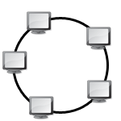
*Fonte: Wikimedia Commons — Schema di topologia ad anello: ogni nodo è connesso al precedente e al successivo, formando un percorso chiuso per la circolazione del token.*

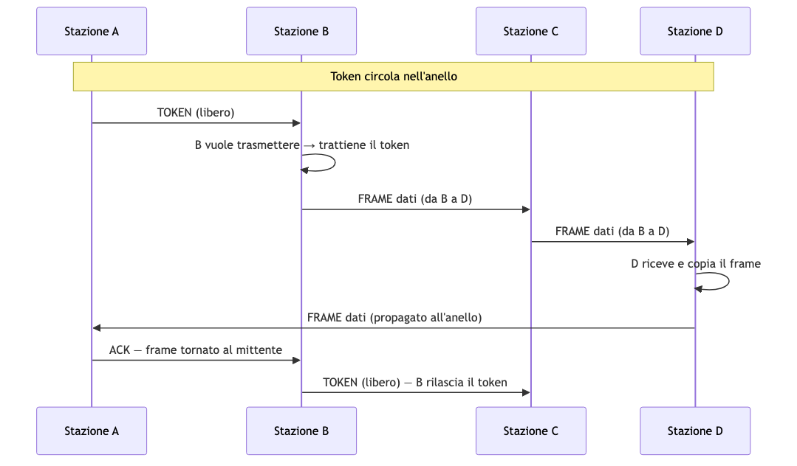
*Fig. — Circolazione del token e trasmissione di un frame in Token Ring: il frame percorre l'intero anello e torna al mittente, che lo rimuove e rilascia il token.*

> [!tip] Vantaggi del Token Ring rispetto a Ethernet
>
> Il Token Ring garantisce **accesso deterministico**: in un anello con N stazioni, ogni stazione ottiene il token al massimo ogni N × `tempo_di_trasmissione_massimo`. Questo lo rende adatto a contesti industriali e real-time dove la latenza massima di accesso deve essere garantita. Ethernet classica, essendo probabilistica, non offre questa garanzia. Il prezzo è la complessità: gestire il token (elezione del monitor, recupero del token perso) richiede protocolli aggiuntivi.

Nonostante le sue proprietà eleganti, il Token Ring è stato soppiantato da Ethernet per ragioni economiche: la semplicità e il costo inferiore dell'hardware Ethernet, combinati con Ethernet switched (che elimina le collisioni in modo diverso, mediante switch dedicati), hanno reso il Token Ring commercialmente marginale dagli anni '90. Il concetto di token, tuttavia, sopravvive in contesti diversi: le reti industriali come **PROFIBUS** e alcune reti automotive usano meccanismi simili per garantire latenze deterministiche.

---

```{=latex}
\newpage
```

# Lezione 14 — Server, BMC e Containerizzazione

## Server, BMC e Containerizzazione

Questa lezione chiude la parte hardware del corso e apre la parte software. Si parte dall'anatomia fisica dei server rack, si analizza come la crescente domanda di GPU ha trasformato radicalmente l'architettura dei sistemi di calcolo, si introduce il **Base Management Console (BMC)** come strumento fondamentale per la gestione remota, e infine si affronta la **containerizzazione** — la tecnologia che disaccoppia il software dall'hardware fisico e che domina il deployment moderno delle applicazioni.

---

### Architettura fisica dei server

#### Il server rack 1U standard

Il punto di partenza è il server rack più diffuso: una macchina **1U** (un'unità rack, circa 4,4 cm di altezza) ottimizzata per il calcolo general purpose senza acceleratori GPU.

L'organizzazione interna segue un flusso d'aria da davanti a dietro e riflette vincoli termici precisi:

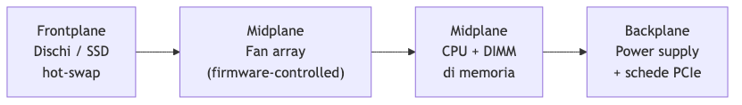
*Fig. — Layout interno di un server 1U standard. L'aria entra dai dischi anteriori e viene espulsa dal backplane.*

I **fan** non girano a velocità fissa: il firmware monitora continuamente le temperature dei processori e aumenta o riduce la velocità in modo proporzionale al carico computazionale. Un server idle è quasi silenzioso; sotto carico pieno, il rumore è considerevole. Il power supply tipico di un sistema 1U si attesta intorno ai **750 W**.

Questo tipo di server ha un numero massimo di socket CPU pari a due: l'interconnessione tra più di due socket attraverso il bus esterno diventa un collo di bottiglia significativo per la latenza e la banda di memoria.

#### Server four-way: scala verticale

Quando serve una grande quantità di RAM o si vogliono più socket CPU, si ricorre a server da **4U o 5U** con architettura **four-way** (quattro socket). Lo spazio aggiuntivo serve a:

- dissipatori più grandi per processori con TDP più elevato,
- più slot DIMM per aumentare la memoria totale,
- più bay per dischi,
- più spazio per le schede PCIe.

Il four-way è la scelta giusta quando il collo di bottiglia è la quantità di memoria: più socket significano più canali di memoria, quindi più banda aggregata.

#### Blade server: densità e semplificazione del cabling

> [!definition] Blade Server
>
> Sistema modulare composto da uno **chassis condiviso** e da una serie di schede di calcolo inseribili (le "lame"), ciascuna delle quali è un server autonomo. Lo chassis fornisce alimentazione ridondante, fabric di rete integrato nel backplane e console di gestione condivisa.

La storia del blade server è interessante. Alla fine degli anni '90, una società britannica chiamata **RLX Technologies** (poi acquisita da HP) aveva il problema di aumentare la densità di calcolo. L'idea fu radicale: prendere la motherboard di un laptop, schiacciarla fino a darle la forma di una scheda da inserire in uno chassis con guide. Tre o quattro unità rack erano sufficienti a contenere **24 schede CPU**, creando una macchina parallela ad alta densità perfetta per applicazioni come il web crawling dei motori di ricerca.

L'idea era così buona che fu adottata da tutti i principali vendor come **form factor standard**. Il nome "blade" si riferisce proprio alla forma allungata e sottile delle singole schede.

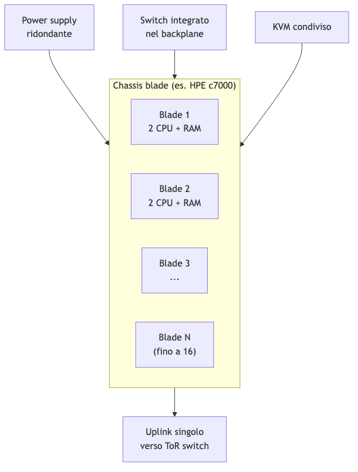
*Fig. — Architettura di uno chassis blade. Lo switch nel backplane connette tutte le lame; verso l'esterno esce un solo cavo uplink per chassis.*

Il vantaggio principale del blade non è solo la densità CPU, ma la **drastica semplificazione del cabling**: 16 nodi di calcolo richiedono un solo cavo uplink verso il top-of-rack switch invece di 16 cavi separati. La gestione dell'infrastruttura diventa molto più semplice.

Con un chassis HPE c7000 da 16 lame, ognuna con 2 CPU, si ottengono **32 CPU in circa 10U**, ovvero circa **3.2 CPU/U** rispetto alle **2 CPU/U** del server rack tradizionale.

> [!note] Blade e Ferrari F1
>
> Lo stesso chassis HPE BladeSystem c7000 mostrato a lezione era quello utilizzato dalla scuderia Ferrari Formula 1 intorno al 2008 per le simulazioni aerodinamiche.

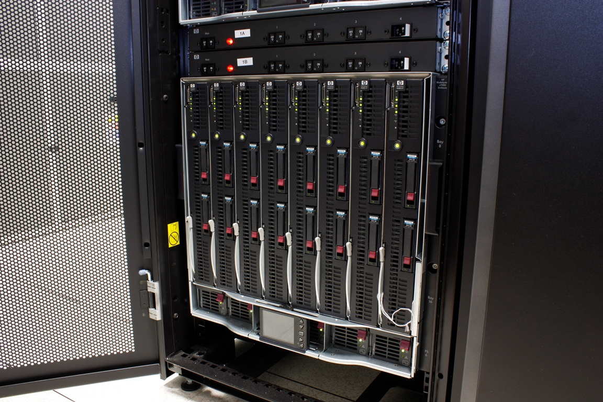
*Fig. — HPE BladeSystem c7000: uno degli chassis blade più diffusi. Le lame si inseriscono frontalmente; il backplane ospita switch, power supply e modulo KVM.*

Nel tempo, la crescita della banda di rete ha reso difficile scalare il backplane dello chassis, e alcuni vendor hanno cercato di abbandonare il formato. Il mercato ha però continuato a richiedere blade perché la semplificazione del management è un valore reale. Oggi i blade esistono ancora, affiancati da forme ibride.

#### Twin architecture: densità senza networking integrato

**SuperMicro** ha introdotto circa 15 anni fa la **Twin architecture** (o TwinPro): assomiglia superficialmente a un blade, ma lo chassis condivide **solo l'alimentazione** — non c'è networking integrato nel backplane. Ogni nodo ha la propria scheda di rete indipendente.

Il risultato è una densità ancora più elevata: **4 CPU/U** con nodi disposti a coppie affiancate. Tecnicamente non è un blade, ma è spesso classificato insieme a loro per la somiglianza visiva.

#### Evoluzione dei server GPU

Prima dell'era AI, le GPU venivano inserite nei server come **schede PCIe standard**, le stesse del gaming. La soluzione era meccanicamente complicata: cavi di alimentazione supplementari, strutture di supporto fragili, e la banda PCIe come bottleneck.

Con l'esplosione del machine learning, questa architettura non reggeva più. NVIDIA ha risposto con **HGX**: le GPU non sono più schede inseribili ma vengono **saldate direttamente sulla motherboard** come se fossero CPU, collegate tra loro via **NVLink** che offre una banda di circa **1 TB/s** — ordini di grandezza superiori al PCIe.

Il passo successivo è stato **Grace Hopper**: un modulo unico che integra una CPU ARM (Grace) con una GPU H100 (Hopper) collegate tramite NVLink-C2C ad altissima banda. Il risultato è che oggi la maggior parte dei server AI viene **progettata direttamente da NVIDIA**, con HP, Dell e altri che si limitano a "mettere il box intorno".

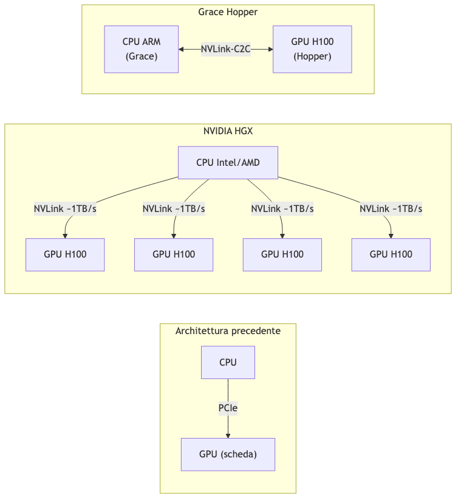
*Fig. — Evoluzione dell'architettura GPU server: da scheda PCIe a GPU on-board (HGX) fino al modulo integrato Grace Hopper.*

> [!tip] La proliferazione dei form factor come segnale
>
> Nel 2005 esistevano essenzialmente due form factor: 1U e 2U. Nel 2008 si erano aggiunti i blade. Oggi esistono **decine** di form factor diversi. Questa proliferazione non è casualità: è il segnale che il calcolo general purpose è ormai inadeguato e che **l'hardware si sta specializzando** per carichi di lavoro specifici. Ogni workload ha le sue esigenze ottimali di densità GPU, RAM, storage e networking.

#### La filosofia del compromesso: server come Lego

Configurare un server è un esercizio di ottimizzazione vincolata: si parte da uno spazio fisso (il rack unit) e si decide come riempirlo.

| Workload | Configurazione ottimale |
|---|---|
| Calcolo intensivo (AI, HPC) | Poche drive, molte GPU, molto RAM GPU |
| Database in-memory | Server four-way, massima RAM CPU |
| Densità CPU pura, CPU-only | Twin o Blade |
| Calcolo GPU mid-range | Server 1U con schede PCIe RTX |

Se si decide di mettere 24 drive in un server 2U, si rinuncia necessariamente allo spazio per ulteriori schede PCIe o slot di memoria. Ogni scelta di forma ha un costo in un'altra dimensione.

> [!tip] Risorse per esplorare form factor
>
> Il sito di **SuperMicro** è uno dei cataloghi più completi di form factor server esistenti — dalla singola scheda Twin al rack pre-configurato con GPU. È un ottimo punto di riferimento per capire concretamente la gamma di possibilità.

---

### Base Management Console (BMC)

#### Il problema della gestione remota

Un datacenter con centinaia o migliaia di server non può richiedere la presenza fisica di un operatore per ogni operazione. Il **Base Management Console (BMC)** risolve questo problema: è una scheda embedded nel server con un proprio processore, memoria e sistema operativo, completamente indipendente dallo stato del server principale.

> [!definition] BMC — Base Management Console
>
> Componente hardware autonomo presente in ogni server enterprise che fornisce accesso remoto completo alla macchina, indipendentemente dallo stato del sistema operativo principale. Ogni vendor usa un nome proprietario: **ILO** (HP), **iDRAC** (Dell), **IPMI** è lo standard di protocollo sottostante.

#### Funzionalità

Il BMC espone un'interfaccia web raggiungibile tramite browser o SSH, attraverso cui è possibile:

- **Monitorare** in tempo reale voltaggio, temperatura, velocità fan, watt consumati, stato di CPU e memoria,
- **Accedere alla console virtuale**: una sessione che emula la connessione fisica monitor+tastiera, inclusa la possibilità di inviare Ctrl+Alt+Del (che nella tastiera PC è un interrupt hardware separato, non intercettabile dal sistema operativo),
- **Montare immagini ISO** e installare un sistema operativo da remoto come se si inserisse un DVD fisico,
- **Configurare BIOS e firmware** del server.

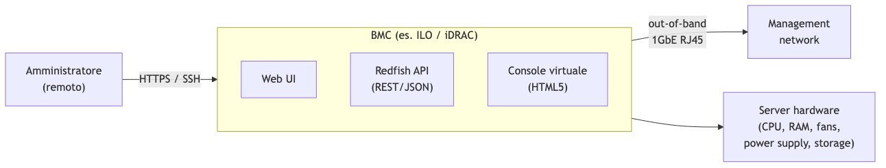
*Fig. — Il BMC si connette alla management network tramite una porta di rete dedicata e fornisce accesso completo all'hardware indipendentemente dal sistema operativo.*

#### Redfish API: automazione del provisioning

Per ambienti con molti server, la gestione manuale via web UI è inefficiente. Lo standard **Redfish** definisce una API REST che espone l'intero modello dati del server in JSON, permettendo l'automazione completa:

```
GET  /redfish/v1/Systems/1                  # stato del sistema
POST /redfish/v1/Systems/1/Actions/
     ComputerSystem.Reset                   # reset del server
GET  /redfish/v1/Systems/1/Processors       # info CPU
GET  /redfish/v1/Chassis/1/Thermal          # temperature e fan
```

Attraverso Redfish è possibile fare **zero-touch provisioning**: uno script può formattare un server, montare un'immagine ISO, avviare l'installazione e configurare il sistema — tutto senza nessun operatore fisicamente presente.

#### Sicurezza della management network

> [!warning] Il management network è equivalente all'accesso fisico
>
> Chiunque abbia accesso alla management network può riformattare qualsiasi server, riavviarlo, modificarne il firmware, o estrarne le credenziali. È un vettore di attacco **catastrofico** se esposto.

Per questo motivo, il management network segue sempre uno di questi modelli:

- **Rete fisicamente separata** dalla rete di produzione (out-of-band),
- **VLAN dedicata** con accesso controllato da firewall/ACL,
- Accesso esclusivamente tramite **VPN** con autenticazione forte.

La porta BMC è tipicamente una singola porta RJ45 da 1 GbE separata dalle porte di dati. La sua separazione è un requisito architetturale, non un'opzione.

---

### Containerizzazione

#### Il problema: accoppiamento tra software e hardware

Il datacenter fisico — server, rete, storage, power, cooling — è l'infrastruttura. Sopra di essa vivono i **servizi**. Il problema classico è che un servizio legato a un server fisico specifico si ferma ogni volta che quel server deve essere manutenuto. Per costruire servizi con alta disponibilità, occorre **disaccoppiare il software dall'hardware sottostante**.

La virtualizzazione (macchine virtuali) risolve questo problema ma ha un costo: ogni VM emula un hardware completo, ha il suo kernel, e occupa risorse significative. I **container** offrono un compromesso diverso: l'isolamento senza l'emulazione.

#### CGroups: la primitiva del kernel

La base tecnica dei container Linux è una funzionalità del kernel chiamata **CGroups** (Control Groups), sviluppata originariamente da Google.

> [!definition] CGroups — Control Groups
>
> Feature del kernel Linux che introduce uno **scoping dei nomi** per le risorse del sistema operativo. Invece di esporre globalmente tutti i processi, file system, socket di rete e device, il kernel può restringere la visibilità di un processo a un sottoinsieme di risorse appartenenti allo stesso gruppo.

Il ragionamento è semplice. Normalmente, quando un processo chiede al kernel "dammi la lista dei processi in esecuzione", riceve la lista completa di tutti i processi del sistema. Con i CGroups, il kernel risponde con la lista dei soli processi nello stesso container group.

La stessa logica si applica a:
- **filesystem**: ogni container vede solo il proprio albero di directory,
- **networking**: ogni container ha la propria interfaccia di rete virtuale,
- **PID**: i PID sono locali al container (il processo init dentro un container ha PID 1),
- **risorse CPU/memoria**: quote allocabili per container.

> [!note] Perché Google ha inventato i CGroups
>
> Google aveva bisogno di isolare ogni query di ricerca: se un utente trovava il modo di far crashare il motore tramite una query malevola, non doveva abbattere il servizio globale. Le VM erano troppo costose per questo use case (una per ogni query). I CGroups permisero di creare un container per ogni ricerca in modo quasi istantaneo, scaricarlo alla fine, e garantire che nulla potesse "uscire" da quella query. Oggi ogni ricerca Google gira in un container isolato.

#### Differential file system: la base delle immagini

Il secondo componente fondamentale è il **differential file system** (o overlay filesystem). L'idea è analoga ai differenziali dei dischi virtuali già visti nella parte di storage:

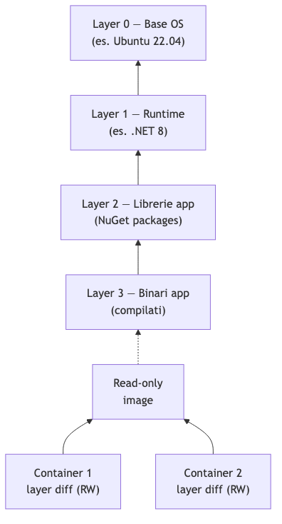
*Fig. — Il differential file system permette a più container di condividere gli stessi layer read-only. Solo le modifiche specifiche di ogni container vengono scritte nel layer differenziale in cima.*

Dieci istanze dello stesso container condividono sul disco una sola copia dei layer comuni. Solo le differenze generate a runtime — file di log, dati scritti, configurazioni modificate — occupano spazio aggiuntivo per ogni istanza.

> [!definition] Container (definizione formale)
>
> Un container è un **insieme di processi** a cui il kernel Linux fornisce una visione ristretta e isolata delle risorse di sistema, grazie ai CGroups per il namespace isolation e a un differential filesystem per l'isolamento del filesystem. Non include un kernel proprio: condivide il kernel dell'host.

#### Contenuto di un container vs macchina virtuale

> [!warning] Container ≠ Virtual Machine
>
> Un container condivide il kernel dell'host. Una VM ha il suo kernel separato. Questa differenza è cruciale per la sicurezza: **side-channel attacks** (Spectre, Meltdown, e varianti) che sfruttano la condivisione della microarchitettura CPU sono possibili tra container sullo stesso host, mentre sono molto più difficili tra VM. Il container offre un isolamento logico, non un isolamento hardware.

Poiché i container condividono il kernel, è possibile eseguire un container **Debian su un host RedHat**: il kernel è lo stesso (Linux), e la differenza tra le distribuzioni è essenzialmente nel layout del filesystem e nelle versioni delle librerie dinamiche. Quando un processo del container viene eseguito, il loader cerca le librerie nel filesystem del container (Debian), non in quello dell'host.

Questo funziona perché il **kernel Linux API è straordinariamente stabile**: le syscall non cambiano tra versioni. Il rischio esiste solo se un container richiede funzionalità di un kernel molto più recente di quello dell'host.

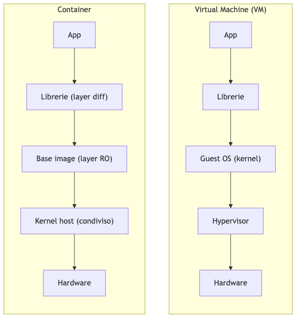
*Fig. — Differenza strutturale tra VM e container. La VM porta il proprio kernel; il container condivide quello dell'host.*

#### Docker: la piattaforma container più diffusa

**Docker** non è l'unico runtime container (esistono anche Podman, containerd, LXC), ma è il più popolare e ha definito le convenzioni del settore. Il file centrale è il **Dockerfile**: una sequenza dichiarativa di istruzioni per costruire un'immagine.

#### Multi-stage build: la pratica comune

Una caratteristica importante dei Dockerfile moderni è il **multi-stage build**: si usano più immagini intermedie per costruire l'applicazione, e si copia solo il risultato finale nell'immagine di produzione.

```
## Stage 1: immagine di build (con compilatori e SDK)
FROM mcr.microsoft.com/dotnet/sdk:8.0 AS build
WORKDIR /src
COPY src/ src/
RUN dotnet restore
COPY . .
RUN dotnet build

## Stage 2: compilazione e publish
FROM build AS publish
RUN dotnet publish -o /app/publish

## Stage 3: immagine finale (solo runtime, senza compilatori)
FROM mcr.microsoft.com/dotnet/aspnet:8.0 AS final
WORKDIR /app
COPY --from=publish /app/publish .
EXPOSE 8080
ENTRYPOINT ["dotnet", "app.dll"]
```

Il vantaggio di questo approccio è duplice:
- **Sicurezza**: l'immagine finale non contiene compilatori, SDK o tool di build. Un attaccante che compromette il container non trova alcun compilatore C# disponibile,
- **Dimensione**: l'immagine finale è molto più piccola perché non include il layer con l'SDK.

Le istruzioni principali di un Dockerfile:

| Istruzione | Significato |
|---|---|
| `FROM image AS name` | Base da cui si parte (o alias per multi-stage) |
| `WORKDIR /path` | Imposta la directory di lavoro nel container |
| `COPY src dst` | Copia file dall'host (o da un altro stage) nel container |
| `RUN cmd` | Esegue un comando nel container durante la build |
| `ENV KEY=VALUE` | Definisce una variabile d'ambiente |
| `EXPOSE port` | Dichiara la porta che il container vuole usare |
| `ENTRYPOINT ["cmd"]` | Processo principale avviato all'avvio del container |

#### Port mapping e networking

Ogni container ha una propria interfaccia di rete virtuale. Se si vuole rendere il container accessibile dall'esterno, occorre fare **port mapping** (tecnicamente un NAT):

```
docker run -p 9000:8080 myapp   # porta host 9000 → porta container 8080
```

Questo permette di avviare più istanze dello stesso container sullo stesso host, ognuna con una porta esterna diversa, anche se tutte internamente ascoltano sulla stessa porta 8080. Il meccanismo è implementato tramite le regole `iptables` del kernel Linux.

#### Docker Compose: composizione di servizi

Un'applicazione reale raramente è un singolo processo. Una web app tipica include: un **reverse proxy** (NGINX o Caddy), un **application server** (il codice applicativo), e un **database** (PostgreSQL, SQL Server). Docker Compose permette di definire e avviare l'intero stack con un singolo file YAML:

```yaml
services:
  frontend:
    image: nginx:alpine
    ports: ["443:443", "80:80"]
    volumes:
      - ./nginx.conf:/etc/nginx/conf.d/default.conf:ro
    depends_on: [app]
    restart: always
    networks: [app-network]

  app:
    build: .
    environment:
      - ASPNETCORE_ENVIRONMENT=Production
      - ConnectionStrings__Default=Server=db;...
    ports: ["8080:8080"]
    depends_on: [db]
    networks: [app-network]

  db:
    image: mcr.microsoft.com/mssql/server:2022-latest
    environment:
      - SA_PASSWORD=MySecurePass1!
    ports: ["1433:1433"]
    volumes:
      - ./data:/var/opt/mssql
    networks: [app-network]

networks:
  app-network:
    driver: bridge
```

Quando si esegue `docker compose up`, Docker avvia tutti i container definiti, crea la rete virtuale di tipo **bridge** che li connette tra loro, e gestisce i volumi. I container si raggiungono per nome (il container `app` può connettersi a `db` usando `db` come hostname).

> [!tip] Perché le applicazioni container-native usano variabili d'ambiente
>
> Docker Compose permette di passare configurazioni ai processi tramite variabili d'ambiente anziché file di configurazione. Questo è diventato lo standard per le applicazioni moderne per due motivi: primo, è il meccanismo naturale per iniettare configurazioni in un container senza modificare l'immagine; secondo, le variabili d'ambiente sono intrinseche al processo e non scritte su disco, quindi se il processo viene terminato, la configurazione (incluse eventuali credenziali) scompare con esso.

#### Container nel contesto AI e distribuzione software

Il fenomeno si è espanso ben oltre le web app. **NVIDIA** distribuisce i propri driver GPU per Linux esclusivamente come container: la complessità dell'installazione (dipendenze, versioni del kernel, moduli) era tale che impacchettarla in un container garantisce che funzioni identicamente su qualsiasi host compatibile.

Più in generale, il container risolve il problema classico delle dipendenze: se si usa Node.js, che può scaricare migliaia di pacchetti durante `npm install`, basta fissare quei pacchetti nel container al momento della build. L'applicazione gira sempre con le stesse versioni, anche se il sistema ospite ha aggiornato le librerie.

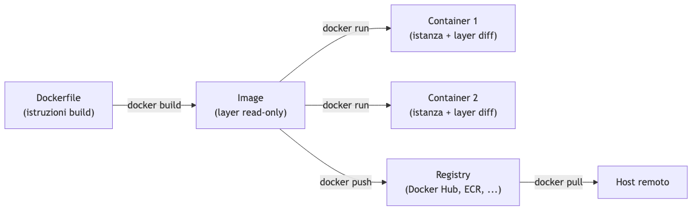
*Fig. — Ciclo di vita di un container: dal Dockerfile all'immagine, alle istanze in esecuzione, fino alla distribuzione tramite registry.*

> [!abstract] Sintesi — Container
>
> Un container è un processo (o un gruppo di processi) a cui il kernel Linux fornisce una visione isolata del sistema tramite **CGroups** e un **differential filesystem**. Non include un kernel proprio. Rispetto a una VM è molto più leggero (avvio in millisecondi, overhead minimo), ma condivide il kernel con l'host, il che implica minore isolamento di sicurezza. Docker è la piattaforma standard per costruire (`Dockerfile`), distribuire (registry) e comporre (`docker compose`) container. La tecnologia è stata inventata da Google per isolare le query di ricerca ed è oggi il meccanismo di deployment dominante nel software cloud-native.

---

### Prossimi argomenti

Il professore ha annunciato che le lezioni successive copriranno:

1. **Virtualizzazione** — il disaccoppiamento tra software e hardware tramite hypervisor, motivato dalla necessità di servizi sempre disponibili anche durante la manutenzione hardware,
2. **Cloud reference model** — come il datacenter fisico diventa la base per i modelli di servizio cloud (IaaS, PaaS, SaaS).

```{=latex}
\newpage
```

# Virtualizzazione e Containerizzazione

La lezione affronta due tecnologie fondamentali per il datacenter moderno: i **container** e le **macchine virtuali** (VM). Il professore presenta intenzionalmente i container per primi, anche se storicamente sono venuti dopo la virtualizzazione, perché permettono di capire più facilmente il principio di isolamento. La virtualizzazione vera e propria — quella basata su hypervisor — è invece la tecnologia che ha reso possibile il cloud computing così come lo conosciamo oggi.

---

## Container

### Il principio fondamentale: cgroups e namespace

Un container non è un sistema operativo separato, ma una *vista* ristretta del sistema operativo esistente. Il meccanismo sottostante si chiama **cgroup** (control group), un modulo del kernel Linux che permette di raggruppare processi e limitare quali risorse di sistema essi possono nominare.

> [!tip] Il potere del nome
>
> In informatica, nominare una risorsa è l'unica condizione necessaria per potervi accedere. Un indirizzo di memoria è un nome. Un PID è un nome. Se una risorsa non è nominabile — cioè non è visibile nel namespace del processo — non esiste per quel processo. I cgroup sfruttano proprio questo principio: mostrano ai processi del container solo le risorse del proprio gruppo.

Concretamente, quando un processo all'interno di un container esegue una chiamata di sistema per elencare le risorse disponibili (altri processi, interfacce di rete, filesystem), il kernel filtra la risposta mostrando solo quelle appartenenti al suo cgroup. Il risultato è l'illusione di avere un sistema operativo dedicato, pur condividendo lo stesso kernel con tutti gli altri container sulla macchina.

Qui emerge la differenza fondamentale rispetto alle VM: **tutti i container condividono lo stesso kernel**. Questo ha implicazioni di sicurezza rilevanti: una vulnerabilità nel kernel colpisce simultaneamente tutti i container in esecuzione. Un esempio recente e concreto è **CVE-2026-31431 "Copy Fail"**: un bug introdotto nell'agosto 2017 nel modulo crittografico `authencesn` del kernel Linux, rimasto silente per quasi dieci anni e scoperto nel 2026 grazie ad analisi assistita da AI (strumento Xint Code). Un exploit di soli 732 byte di Python standard è sufficiente per ottenere privilegi di root su tutte le principali distribuzioni Linux (Ubuntu, RHEL, Amazon Linux, SUSE). Poiché il page cache del kernel è condiviso tra tutti i processi — inclusi quelli appartenenti a container diversi — la vulnerabilità non è solo una local privilege escalation ma anche un **container escape** e un vettore di compromissione di nodi Kubernetes. Al momento della lezione non esisteva una patch generale: la raccomandazione era disabilitare il modulo se non strettamente necessario.

### Il filesystem differenziale

Un container ha il proprio filesystem, ma questo non è una copia completa: è un **filesystem differenziale** a strati (layer). Ogni immagine container è definita da una sequenza di layer sovrapposti. Quando si crea un container a partire da un'immagine base, si aggiunge semplicemente un nuovo layer che registra solo le differenze rispetto a quello precedente — esattamente come un disco differenziale nelle VM.

> [!example] Vantaggi del filesystem a layer
>
> Se dieci container derivano dalla stessa immagine base (ad esempio Ubuntu), i layer comuni esistono una sola volta su disco. Al download, se un layer è già presente localmente, non viene riscaricato. Questo si traduce in risparmio di spazio e download incrementali.

Il rovescio della medaglia è **prestazionale**: il filesystem differenziale è una struttura dati complessa. Quando si accede a un file, il sistema deve cercarlo nel layer corrente e, se non lo trova, risalire ai layer precedenti. Più layer ci sono, più operazioni di I/O sono necessarie. Per i dati che richiedono prestazioni elevate — come i file di un database — è quindi consigliabile montare una directory reale del filesystem host.

### Volumi e variabili d'ambiente

Due meccanismi permettono di iniettare configurazione e dati dall'esterno nel container senza modificarne il filesystem interno:

**Variabili d'ambiente**: prima dell'era dei container erano considerate un mezzo di configurazione obsoleto e scomodo. Docker le ha riportate in auge perché rappresentano il modo più semplice per iniettare parametri in un container senza dover accedere al suo filesystem interno. La configurazione viene specificata al momento del lancio del container e non richiede di modificare l'immagine.

**Volumi**: un volume è una directory (o file) del filesystem host montata in una posizione specifica all'interno del container. Il container la vede come parte del proprio filesystem, ma i dati risiedono fisicamente sull'host. I casi d'uso principali sono:
- Persistenza dei dati oltre il ciclo di vita del container (es: directory dati di un database)
- Condivisione di dati tra più container
- Iniezione di file di configurazione o certificati senza ricostruire l'immagine

> [!warning] Dati persistenti nei container
>
> Se si esegue un database in un container senza montare un volume per la directory dati, tutti i dati vengono persi quando il container viene eliminato. Montare la directory `/var/lib/postgresql/data` (o equivalente) su un volume host è pratica obbligatoria in produzione.

### Rete nei container

Ogni container ha il proprio network namespace: il suo `localhost` è diverso dal `localhost` dell'host e da quello degli altri container. In Docker, ogni container riceve un indirizzo IP nel range `172.x.x.x` della rete interna Docker. I container non comunicano tra loro tramite `localhost`, ma tramite questi indirizzi IP privati o tramite il nome del servizio definito in Docker Compose.

Il mapping delle porte (`ports`) nel file di Compose permette di esporre verso l'esterno una porta del container su una porta dell'host. Poiché tutti i container condividono la stessa interfaccia di rete fisica, non è possibile che due container siano in ascolto contemporaneamente sulla porta 80 dell'host: il port mapping risolve il conflitto assegnando porte diverse esternamente.

> [!note] Sicurezza della rete condivisa
>
> Nei container la scheda di rete fisica (**NIC**, *Network Interface Card*) dell'host è condivisa tra tutti i container in esecuzione — è lo stesso hardware che gestisce il traffico di tutti. Nelle VM, invece, ogni macchina virtuale riceve una scheda di rete virtuale dedicata (vNIC), emulata dall'hypervisor, con il proprio MAC address e la propria identità di rete completa. Questa è una delle differenze di isolamento più significative tra i due approcci.

### Docker Compose

Docker Compose permette di descrivere un'applicazione multi-container come composizione di servizi in un file YAML. Il professore mostra un esempio con tre servizi: un frontend (Nginx come reverse proxy), un application server (backend su porta 8080) e un database (SQL Server su porta 1433).

> [!example] Anatomia di un docker-compose.yml
>
> - **`image`**: specifica l'immagine da scaricare da Docker Hub (o da un registry privato come quello di Microsoft). Il tag `latest` è una convenzione: quando si pubblica, si tagga l'immagine più recente con `latest` oltre alla versione specifica.
> - **`environment`**: variabili d'ambiente iniettate nel container (es: password SA per SQL Server, EULA acceptance). Nei file di sviluppo si accetta di avere password in chiaro; in produzione si usano secret manager.
> - **`volumes`**: mappatura `host_path:container_path`, opzionalmente con `:ro` per sola lettura. Utile per montare certificati, credenziali, e directory dati.
> - **`ports`**: mappatura `host_port:container_port`. Se le porte sono uguali si può scrivere solo il numero.
> - **`depends_on`**: ordine di avvio tra i servizi.
> - **`networks`**: i servizi nella stessa rete si vedono tra loro; quelli in reti diverse no.

L'architettura tipica con Nginx come reverse proxy è raccomandata perché i server applicativi (Tomcat, Kestrel, ecc.) non sono progettati per gestire direttamente il traffico web ad alta concorrenza. Nginx, invece, è ottimizzato per questo e funge da punto di terminazione TLS, da load balancer e da proxy verso i backend.

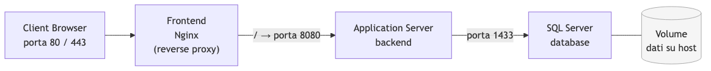
*Fig. — Architettura di un'applicazione multi-container con Docker Compose: Nginx riceve le connessioni esterne e le inoltra al backend; il database monta un volume host per la persistenza.*

### Orchestrazione: Kubernetes

Una volta che si è in grado di eseguire più container, nasce spontaneamente il bisogno di orchestrarli su più macchine. Kubernetes (abbreviato K8s) nasce in Google proprio per questo: scalare i servizi di ricerca su cluster di migliaia di macchine. Il caso d'uso originale è semplice: se ho 1000 richieste concorrenti, voglio istanziare automaticamente N repliche del container che serve la richiesta e bilanciarle.

> [!definition] Kubernetes
>
> Piattaforma open source per l'orchestrazione di container su cluster di macchine. Permette di definire lo stato desiderato del sistema (numero di repliche, risorse allocate, regole di networking) e si occupa autonomamente di mantenerlo.

L'architettura è composta da un **control plane** (nodo master che coordina tutto il cluster) e da **worker node** su cui girano i container. I container sono raggruppati in **pod** — la più piccola unità deployabile in Kubernetes, tipicamente un container o un gruppo strettamente accoppiato.

> [!tip] Canary deployment e rolling updates
>
> Kubernetes permette di avere contemporaneamente la versione 1 e la versione 2 di un servizio. Il reverse proxy in ingresso (Ingress controller) decide la percentuale di traffico da inviare a ciascuna versione. Si aggiorna così gradualmente il software senza interruzioni di servizio (rolling update) o si testa la nuova versione su una piccola percentuale di utenti (canary deployment).

---

## Virtualizzazione

### VM vs Container: la differenza fondamentale

La differenza chiave è il livello di isolamento: i container condividono il kernel del sistema operativo host; le VM no. Una VM contiene il proprio sistema operativo completo, compreso il kernel. Questo significa che:

- Su una macchina si possono eseguire simultaneamente una VM Linux e una VM Windows (impossibile con i container, che devono condividere il kernel dell'host)
- Una vulnerabilità del kernel non attraversa il confine della VM
- Le VM hanno overhead maggiore (dimensione su disco, memoria, tempo di avvio)

> [!note] WSL2 e i container Linux su Windows
>
> Su Windows, i container Linux vengono eseguiti dentro una VM Linux leggera gestita da Hyper-V (WSL2). Non è una violazione del principio: i container condividono il kernel della VM Linux, non direttamente il kernel Windows.

### L'Hypervisor

L'**hypervisor** è il software che implementa la virtualizzazione: prende le risorse fisiche della macchina (CPU, memoria, rete, storage) e le suddivide in slice assegnate a ciascuna VM. È responsabile di:

- **Scheduling della CPU**: distribuire i core fisici tra le VM
- **Gestione della memoria**: isolare gli spazi di indirizzamento
- **I/O virtualizzato**: presentare a ogni VM disk controller, interfacce di rete e altri dispositivi come se fossero fisici
- **Virtual console**: permettere l'accesso grafico alla VM

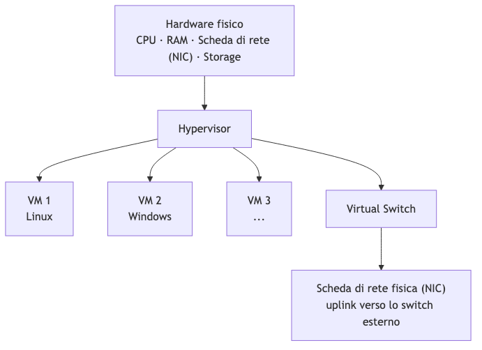
*Fig. — Architettura di un sistema di virtualizzazione: l'hypervisor si interpone tra l'hardware fisico e le VM, esponendo risorse virtualizzate a ciascuna.*

### Il Virtual Switch

Accanto all'hypervisor, il **virtual switch** è il componente che rende le VM indistinguibili da macchine fisiche dal punto di vista della rete. Poiché più VM girano sullo stesso host fisico, serve un'infrastruttura di rete interna che:

- Assegni a ogni VM un'identità di rete completa (MAC address, IP, VLAN)
- Gestisca il traffico est-ovest tra VM dello stesso host senza passare dalla scheda di rete fisica (traffico puramente in-memory, molto più veloce)
- Colleghi le VM alla rete fisica usando la scheda di rete fisica dell'host come uplink verso lo switch esterno

Il virtual switch implementa in software le stesse funzionalità di un switch fisico: broadcast domain, VLAN tagging, forwarding basato su MAC. In VMware questo componente si chiama **vSwitch** (o **Distributed Switch** nelle configurazioni enterprise).

### Live Migration

La capacità più potente della virtualizzazione è la **live migration** (chiamata **vMotion** in VMware): spostare una VM in esecuzione da un server fisico a un altro **senza interruzione del servizio**.

> [!tip] Perché la live migration è rivoluzionaria
>
> Un sito web che serve pagine può essere spostato da una macchina fisica a un'altra mentre continua a rispondere alle richieste HTTP. Questo rende possibile la manutenzione dell'hardware senza downtime, il bilanciamento del carico tra server e la gestione automatica dei guasti. È la tecnologia che ha reso il cloud computing economicamente viable.

Il meccanismo si basa sul fatto che lo stato completo di una VM (memoria, registri CPU, stato dei device) è una struttura dati nel software dell'hypervisor. Copiare questa struttura da un host all'altro, sincronizzare le ultime modifiche e commutare il controllo è tecnicamente complesso ma possibile. Lo storage condiviso (SAN o NAS) elimina il problema di dover spostare anche i disk file.

### CPU Virtualization: anelli e istruzioni hardware

Il problema tecnico più sottile della virtualizzazione è la **virtualizzazione della CPU**. Un kernel di sistema operativo esegue istruzioni privilegiate che accedono direttamente all'hardware (gestione degli interrupt, manipolazione della memoria fisica, configurazione del timer). Se si esegue un kernel "ospite" dentro una VM, queste istruzioni devono essere intercettate e gestite dall'hypervisor prima di raggiungere la CPU fisica.

Le CPU x86 (e ARM) non hanno solo due livelli di privilegio (supervisor/user): l'Intel 386 ne aveva già 16, chiamati **ring** (da ring 0, il più privilegiato, a ring 15). Il kernel normalmente gira in ring 0 e le applicazioni in ring 3.

Le prime implementazioni di virtualizzazione sfruttavano questi ring intermedi per interporre il kernel ospite tra il kernel dell'hypervisor e le applicazioni, ma era un'architettura fragile. La soluzione definitiva è arrivata con l'introduzione di **istruzioni hardware dedicate alla virtualizzazione**:

- **Intel VT-x** (Virtualization Technology for x86)
- **AMD-V** (AMD Virtualization)

Queste estensioni aggiungono strutture dati (VMCS su Intel) per salvare e ripristinare efficientemente lo stato completo di una VM durante i context switch tra VM diverse, interrupt virtuali separati da quelli fisici, e timer virtuali indipendenti.

> [!warning] Context switch tra VM vs tra processi
>
> Un context switch tra processi salva/ripristina i registri del processo. Un context switch tra VM deve salvare/ripristinare l'intero stato del kernel ospite (registri + stato MMU + interrupt controller virtuale + timer). Senza supporto hardware è un'operazione ordini di grandezza più costosa.

### I principali hypervisor

> [!abstract] Panorama dei vendor
>
> - **VMware** (ora Broadcom): leader storico del mercato enterprise. Fondato nel 1997-98, acquisito da Dell tramite EMC², poi ceduto a Broadcom. Il cambio di ownership ha portato a una riorganizzazione radicale del licensing che ha spinto molti clienti a cercare alternative — operazione resa difficile dalla maturità tecnica insostituibile di VMware in ambito enterprise.
> - **Hyper-V** (Microsoft): integrato in Windows Server e nelle versioni Pro/Enterprise di Windows. Microsoft è stata per un periodo il maggior contributore al kernel Linux, contribuendo i moduli per la virtualizzazione tramite Hyper-V (usati anche da WSL2).
> - **KVM** (Kernel-based Virtual Machine): modulo integrato nel kernel Linux; base di molte distribuzioni cloud, incluso OpenStack.
> - **Proxmox**: soluzione open source basata su KVM, usata molto in ambienti homelab e PMI. Non raggiunge le prestazioni e la maturità di VMware in ambito enterprise.

### Snapshot e Checkpoint

Un **checkpoint** (o snapshot) è una fotografia istantanea dello stato completo di una VM in un dato momento: contenuto della memoria, stato dei registri CPU, stato del disco. Viene implementato attraverso lo stesso meccanismo del filesystem differenziale: al momento dello snapshot, il file del disco virtuale viene congelato e tutte le scritture successive vanno in un nuovo file differenziale.

> [!example] Demo: snapshot e ripristino
>
> Durante la lezione il professore dimostra la potenza degli snapshot:
> 1. Crea una VM Ubuntu su Hyper-V con un virtual disk VHDX
> 2. Installa Ubuntu
> 3. Prende un checkpoint (il file disco si divide: base frozen + differenziale attivo)
> 4. Esegue `rm -rf /` all'interno della VM, distruggendo il filesystem
> 5. Ripristina il checkpoint precedente → la VM riparte esattamente nello stato in cui era prima del disastro, memoria inclusa

> [!warning] Performance overhead degli snapshot
>
> Ogni accesso al disco di una VM con snapshot attivi richiede una ricerca a cascata attraverso i layer: prima nel differenziale corrente, poi in quello precedente, e così via. Più snapshot ci sono, più operazioni I/O multiple si sommano per ogni accesso. Mantenere snapshot a lungo su VM in produzione (che scrivono continuamente sul disco per aggiornamenti, log, ecc.) degrada significativamente le prestazioni e aumenta lo spazio su disco ben oltre la dimensione nominale allocata alla VM. È una cattiva pratica comune nei team di datacenter operation.

```{=latex}
\newpage
```

# Virtualizzazione 2 — Live Migration e Gestione del Datacenter Virtuale

La lezione riprende il filo della virtualizzazione affrontando i meccanismi interni dell'hypervisor, le operazioni che questo rende possibili — in particolare la **live migration** — e le conseguenze architetturali che queste capacità hanno avuto sull'intera industria del cloud. Il professore dimostra tutto in diretta su un cluster reale dell'Università di Pisa.

---

## Contesto storico: da IBM agli anni 2000

La virtualizzazione non è un'invenzione recente. Il sistema operativo **VM/CMS** di IBM, apparso negli anni '70, era già un sistema di virtualizzazione completo: permetteva di far girare multiple istanze indipendenti di un sistema monoprogrammato sullo stesso mainframe fisico. L'idea precede persino il concetto moderno di processo.

### Emulazione: il predecessore pratico

Prima che la virtualizzazione si affermasse, la soluzione dominante per eseguire software scritto per un'architettura diversa era l'**emulazione**. I Macintosh con CPU PowerPC, ad esempio, usavano un emulatore x86 per girare software Windows — più lento, ma funzionante. La logica dell'emulazione è concettualmente semplice:

> [!definition] Emulatore
>
> Un programma che implementa il ciclo *fetch-decode-execute* di una CPU bersaglio, interpreta ogni istruzione e emula l'effetto di ogni operazione I/O. Può eseguire codice di qualsiasi architettura su qualsiasi altra architettura, a patto di accettare un rallentamento significativo.

Il rallentamento deriva dal fatto che ogni ciclo della CPU emulata richiede molti cicli della CPU fisica per essere simulato. Storicamente era accettabile solo per emulare sistemi molto vecchi — la Legge di Moore forniva il margine di velocità necessario a compensare l'inefficienza. Oggi strumenti come **JSLinux** di Fabrice Bellard dimostrano che persino sistemi complessi (Linux, Windows 2000) possono essere emulati all'interno di un browser, incluse CPU di architetture diverse da quella del dispositivo host.

> [!note] Bug fedeli
>
> Un emulatore non deve implementare solo la specifica ufficiale di una CPU, ma anche i suoi bug. Il software reale spesso si affida a comportamenti non documentati o a quirk storici dell'hardware: un emulatore che non li riproduce non riesce a far girare quel software correttamente.

### La nascita di VMware (1997) e la virtualizzazione x86

Nel 1997, quando VMware fu fondata, le CPU multi-core non esistevano ancora. Il problema che spinse a creare il primo hypervisor era pragmatico: un commesso viaggiatore doveva dimostrare architetture client-server senza connessione internet affidabile. La soluzione fu eseguire sia il client che il server sulla stessa macchina laptop — ma in modo isolato.

Emulare una CPU x86 sopra un'altra CPU x86 è tecnicamente possibile ma lento. L'insight chiave di VMware fu diverso: se il codice gira già sulla stessa architettura, non serve emulare le istruzioni — basta trovare un meccanismo per *preemptare* il codice della macchina virtualizzata e lasciarlo girare direttamente sulla CPU fisica, intervenendo solo quando necessario (accessi privilegiati, I/O, cambio di contesto).

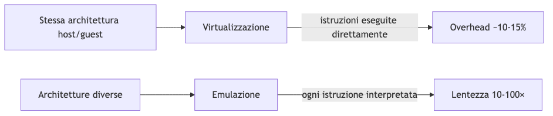
*Fig. — Emulazione vs virtualizzazione: il discriminante è la compatibilità di architettura.*

---

## Perché la virtualizzazione si è affermata

L'esplosione della virtualizzazione nei datacenter avviene attorno al **2003-2004**, per una ragione strutturale: l'hardware cresceva più velocemente del software. I server dell'epoca erano già troppo potenti per le applicazioni disponibili. Un web server o un mail server, essendo workload **IO-bound**, teneva la CPU occupata una piccola percentuale del tempo: il processore aspettava il disco o la rete, non elaborava.

In questo contesto, far girare una singola applicazione per server era uno spreco enorme. La virtualizzazione offriva la risposta: eseguire decine di servizi isolati sulla stessa macchina fisica, sfruttando i core altrimenti inattivi.

> [!tip] Perché non semplici processi?
>
> I processi condividono sistema operativo, librerie e kernel. Due applicazioni che richiedono versioni diverse della stessa libreria non possono coesistere facilmente. Una patch di sicurezza a un componente richiede il riavvio dell'intera macchina. Una compromissione del web server può propagarsi al database. La VM risolve tutti e tre i problemi grazie all'**isolamento completo**.

Il secondo catalizzatore fu l'arrivo delle **CPU multi-core** attorno al 2006. Il software dell'epoca era quasi tutto single-threaded — il multithreading era considerato programmazione avanzata. La virtualizzazione diventò il modo principale per sfruttare i core aggiuntivi senza riscrivere le applicazioni: ogni VM occupava uno o più core separati.

L'overhead introdotto dall'hypervisor moderno è stimato attorno al **10-15%** — ben speso dato il ritorno in termini di isolamento, flessibilità e gestibilità.

---

## L'hypervisor per ambienti server

Il software di virtualizzazione desktop (VirtualPC, VMware Workstation) era pensato per eseguire sistemi operativi con interfaccia grafica, audio, USB. L'**hypervisor** per server è un sistema completamente diverso: nessuna console grafica, gestione solo via rete, ottimizzato per eseguire decine o centinaia di VM headless.

### La vCPU e la gestione dell'instruction set

Ogni VM riceve una o più **vCPU** — CPU virtuali che mappano sui core fisici del server. La vCPU non è semplicemente un core fisico dedicato: è un'astrazione configurabile. In particolare, l'hypervisor può dichiarare alla VM un sottoinsieme delle istruzioni disponibili sulla CPU fisica.

Questo è cruciale per la **live migration**. Se una VM utilizza istruzioni AVX-512 disponibili solo su alcuni modelli Intel, non può essere spostata su un server con una CPU più vecchia che non supporta quelle istruzioni. Configurando la vCPU per esporre solo le istruzioni comuni al set minimo tra sorgente e destinazione, si garantisce la portabilità.

Analogamente, l'hypervisor può configurare la topologia **NUMA** percepita dalla VM: quanti socket, quanti nodi NUMA, quanta memoria per nodo. La VM non vede la topologia reale del server fisico — vede solo ciò che l'hypervisor le mostra.

### Due sistemi operativi all'avvio di Windows

Un fatto poco noto: Windows, all'avvio, lancia **due sistemi operativi**, non uno. Il primo è un micro-OS molto piccolo, senza console, che prende il controllo dell'hardware dedicato alla protezione delle chiavi crittografiche — quelle usate per BitLocker, TPM, transazioni finanziarie. Questo micro-OS è chiamato internamente **Secure World** (o Virtual Secure Mode). Solo dopo averlo avviato, lancia Windows normale, che gira accanto a lui in modalità virtualizzata.

> [!example] Perché due OS?
>
> Il software non è perfetto. Se un attaccante ottiene privilegi kernel su Windows, normalmente può leggere qualsiasi area di memoria, incluse le chiavi crittografiche. Con il modello a due OS, le chiavi risiedono nel Secure World, inaccessibile anche al kernel Windows. Il Secure World è esposto solo attraverso API ben definite, rendendo molto più difficile l'esfiltrazione.

Lo stesso principio vale per **Windows Subsystem for Linux (WSL2)**: anche qui gira un kernel Linux completo all'interno di Windows, sfruttando le stesse tecniche di virtualizzazione. Sul laptop del professore (ARM con processore Apple) gira anche un layer di emulazione x86 integrato in Windows, dimostrando la coesistenza di tre livelli: ARM nativo, x86 emulato, Linux virtualizzato.

---

## Operazioni fondamentali sulle VM

### Pause e Resume

Un hypervisor può fermare completamente l'esecuzione di una VM in qualsiasi momento. Questo è possibile perché un sistema operativo è, in ultima analisi, codice che viene eseguito dal ciclo fetch-execute. Se si interrompe quel ciclo e si conserva lo stato — i registri della CPU — il sistema operativo non ha alcun modo di accorgersi che il tempo si è fermato. Alla ripresa, riprende esattamente da dove si era fermato.

> [!definition] Stato completo di una VM
>
> Lo stato completo di una VM è composto da tre elementi: (1) i **registri della CPU** inclusi quelli di sistema, (2) il contenuto della **memoria RAM** allocata alla VM, (3) lo stato del **disco virtuale**. Conservare tutti e tre equivale a poter ricreare fedelmente la VM in qualsiasi momento futuro.

### Snapshot

Uno **snapshot** è una fotografia del stato completo della VM in un istante dato. Tecnicamente si realizza con una combinazione di:
- Copia dei registri CPU
- Copia della memoria (o riferimento CoW — Copy-on-Write)
- Disco differenziale: da quel momento in poi, le scritture sul disco vanno in un file differenziale separato; il disco originale resta intatto come "base"

L'insieme di snapshot forma una catena che permette di tornare a qualsiasi punto precedente nel tempo, esattamente come i commit di un sistema di versionamento.

### Integration Services

L'hypervisor espone alla VM un insieme di servizi di integrazione che vanno oltre la semplice emulazione hardware:

- **Sincronizzazione del clock**: la VM usa il clock dell'host. Cruciale perché Kerberos (il protocollo di autenticazione usato in Active Directory e nei datacenter) richiede che tutti i sistemi abbiano lo stesso orario con margine inferiore a 5 minuti. Un clock desincronizzato impedisce l'autenticazione.
- **Heartbeat**: la VM invia periodicamente un segnale all'hypervisor. Se il heartbeat cessa, l'hypervisor sa che il kernel della VM è bloccato e può intervenire con un riavvio forzato — fondamentale per la business continuity.
- **Shutdown graceful**: l'hypervisor può inviare alla VM il segnale equivalente alla pressione del tasto power, permettendo uno spegnimento pulito anziché un kill brutale.
- **Backup senza contention**: sospendendo brevemente la VM, l'hypervisor può eseguire un backup coerente del disco senza race condition, anche con il sistema in esecuzione.

---

## Live Migration

La **live migration** è probabilmente la funzionalità più importante introdotta dalla virtualizzazione nell'industria del datacenter. Permette di spostare una VM da un server fisico a un altro **mentre è in esecuzione**, con un'interruzione percepibile dell'ordine di qualche millisecondo — del tutto compatibile con i normali glitch di rete.

### Cold migration vs live migration

La *cold migration* è concettualmente semplice: si spegne la VM, si copiano i file del disco e della memoria sul server destinazione, si riavvia. La VM è offline per tutta la durata della copia.

La *live migration* mantiene la VM operativa durante quasi tutta la fase di trasferimento. Il problema tecnico è che la VM continua a modificare memoria e disco durante la copia, rendendo impossibile ottenere uno snapshot coerente senza un intervento coordinato.

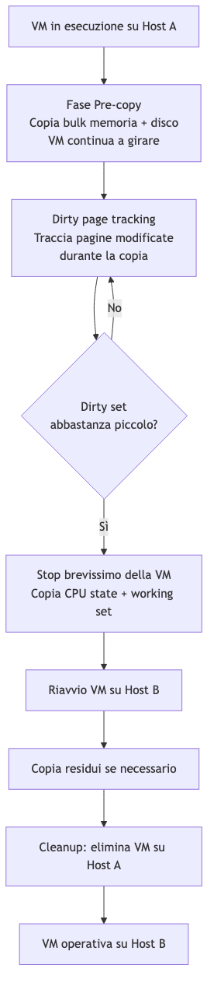
*Fig. — Il processo di live migration in sei fasi: pre-copy con dirty tracking, stop-copy, riavvio e cleanup.*

### Fase 1: Pre-copy con dirty page tracking

La prima fase è la più lunga. L'hypervisor comincia a copiare memoria e disco verso il server destinazione mentre la VM continua a girare. Durante questa copia, ogni pagina di memoria (o blocco di disco) modificata dalla VM viene marcata come **dirty**: deve essere ricopiata perché il valore già trasferito è diventato obsoleto.

Il meccanismo di **page fault** dell'hypervisor è lo strumento chiave: quando la VM prova a scrivere in una pagina già inviata alla destinazione, si genera un fault che permette all'hypervisor di aggiornare il tracking.

Con il passare del tempo, se la VM non è troppo "write-intensive", il set di pagine dirty si riduce: la maggior parte della memoria è già stata copiata e non è stata rimodificata. A questo punto si è pronti per la fase finale.

### Fase 2: Stop, copy del working set, riavvio

Quando il dirty set è sufficientemente piccolo — ogni sistema ha le proprie soglie — l'hypervisor **ferma la VM per un brevissimo momento**. In questo fermo:
1. Copia i registri CPU
2. Copia le restanti pagine dirty (il *working set attivo*)
3. Trasferisce il tutto alla destinazione

Dopodiché, la VM viene **riavviata sulla destinazione**. Il fermo dura tipicamente pochi millisecondi — paragonabile alla latenza di un roundtrip di rete, o alla preemption che qualsiasi sistema operativo subisce normalmente durante lo scheduling.

### Fase 3: Gestione della rete — il problema dell'ARP cache

Quando la VM si sposta su un altro host fisico, il suo indirizzo MAC (e IP) rimangono invariati — vanno con la VM. Ma i switch fisici mantengono una **ARP cache** che associa ogni MAC address alla porta fisica su cui lo hanno visto l'ultima volta. Dopo lo spostamento, quella cache è obsoleta: i pacchetti verrebbero ancora inviati alla porta del vecchio host.

La soluzione è un meccanismo a due livelli:

1. Il **virtual switch della destinazione** invia un **gratuitous ARP** — un messaggio ARP non richiesto che annuncia "il MAC X è ora raggiungibile da questo switch". Questo forza gli switch della rete a invalidare immediatamente le entry stantie.

2. Nel breve intervallo tra la migrazione e la propagazione del gratuitous ARP, il virtual switch della sorgente — che è un software a conoscenza della migrazione — fa da **proxy**: i pacchetti che arrivano ancora alla sorgente vengono inoltrati alla destinazione anziché andare persi.

Il risultato pratico è **zero packet loss** durante la migrazione.

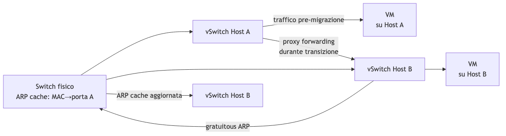
*Fig. — Gestione della rete durante la live migration: forwarding proxy + gratuitous ARP eliminano la perdita di pacchetti.*

---

## Il Cloud come conseguenza della live migration

La live migration ha cambiato le regole del gioco nell'industria IT. Prima di essa, il software era legato all'hardware su cui girava: aggiornare o sostituire un server significava downtime. Con la live migration, il legame è spezzato.

> [!tip] Perché si chiama "Cloud"?
>
> Il termine "cloud" è metaforico: le nuvole in cielo sono un insieme di vapore acqueo che non si può localizzare con precisione. Analogamente, nel cloud non si sa — e non importa sapere — su quale hardware specifico girano le proprie risorse. Il cloud provider può muoverle liberamente, e finché il servizio funziona, per il cliente è equivalente.

La live migration è la tecnologia abilitante di questa astrazione. Un server con un disco rotto? Le VM vengono migrate su altri host in pochi secondi, il server viene spento, sostituito, riavviato — senza che nessun utente se ne accorga.

Il professore cita l'esempio concreto del cluster dell'Università di Pisa: operativo da 8 anni, il primo cluster di 10 nodi è stato completamente decommissionato e nessuno ha notato, perché le VM sono state spostate gradualmente con live migration.

### Container vs VM per la mobilità

I **container** — a differenza delle VM — non possono essere migrati a caldo con la stessa facilità. Un processo con il suo stato interno (socket aperti, memoria allocata, descrittori di file) non può essere "congelato" e ripristinato su un altro host senza serializzare esplicitamente tutto lo stato. Quella tecnologia (CRIU per Linux) esiste ma è complessa e non universalmente supportata.

Per questo motivo, il pattern dominante nei datacenter è eseguire **container dentro VM**: si ottiene il meglio di entrambi i mondi. I container forniscono leggerezza e avvio rapido per i workload; la VM fornisce l'isolamento hardware e la mobilità tramite live migration.

---

## Software di gestione: il layer orchestrator

Un singolo hypervisor gestisce le VM di un singolo host. Ma un datacenter ha decine o centinaia di host. Serve un software che coordini tutti gli hypervisor da un unico punto di controllo.

Per gli ambienti Microsoft, questo software è **System Center Virtual Machine Manager (SCVMM)**. Per VMware, **vCloud Foundation**. Questi strumenti permettono di vedere il datacenter come un unico pool di risorse, eseguire live migration attraverso un'interfaccia grafica o API, monitorare tutti i cluster, configurare le reti virtuali.

Esistono alternative open source: **OpenStack** (più orientato alle API, meno integrato), **Proxmox** (più simile agli strumenti commerciali per usabilità). Il professore sottolinea che la scelta tra open source e commerciale nel datacenter non è solo tecnica:

> [!warning] Open source nel datacenter: una riflessione critica
>
> Avere il codice sorgente non significa poter risolvere autonomamente ogni problema. Quando 300 macchine virtuali vanno offline per un'inconsistenza nello storage, il tempo a disposizione per il debug è zero. In quel caso, avere un contratto di supporto con ingegneri che conoscono il prodotto dall'interno vale il suo costo. Il professore descrive un incidente reale: la risoluzione ha richiesto 6 ore di escalation su tre continenti (India → Giappone → Messico), dove un esperto ha usato uno strumento open source per analizzare i metadati del filesystem e fornire il comando esatto per ripristinare la coerenza. L'alternativa senza supporto sarebbe stata 4 giorni di restore da backup.

---

## Architettura a cluster

Un **cluster** è un insieme di server che condividono risorse e si coordinano per garantire alta disponibilità. Ogni nodo contribuisce con CPU, memoria, storage e rete al pool condiviso. L'hypervisor di ciascun nodo comunica con gli altri per sapere quante risorse sono disponibili, dove stanno le VM, e cosa fare in caso di guasto.

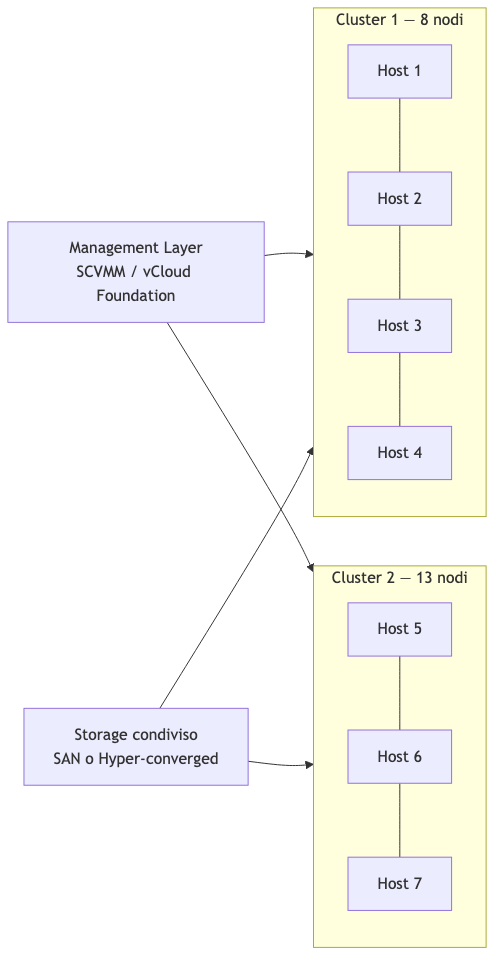
*Fig. — Il datacenter come insieme di cluster gestiti da un layer di management centralizzato.*

### Limiti dimensionali del cluster

I cluster non crescono indefinitamente. Il limite pratico è attorno a **32 nodi**. La ragione è la complessità della comunicazione intra-cluster: ogni nodo deve tenersi aggiornato sullo stato di tutti gli altri. Il pattern di comunicazione è quasi **quadratico** nel numero di nodi: raddoppiare i nodi quadruplica quasi la quantità di messaggi di heartbeat e sincronizzazione dello stato. Oltre una certa dimensione, il coordinamento introduce latenze non accettabili.

Il **master role** all'interno del cluster è floating: un nodo assume il ruolo di master, ma non è fisso. Se il master diventa irraggiungibile, gli altri nodi usano un protocollo di consenso per eleggerne uno nuovo. Questo evita il single point of failure che esisterebbe con un master fisso.

Per scalare oltre i limiti di un singolo cluster, si usano **multipli cluster** coordinati dallo stesso management layer.

> [!note] Prerequisito per la live migration intra-cluster
>
> Tutti i nodi di un cluster devono essere connessi alle **stesse reti**. Se una VM è connessa a una specifica VLAN, quella VLAN deve essere disponibile su ogni host del cluster — altrimenti la live migration fallisce perché la VM non può mantenere la sua connettività.

---

## Storage: Hyper-converged vs SAN

Il modo in cui lo storage è collegato alle VM ha implicazioni di performance significative.

### Hyper-converged infrastructure (HCI)

Nell'architettura **hyper-converged**, i dischi fisici di ogni server fanno parte di un pool di storage distribuito. I file delle VM girano fisicamente sui dischi del server su cui la VM è in esecuzione — o sui server più vicini nella rete del cluster. Il traffico tra vCPU e vDisk viaggia sul bus **PCIe** interno al server, non sulla rete.

Il software che gestisce il pool distribuito (S2D su Microsoft, vSAN su VMware) mantiene tipicamente **3 copie** di ogni blocco di dati su nodi diversi. Questo garantisce la sopravvivenza al guasto di uno o due nodi.

**Vantaggio**: bandwidth massima, latenza minima.
**Svantaggio**: si usa solo 1/3 dello spazio disco totale (efficienza 33%). Le licenze software (Microsoft S2D, VMware vSAN) sono costose — talvolta più del hardware stesso.

### SAN (Storage Area Network)

Nella configurazione SAN, lo storage è centralizzato in un array dedicato, raggiungibile via FC o iSCSI. I dischi delle VM risiedono sulla SAN, non sui server.

**Vantaggio**: spazio usato più efficiente (RAID tradizionale, meno overhead di replica); licenze software spesso assenti o più economiche.
**Svantaggio**: la SAN è un collo di bottiglia. La rete FC o iSCSI ha larghezza di banda inferiore al PCIe. Con carichi I/O elevati (database), si nota.

> [!warning] L'impatto dell'AI sui costi dello storage
>
> Il costo degli storage media (SSD, NVMe) è aumentato significativamente a causa della domanda AI. Questo ha reso ancora più costosa la replica ×3 dell'HCI, spingendo alcune organizzazioni verso la SAN nonostante le limitazioni tecniche.

---

## Virtual Networking e Overlay Networks

### La complessità a strati

Ogni VM ha una o più **NIC virtuali** (vNIC). Queste vNIC sono connesse a un **virtual switch** software che gira sull'hypervisor host. Il virtual switch a sua volta è connesso alle NIC fisiche del server, che sono connesse agli switch fisici della rete.

Ogni strato aggiunge complessità al troubleshooting: seguire il percorso di un pacchetto richiede di conoscere la configurazione del virtual switch, le VLAN tagate sulle porte fisiche, e la topologia dello switch fisico.

### Il limite delle VLAN e VXLAN

Le VLAN tradizionali (IEEE 802.1Q) hanno un identificatore a 12 bit: al massimo **4096 VLAN** distinte su tutta la rete. In un datacenter con milioni di tenant virtuali, questo è insufficiente.

La soluzione è **VXLAN** (*Virtual eXtensible LAN*): un protocollo di overlay che incapsula frame Ethernet layer 2 all'interno di pacchetti UDP layer 3. L'identificatore VXLAN è a 24 bit: circa **16 milioni** di reti virtuali distinte.

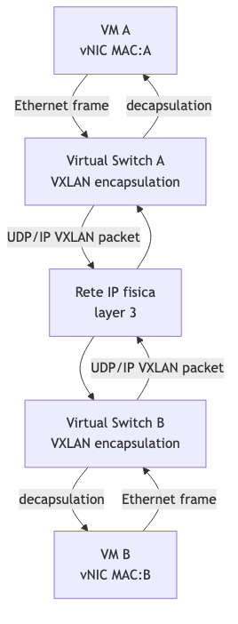
*Fig. — VXLAN: frame Ethernet tra VM incapsulati in UDP/IP, permettendo LAN virtuali indipendenti dall'infrastruttura fisica.*

> [!definition] Overlay Network
>
> Una rete logica costruita sopra una rete fisica esistente, senza richiedere modifiche all'infrastruttura fisica. Il traffico dell'overlay appare come normale traffico IP/UDP per gli switch fisici, ma trasporta frame di reti virtuali separate. Questo permette di creare LAN isolate per tenant diversi su qualsiasi numero di server nel datacenter.

L'overlay network elimina la necessità di configurare VLAN sugli switch fisici per ogni nuovo tenant — operazione manuale, lenta, e limitata a 4096 combinazioni. Con VXLAN, la configurazione avviene interamente a livello software nel virtual switch, da un pannello centralizzato.

### Ridondanza delle NIC

Ogni server in un cluster è tipicamente connesso con **due NIC** alla rete di produzione (più una terza per il management). Le due NIC vanno a due switch fisici diversi — spine-leaf. Se uno switch fisico cade, il traffico fluisce automaticamente attraverso l'altro link. Il virtual switch gestisce questa failover in modo trasparente per le VM.

---

## Aggregazione delle risorse e visione del datacenter

Mettendo insieme tutti i pezzi, un datacenter virtualizzato si presenta come:

- Un insieme di **cluster** di 8-32 host ciascuno
- Ogni host contribuisce CPU, RAM, storage e network al pool del cluster
- I pool di cluster multipli sono gestiti da un unico management layer
- Le VM vengono allocate *draw*ando dalle risorse del pool
- La live migration permette di bilanciare il carico, fare manutenzione hardware, e rispondere ai guasti in modo trasparente

La virtualizzazione ha completamente **decoupled il software dall'hardware**: il software non sa su quale server fisico gira, e non ha bisogno di saperlo. Il cloud è la manifestazione estrema di questo principio — il software non sa nemmeno in quale datacenter fisico gira.

> [!abstract] Sintesi
>
> La virtualizzazione non è solo un modo per far girare più OS sulla stessa macchina. È l'infrastruttura tecnologica che ha reso possibile il cloud computing: la live migration garantisce mobilità del workload; il virtual switch e VXLAN garantiscono portabilità della rete; l'hyper-convergence massimizza le prestazioni I/O. Il costo pagato — 10-15% di overhead CPU, spazio disco triplicato, licenze software — è ampiamente giustificato dai vantaggi operativi: manutenzione hardware senza downtime, disaster recovery automatico, isolamento completo tra tenant.

```{=latex}
\newpage
```

# Cloud Computing

Il cloud computing è uno degli argomenti centrali del corso, non solo perché interessa direttamente l'architettura dei datacenter moderni, ma perché ha ridefinito il modo in cui le organizzazioni pensano all'IT. Il professore parte da un punto fondamentale: il cloud non è nato come tecnologia, ma come **modello di business**.

---

## Origini e contesto storico

Nei primi anni 2000, Amazon, Microsoft e Google stavano costruendo datacenter sempre più grandi per supportare picchi stagionali di traffico (Natale, estate). Fuori dai picchi, i server rimanevano inutilizzati. Qualcuno — in particolare Amazon — ebbe l'idea di monetizzare quella capacità in eccesso: perché non affittarla a terzi?

Questo segna il momento in cui nasce il cloud: non come invenzione tecnica, ma come risposta a un problema economico. Google aveva già offerto qualcosa di simile con BigTable — la possibilità di pagare per indicizzare dati usando le infrastrutture di ricerca di Google — ma Amazon trovò la ricetta giusta, quella che portò all'AWS che conosciamo oggi.

Il cambiamento più profondo non era tecnologico ma finanziario: si passava dalle **CapEx** (Capital Expenses, spese in conto capitale) alle **OpEx** (Operational Expenses, spese operative). Prima, un'organizzazione comprava server che possedeva; ora paga per un servizio, e se smette di pagare non le rimane nulla. Questo è un cambio di paradigma enorme.

> [!tip] La logica del capex vs opex
>
> Con CapEx si compra qualcosa che si possiede e ammortizza nel tempo. Con OpEx si paga per l'uso: se smetti di usare, smetti di pagare. Il cloud ha spostato la spesa IT verso OpEx, eliminando l'investimento iniziale ma introducendo una dipendenza continua dal fornitore.

Nella prima ondata cloud, molti Chief Information Officer pensarono di potersi liberare completamente dell'IT on-premise. La promessa era allettante: eliminare l'intero reparto IT aziendale delegando tutto al cloud. Poi arrivarono i problemi:

- **Sovranità dei dati**: usare cloud US significa che il governo americano può accedere ai dati. L'NSA stava spiando anche Angela Merkel; la Germania reagì imponendo a Microsoft di creare una società tedesca indipendente per gestire i suoi servizi sul territorio.
- **Banda e latenza**: una risonanza magnetica può produrre 7 TB in mezzora. Come si carica tutto sul cloud? Non si può. Con l'avvento dell'IoT, controllare un semaforo via cloud introduce una latenza inaccettabile.
- **Nuovi carichi di lavoro**: video, contenuti, documenti sono adatti al cloud; sistemi di controllo real-time no.

Questi limiti hanno ridimensionato la promessa del "full cloud", ma il cloud è rimasto fondamentale per molti carichi di lavoro.

---

## La definizione formale NIST

Il **National Institute of Standards and Technology** (NIST) americano ha fornito la definizione più usata e ancora valida di cloud computing:

> [!definition] Cloud Computing (NIST)
>
> Il cloud computing è un modello per abilitare l'accesso di rete conveniente e on-demand a un pool condiviso di risorse computazionali configurabili (reti, server, storage, applicazioni, servizi) che possono essere rapidamente provisionate e rilasciate con minimo sforzo di gestione o interazione con il fornitore.

Il nome "cloud" è evocativo: non si sa dove fisicamente girino le proprie risorse, così come non si sa dove sia fisicamente una nuvola nel cielo. Questa è resa possibile dalla virtualizzazione e dalla live migration: il proprio servizio può essere spostato fisicamente da un continente all'altro senza che l'utente se ne accorga.

---

## Le 5 caratteristiche essenziali del cloud

Il NIST identifica cinque caratteristiche che devono essere presenti perché un servizio possa essere definito cloud.

### On-demand self-service

Il consumatore può approvvigionare risorse computazionali unilateralmente, senza interagire con un operatore umano del fornitore. Si entra in un portale web, si selezionano le risorse, si inserisce la carta di credito e si ottengono le macchine virtuali in pochi minuti. Su AWS, per esempio, non esiste alcun processo di approvazione manuale.

### Broad network access

Le capacità sono disponibili attraverso la rete e accessibili tramite meccanismi standard che supportano client thin e thick: telefoni, tablet, laptop, workstation. Il corollario critico di questa caratteristica è che **senza rete non si ha accesso a nulla**: il cloud è inutile offline. Tant'è che alcune app pubblicitizzano il funzionamento offline come feature premium.

### Resource pooling

Le risorse del fornitore sono aggregate in un pool condiviso per servire più consumatori con un modello **multi-tenant**. Le risorse fisiche e virtuali vengono assegnate e riassegnate dinamicamente secondo la domanda.

Il concetto di **tenant** è fondamentale: un tenant è l'insieme di risorse usate da un'organizzazione all'interno del cloud. Un cloud multi-tenant ospita contemporaneamente l'Università di Pisa, l'Università di Bologna, e così via, ciascuna con proprie policy di sicurezza e identità.

Un aspetto importante è la **location independence**: il cliente in generale non conosce né controlla dove esattamente si trovano le sue risorse, ma può specificare la posizione a livello alto (paese, regione). Per le pubbliche amministrazioni in Italia, è obbligatorio per legge garantire la residenza dei dati in Europa.

### Rapid elasticity

Le risorse possono essere provisionate e rilasciate elasticamente — in alcuni casi automaticamente — per scalare rapidamente verso l'alto e verso il basso in funzione della domanda. Per il consumatore, le risorse sembrano *infinite*: è la dimensione del datacenter ad essere così grande che quasi sempre c'è spazio per un'altra macchina virtuale.

> [!example] Elasticità: l'esempio dei videogiochi
>
> Ubisoft non possiede un proprio datacenter dimensionato per il picco di lancio dei suoi giochi. Nelle settimane del lancio c'è un ramp-up enorme di richieste, poi il traffico cala. Se Ubisoft acquistasse hardware per il picco, lo lascerebbe quasi sempre inutilizzato. Con il cloud invece si aggiungono risorse durante il picco, si pagano, e si rilasciano quando il traffico cala.

> [!example] Elasticità automatica: il sistema delle tasse
>
> Il sistema di dichiarazione dei redditi in Italia ha un picco enorme nel giorno di scadenza (tutti aspettano l'ultimo momento). Con l'elasticità automatica si può configurare: "se la latenza delle risposte del web server supera X, aggiungi un worker; se scende sotto Y, rimuovine uno". Il sistema scala da solo, pagando solo per le risorse effettivamente usate.

È importante distinguere **scala** (dimensione totale dell'infrastruttura) da **elasticità** (capacità di allocare e deallocare rapidamente su scale temporali brevi). Comprare un server e venderlo dopo 5 anni non è elasticità; richiedere 1000 CPU e ottenerle in 5 minuti, per poi rilasciarle in un'ora, lo è.

### Measured service

I sistemi cloud controllano e ottimizzano automaticamente l'uso delle risorse tramite capacità di misurazione. L'uso delle risorse può essere monitorato, controllato e comunicato, garantendo trasparenza sia al fornitore che al consumatore.

La misurazione avviene a un livello di astrazione: il fornitore non ti dice su quale specifico disco SSD stanno i tuoi dati, ma ti propone livelli di servizio — bronze, silver, gold — ognuno con garanzie di throughput diverse (es. bronze: 500 MB/s, silver: 1 GB/s, gold: 5 GB/s). Paghi per il livello, non per il dispositivo specifico.

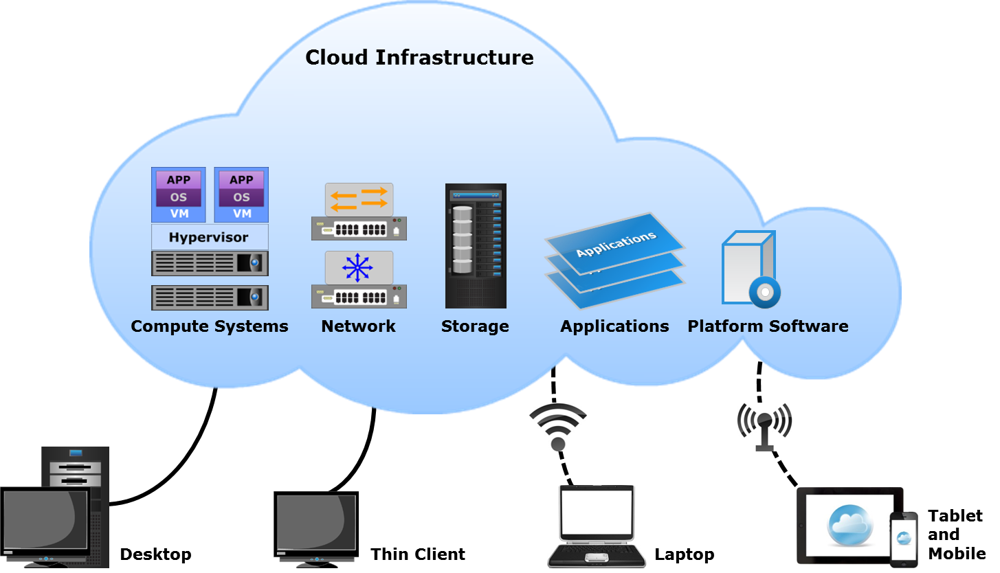
*Fig. — Le cinque caratteristiche essenziali del cloud computing secondo il NIST.*

---

## Benefici del cloud

Il cloud porta numerosi vantaggi rispetto al modello on-premise tradizionale.

**Business agility**: la capacità di rispondere rapidamente alle opportunità di mercato senza aspettare mesi per acquistare, installare e configurare hardware.

**Riduzione dei costi IT**: questa è la promessa più pubblicizzata, ma anche la più insidiosa. I costi materiali (hardware) sono facilmente misurabili. I costi del software invece no: il prezzo del software è quello che il mercato accetta di pagare, non quello che costa produrlo. Le licenze HCI (Hyper-Converged Infrastructure) sono diventate così costose che molte organizzazioni stanno tornando allo storage di rete tradizionale. Attenzione: si può facilmente finire per pagare più di prima.

**High availability**: un cloud provider con decine di datacenter globali può offrire ridondanza e resilienza irraggiungibili per una singola organizzazione. Se un datacenter viene colpito (per esempio da un attacco missilistico come nell'esempio citato), il traffico viene reindirizzato altrove.

**Flexible scaling**: possibilità di scalare dinamicamente sia horizontalmente (scale-out) che verticalmente (scale-up).

**Semplificazione dello sviluppo**: le organizzazioni in passato mantenevano il doppio dell'infrastruttura — una per la produzione, una per il test. Con il cloud, si provisiona un ambiente di test, si usa, si rilascia.

---

## Limiti e svantaggi

I drawback del cloud sono reali e rilevanti nella pratica.

Il problema della **sovranità dei dati** è ancora aperto. Il governo americano rivendica il diritto di accedere a tutti i dati conservati su cloud di proprietà americana, indipendentemente dalla posizione geografica. Microsoft, Google e altri hanno fatto azioni legali per opporsi, con successo parziale. La Germania ha risolto il problema imponendo a Microsoft di creare una controllata tedesca indipendente per gestire i dati tedeschi.

Il **vendor lock-in** è strutturale: se si costruisce tutta la propria infrastruttura su API proprietarie di un singolo cloud provider, cambiarlo in seguito è estremamente costoso. La diversificazione degli investimenti e l'uso di API aperte mitigano il problema, ma non lo eliminano.

Il **software licensing** è un territorio complesso: ci sono professionisti pagati esclusivamente per conoscere i dettagli dei contratti di licenza Microsoft. Un cambiamento nelle condizioni di licenza può ribaltare completamente la convenienza economica di una scelta tecnologica.

---

## I modelli di servizio cloud

Il NIST formalizza tre modelli di servizio principali che è indispensabile conoscere. Il professore usa l'analogia della pizza per renderli immediatamente memorizzabili.

> [!tip] L'analogia della pizza
>
> Pensate alla pizza come all'insieme di tutto ciò che serve per mangiare: ingredienti, impasto, cottura, forno, gas/luce, tavolo, bibita.
> - **On-premise**: si fa tutto a casa (si gestisce tutto).
> - **IaaS**: si compra la pizza surgelata al supermercato e la si cuoce a casa (il fornitore gestisce fino all'OS, tu gestisci il resto).
> - **PaaS**: si ordina la consegna a domicilio (il fornitore gestisce tutto tranne la personalizzazione dell'applicazione).
> - **SaaS**: si va al ristorante (il fornitore gestisce tutto, tu usi solo il servizio finale).

### Infrastructure as a Service (IaaS)

Il fornitore offre capacità computazionale grezza: processori, storage, reti. Il consumatore può deployare e far girare qualsiasi software, inclusi sistema operativo e applicazioni. Il consumatore **non gestisce** l'infrastruttura cloud sottostante, ma **ha controllo** su OS, storage, applicazioni deployate e — limitatamente — sui componenti di rete (es. firewall).

In pratica: il fornitore installa l'hardware e porta l'OS "vergine"; tu lo configuri, aggiorni, gestisci tutta la pila software sopra.

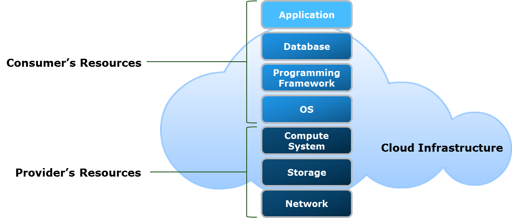
*Fig. — In IaaS il fornitore gestisce hardware e virtualizzazione; il consumatore gestisce da OS in su.*

### Platform as a Service (PaaS)

Il consumatore deploya applicazioni proprie su un'infrastruttura cloud usando linguaggi, librerie e tool supportati dal fornitore. Non gestisce né conosce l'OS sottostante: quello è responsabilità del fornitore. Si ha controllo solo sull'applicazione.

**Esempi pratici**: WordPress è un tipico PaaS. Vuoi un sito web? Non ti preoccupi del web server, del PHP, del sistema operativo. Acquisti un'istanza WordPress, la personalizzi con plugin e temi tuoi, e il fornitore gestisce tutto il resto. Salesforce è un altro esempio sul lato commerciale.

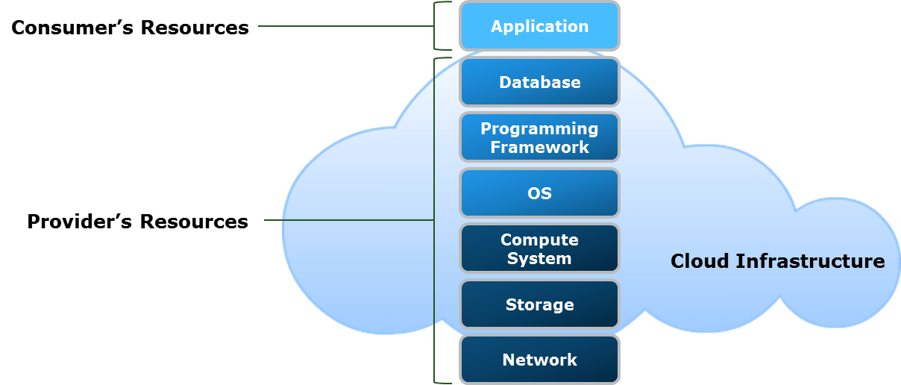
*Fig. — In PaaS il fornitore gestisce fino al runtime; il consumatore gestisce solo l'applicazione.*

### Software as a Service (SaaS)

Il consumatore usa direttamente l'applicazione del fornitore girante su infrastruttura cloud. Non gestisce nulla dell'infrastruttura, della piattaforma, o dell'applicazione stessa — solo la configurazione utente.

**Esempi**: Gmail è SaaS via browser. Microsoft 365 è SaaS con applicazioni scaricabili localmente ma intrinsecamente legate al cloud: se si smette di pagare, le app smettono di funzionare dopo 30 giorni.

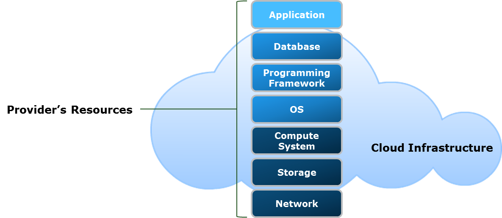
*Fig. — In SaaS tutto è gestito dal fornitore; il consumatore usa solo il prodotto finale.*

### Cloud Services Brokerage (CSB)

La **brokerage** è un livello intermedio che cerca di allocare le risorse cloud sul fornitore più conveniente tra quelli disponibili (AWS, Azure, GCP…). In teoria interessante; in pratica, quando Microsoft e altri hanno adottato la strategia di *matching* automatico dei prezzi dei concorrenti, il vantaggio economico del broker è quasi scomparso.

---

## I modelli di deployment cloud

Oltre ai modelli di servizio, esistono modelli di *deployment* che definiscono chi può accedere all'infrastruttura.

### Public cloud

L'infrastruttura è provisioned per uso pubblico aperto. Chiunque può creare un account su AWS, Azure, GCP, Oracle Cloud e allocare risorse, senza restrizioni. "Pubblico" non significa gratuito: significa accessibile a tutti.

### Private cloud

L'infrastruttura è dedicata esclusivamente a una singola organizzazione. Può essere gestita dall'organizzazione stessa o da terzi, e può esistere on-premise o off-premise. L'Università di Pisa, per esempio, gestisce un proprio private cloud.

Il punto chiave: il cloud privato non è privato perché è *owned* dall'organizzazione, ma perché solo quella organizzazione può allocare risorse su di esso.

### Community cloud

Infrastruttura condivisa tra organizzazioni con mission o requisiti comuni (es. università italiane, PA europee). Può essere on-premise o gestita da terzi.

### Hybrid cloud

Combinazione di due o più infrastrutture cloud distinte (private, community, public) che rimangono entità separate ma sono collegate da tecnologie standardizzate che abilitano la portabilità di dati e applicazioni.

> [!example] UniPi come hybrid cloud
>
> Quando accedi a un servizio universitario di Pisa, stai probabilmente usando tre cloud diversi senza saperlo: i servizi di didattica girano nel datacenter di San Piero (cloud privato UniPi), Alunni gira su Cineca a Bologna, i documenti sono su OneDrive (Microsoft Azure). Tutto appare come un'unica esperienza con una singola identità. Questo è hybrid cloud in pratica.

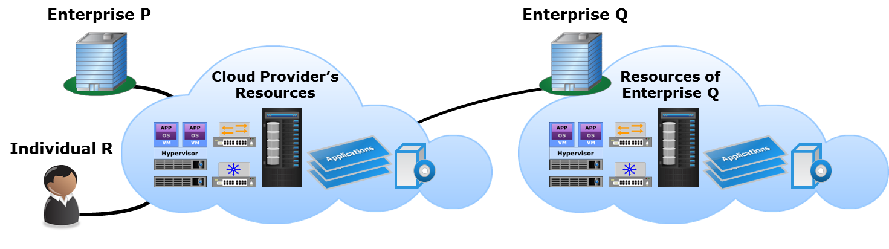
*Fig. — Il modello hybrid cloud combina infrastrutture cloud diverse collegate da standard aperti.*

> [!note] Impatto del private cloud sull'organizzazione IT
>
> Il cloud — anche nella sua versione privata — ha rivoluzionato il modello organizzativo dell'IT. Prima ogni progetto acquistava il proprio server; la capacità inutilizzata era spreco puro. Con il private cloud, si gestisce un pool condiviso da cui ogni progetto preleva le risorse di cui ha bisogno, restituendole quando non servono. Tecnologie come VMware vCloud Foundation, Microsoft Azure Local (ex Azure Stack), e Microsoft System Center consentono di implementare questo modello on-premise.

---

## Il Cloud Computing Reference Model

Una volta che le architetture cloud convergono verso pattern comuni, ha senso definire un **reference model** — una mappa condivisa per descrivere come si organizza un'infrastruttura cloud. Il modello OASIS (ripreso dal NIST) è ancora valido dopo oltre 12 anni.

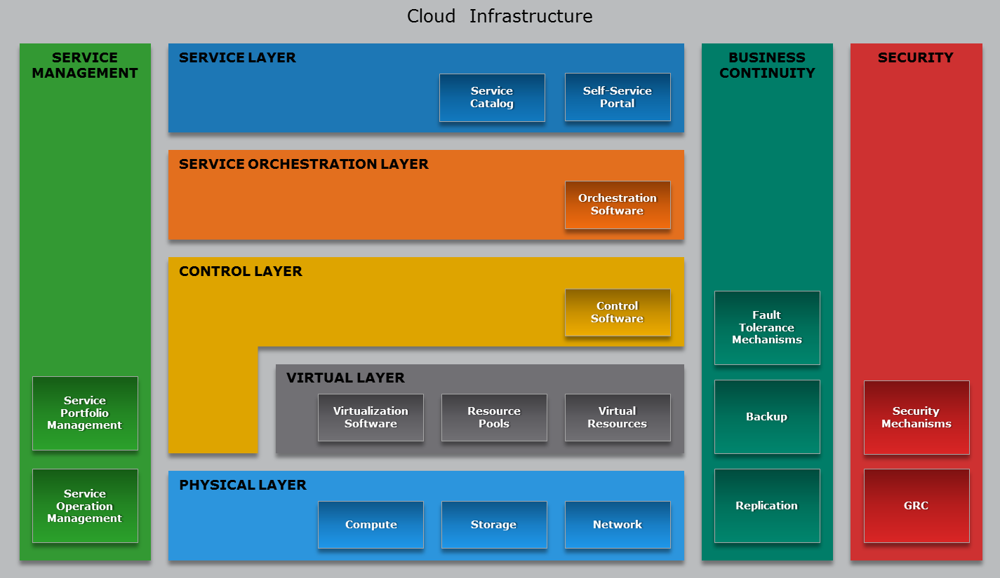
*Fig. — Il reference model OASIS per il cloud computing: layer funzionali e aspetti cross-cutting.*

Il modello è strutturato in layer funzionali verticali e aspetti cross-cutting orizzontali.

### Physical layer

Alla base c'è sempre il silicio: compute, storage, network — tutto ciò che abbiamo studiato nel corso. La maggior parte del cloud è implementata tramite virtualizzazione, ma esiste anche il **bare metal cloud**: invece di una VM, si provisiiona un intero server fisico programmandolo via API (es. Redfish). Meno elasticità di granularità (solo interi server), ma utile per HPC.

### Virtual layer

È il layer cruciale: astrae le risorse fisiche e le presenta come pool omogeneo da cui allocare slice. Macchine virtuali, storage virtuale, reti virtuali (VLAN, vSAN) vivono qui. La virtualizzazione è ciò che rende possibile il resource pooling.

### Control layer

È l'API che consente di dire "allocami una VM con queste caratteristiche" e di ottenere il risultato. Il control layer sa dove ci sono risorse libere, le marca come occupate, tiene il libro contabile. È il "cervello" operativo del cloud: quando si fa una richiesta, il control layer interroga l'inventario, trova capacità disponibile, alloca e conferma.

### Administration / Orchestration layer

Sopra il control layer c'è l'automazione: workflow che definiscono "se succede X, esegui Y, poi Z". Gestisce il provisioning complesso (allocare una VM, poi aspettare che sia pronta, poi configurarla, poi avvisare l'utente), il decommissioning hardware (quando un server va in pensione: wipe dei dischi, rimozione dal configuration database, segnalazione), e tutto ciò che altrimenti richiederebbe intervento umano.

> [!tip] Economia dell'automazione
>
> I grandi cloud provider gestiscono decine di milioni di server con pochissimo personale fisico (poche decine di persone per strutture enormi). Questo è possibile solo perché l'orchestration layer automatizza praticamente tutto: dalla sostituzione di un disco guasto alla sostituzione di un intero rack.

### Service layer

Il layer più alto: il portale web dove l'utente vede il catalogo servizi, si autentica, seleziona le risorse, paga e le riceve. Traduce le richieste utente in task che scendono verso l'orchestration e poi il control layer.

### Aspetti cross-cutting

Sicurezza e business continuity non appartengono a un singolo layer: permeano tutti. La sicurezza deve essere presente a livello fisico (accesso fisico al datacenter), virtuale (isolamento tra tenant), di controllo (autenticazione alle API), di orchestration, e di servizio. La business continuity — RAID, backup, replication, failover tra datacenter — è ugualmente trasversale.

---

## Greenfield vs. Brownfield

Due termini del gergo IT fondamentali:

**Greenfield**: si parte da zero. Hardware nuovo, sistema deployato ex novo, test puliti, consegna. È il caso ideale.

**Brownfield**: si deploya qualcosa in un'infrastruttura già esistente. Le decisioni prese 10, 20, 30 anni fa condizionano le scelte odierne. Il professore gestisce servizi universitari da quasi 10 anni e ancora si confronta con scelte architetturali di decenni fa.

---

## Costruire il cloud: non solo tecnologia

Una lezione chiave: costruire un'infrastruttura cloud non è solo un problema tecnico. Ci sono almeno quattro dimensioni non tecniche altrettanto critiche.

### Governance

La governance è la distribuzione attiva di diritti decisionali e responsabilità tra i vari stakeholder dell'organizzazione. Chi decide quale servizio attivare? Chi approva il budget? Chi è responsabile in caso di incidente?

I modelli principali sono tre: **centralizzato** (un'autorità centrale governa tutte le business unit), **distribuito** (ogni unità ha la propria governance autonoma, tipico di grandi organizzazioni), **federato** (combinazione dei due, con autonomia locale ma coordinamento centrale).

UniPi usa un modello prevalentemente centralizzato: la dimensione dell'organizzazione lo consente.

Il cloud ha introdotto nuovi ruoli organizzativi:
- **Service manager**: responsabile di un singolo servizio
- **Account manager**: gestisce il rapporto con il cliente/utente
- **Cloud architect**: progetta l'architettura complessiva del cloud
- **Service operation manager**: responsabile dell'intera infrastruttura e di tutti i servizi su di essa

### Finance e procurement

In un'organizzazione pubblica italiana, la spesa IT è regolata da norme precise: acquisti diretti fino a ~€139.000, oltre tale soglia si richiede gara europea (€214.000+), con tempi minimi di sei mesi. Se un server si rompe e bisogna lanciare una gara europea, per sei mesi non c'è server.

Questo significa che il procurement deve essere **proattivo**: bisogna prevedere i fabbisogni futuri, pianificare le gare prima che le risorse servano. L'Università di Pisa spende circa 6 milioni/anno in IT: 80.000 switch, 2000 access point, datacenter e cloud privato.

Il **chargeback** è il meccanismo con cui si attribuisce il costo delle risorse cloud ai reparti o progetti che le usano. Non si chiede denaro (in un ente pubblico), ma si tiene traccia di chi usa quanto. Il Dipartimento di Informatica che usa più VM del Dipartimento di Filosofia dovrebbe ricevere un contributo proporzionalmente maggiore.

Modalità di chargeback nel cloud:
- **Pay-as-you-go**: paghi per quello che usi
- **Subscription**: abbonamento per un periodo (come Microsoft 365 annuale)
- **By peak**: si paga per il picco di utilizzo raggiunto
- **User-based**: costo per utente (il modello AI aziendale è spesso così: ogni utente ha una quota di token)

### Service Level Agreement (SLA)

Quando le proprie risorse sono "da qualche parte nel cloud" e non si può andare fisicamente a verificarle, l'unica garanzia possibile è quella **contrattuale**. Uno SLA è la parte del contratto che specifica i parametri del servizio: disponibilità (es. 99.9%), schedule di manutenzione, livelli di performance, tempi di risposta del supporto, e le compensazioni in caso di violazione.

Gli SLA di tutti i servizi Microsoft online, con versioni storiche e in tutte le lingue, sono pubblici e consultabili sul sito Microsoft. Studiarne uno è utile per capire cosa garantisce realmente un cloud provider.

### Vendor lock-in

La dipendenza da un singolo fornitore è un rischio strategico. Se il fornitore cancella un prodotto, cambia le condizioni di licenza, o aumenta i prezzi, l'organizzazione è in difficoltà. Strategie di mitigazione: diversificazione degli investimenti, preferenza per API e standard aperti.

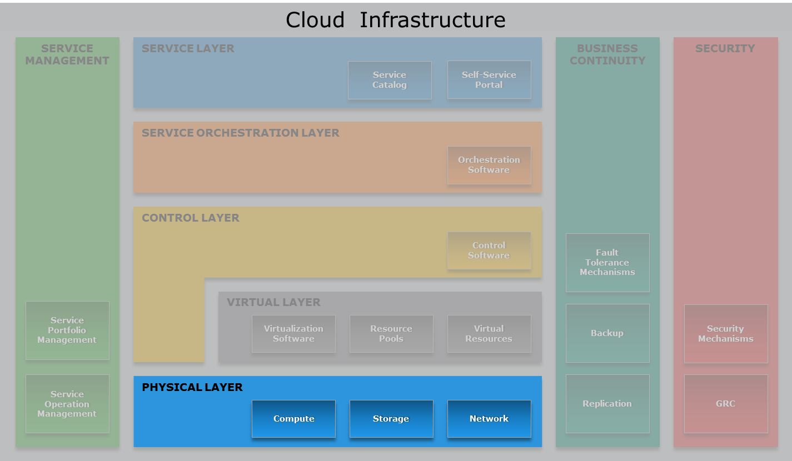
*Fig. — I tre modelli di governance cloud: centralizzato, distribuito, federato.*

---

## Il physical layer e il virtual layer: riepilogo

Il professore dedica gli ultimi minuti a scorrere rapidamente i layer fisici e virtuali già trattati nel corso, confermando che i concetti si incastrano con quanto visto.

Il **physical layer** comprende compute (server, CPU, GPU), storage (a blocchi, a file, a oggetti — unified storage come configurazione ibrida), e network (Fibre Channel per storage, iSCSI sempre meno usato, Ethernet convergente). Le note nelle slide originali fanno riferimento alle tecnologie meccaniche di dischi prima della diffusione degli SSD, ma le categorie logiche (block, file, object) rimangono attuali.

Il **virtual layer** è composto da macchine virtuali (file VMDK, virtual appliance), storage virtuali (LUN thin-provisioned, vSAN), e reti virtuali. La **PVLAN** (*Private VLAN*) merita un dettaglio: è una VLAN che vieta il broadcast orizzontale tra host. Se siete connessi al Wi-Fi universitario, siete su una PVLAN — per questo non potete fare ping tra due device sulla stessa rete wireless: la rete non consente comunicazione diretta tra client, solo north-south (client → gateway).

> [!note] Prossime lezioni
>
> Il professore ha annunciato che la lezione successiva partirà dal **control layer** e dall'**orchestration layer** — le parti veramente nuove rispetto a ciò già coperto nel corso. Poi seguiranno sicurezza e operazioni, e il venerdì successivo la visita al datacenter di San Piero.

---

```{=latex}
\newpage
```

# Control Layer, Orchestrazione e SLA

La lezione riprende dal punto in cui si era interrotto il ciclo precedente, cioè dal **Control Layer**, l'ultimo strato funzionale dell'architettura di riferimento del cloud che non era ancora stato discusso in dettaglio. Il professore chiarisce subito la prospettiva corretta: dal punto di vista informatico, nessuno degli strati funzionali del cloud è particolarmente complesso concettualmente. Le difficoltà reali risiedono nell'hardware, nella topologia e nelle scelte implementative dei singoli layer. L'obiettivo della lezione è passare rapidamente sui layer funzionali per poi spostarsi sugli aspetti trasversali più interessanti: sicurezza, business continuity, service management e, soprattutto, framework legali e compliance.

---

## Il Control Layer

### Posizione nell'architettura

Il control layer si inserisce sopra il virtual layer (o direttamente sopra il physical layer, in assenza di virtualizzazione). Riceve richieste dagli strati superiori — service e orchestration layer — e si occupa di provisioning delle risorse fisiche e virtuali necessarie per soddisfarle.


*Fig. — Il Cloud Reference Model con il Control Layer evidenziato (in giallo). Sopra ci sono Service Layer e Orchestration Layer; sotto il Virtual Layer e il Physical Layer.*

> [!definition] Control Layer
>
> Include gli strumenti software responsabili di gestire e controllare l'infrastruttura cloud sottostante, abilitando il provisioning delle risorse IT per la creazione di servizi cloud.

### Il Control Software

Il control software lega insieme le risorse sottostanti. Le sue funzioni principali sono: **resource pooling**, **allocazione dinamica** delle risorse, **ottimizzazione dell'utilizzo** e gestione centralizzata di tutti gli asset. Quest'ultima caratteristica spiega perché questo software è stato adottato da moltissime organizzazioni enterprise anche al di fuori di contesti cloud puri: offre un punto unico da cui gestire in blocco tutti i sistemi, eseguire operazioni di manutenzione coordinate, applicare patch di sicurezza svuotando il nodo interessato prima di portarlo offline, riavviarlo e poi ribilanciare le risorse — il tutto senza che nessun utente se ne accorga.

Il control software funziona bene solo se l'ambiente è **omogeneo**: se le procedure sono standardizzate e replicabili, l'automazione ha senso. Altrimenti, ogni sistema richiederebbe attenzione individuale, negando i vantaggi del layer.

Un ruolo cruciale del control software è quello di **adapter**: astrae il brand e la tecnologia dei componenti fisici dagli strati superiori. Il cloud non sa se lo storage è Dell, HP o VAS Data — non importa. Il control layer si preoccupa dei dettagli hardware e presenta agli strati superiori un'interfaccia uniforme. Analogamente, tutta l'infrastruttura espone **API** che permettono di automatizzare e orchestrare le operazioni programmaticamente.

### Element Manager vs Unified Manager

Il control software può essere organizzato in due modi:

**Element Manager**: ogni componente infrastrutturale (compute, network, storage) viene gestito da un software dedicato fornito dal vendor. Ogni element manager espone le proprie API verso le risorse che gestisce.


*Fig. — Gli Element Managers gestiscono indipendentemente i tre pilastri: compute, network e storage.*

**Unified Manager**: un singolo software fornisce un'interfaccia unificata per configurare e provisioning tutte le risorse. Internamente si interfaccia con gli element manager tramite API, ma presenta all'amministratore e agli strati superiori una visione olistica e coerente dell'intera infrastruttura.


*Fig. — L'Unified Manager fornisce un singolo punto di controllo, coordinando internamente gli element manager di compute, network e storage.*

In pratica, le implementazioni reali combinano entrambi gli approcci: l'unified manager gestisce le operazioni di alto livello, mentre gli element manager si occupano dei dettagli specifici di ciascun componente.

---

## Fasi del Provisioning delle Risorse

### Resource Discovery

Prima di poter allocare qualcosa, il sistema deve **conoscere le risorse disponibili**. La resource discovery è il processo con cui nuove risorse vengono aggiunte al resource pool. Questo è il riflesso dell'industrializzazione del datacenter: non si interviene sul singolo disco rotto, si aspetta che l'intero pod scenda sotto una soglia (es. 20% di risorse disponibili), si decommissiona tutto il pod, lo si sostituisce fisicamente, e poi le nuove risorse vengono scoperte automaticamente e aggiunte al pool. Tutto ciò vale per compute, storage e network.

### Resource Pool Management e Grading

Una volta note le risorse, queste vengono **astratte e classificate**. Non ha senso tracciare ogni dettaglio tecnico — se un link è da 25 Gbps con fibra ottica OM4 o meno — per scopi di billing, monitoraggio e provisioning. Si definiscono invece **categorie equivalenti**, all'interno delle quali le risorse sono considerate intercambiabili anche se tecnicamente diverse.

Il meccanismo tipico è il **grading**: si definiscono livelli qualitativi come *Gold*, *Silver*, *Bronze* per ogni tipo di risorsa (compute, storage, network). Ogni livello ha un costo diverso e garantisce caratteristiche diverse. Per esempio:

- **Gold Storage**: include drive Flash, FC e SATA, supporta automated storage tiering, capacità 3 TB, RAID 5.
- **Silver Storage**: mix bilanciato tra Flash, FC e SATA, RAID 1+0.
- **Bronze Storage**: solo drive FC, nessun tiering automatico.

Il grading permette di offrire ai consumatori scelte differenziate e consente alla piattaforma di prendere decisioni di allocazione senza conoscere i dettagli fisici sottostanti.

### Resource Provisioning

Quando un consumatore seleziona un servizio dal catalogo, il sistema alloca risorse dal pool corrispondente alla grade richiesta. Se non ci sono risorse sufficienti, la risposta è semplice: il servizio non può essere creato. Un esempio classico è quello di una virtual machine più grande di qualunque singolo server disponibile: anche se il server è libero al 100%, la VM semplicemente non può essere creata perché è fisicamente impossibile.

---

## L'Approccio Software-Defined

Il naturale corollario della gestione centralizzata a scala è la **software-defined infrastructure**: separare le funzioni di management dai componenti fisici e delegarle a controller software. Questo approccio si è affermato a partire dal 2008 circa con standard come **OpenFlow** per il networking e poi VXLAN per gli overlay di rete.


*Fig. — Il software-defined controller astrae compute, storage e network, esponendo API verso le applicazioni esterne e comunicando con i componenti fisici tramite API standardizzate.*

Il vantaggio originale era economico: il software-defined permetteva di evitare hardware proprietario costoso (specialmente storage dedicato) usando hardware commodity. Oggi la situazione si è in parte invertita: i vendor software hanno alzato i prezzi delle licenze al punto che in alcuni casi conviene tornare all'hardware dedicato. Le dinamiche cambiano nel tempo.

Il software-defined si applica a tutti e tre i pilastri:
- **Compute**: il server può essere provisioned completamente via software (es. Redfish sul BMC).
- **Storage**: storage pools gestiti via API, indipendentemente dal vendor.
- **Network**: switch programmabili via OpenFlow, VXLAN per creare VLAN overlay senza configurare fisicamente ogni switch.

---

## Tecniche di Resource Management

### Modelli di Allocazione

Esistono due approcci fondamentali:

> [!definition] Relative Resource Allocation
>
> Le risorse vengono allocate proporzionalmente rispetto agli altri servizi. Non molto diffuso in pratica.

> [!definition] Absolute Resource Allocation
>
> Si definisce un range quantitativo: un **lower bound** (garanzia minima) e un **upper bound** (limite massimo di consumo). Il cloud provider firma contratti SLA in base a questi range, quindi deve rispettarli e gestire la contesa tra tenant.

Il problema dell'allocazione assoluta è la **contesa tra tenant**: se tutti i tenant chiedono il massimo simultaneamente, le risorse si esauriscono. Il cloud provider deve bilanciare le allocazioni in modo da poter onorare i contratti di tutti, altrimenti si espone a responsabilità legale.

### Hyper-Threading

> [!definition] Hyper-Threading
>
> Tecnica Intel che consente a un singolo core fisico di apparire come due core logici, eseguendo due stream di istruzioni in modo parzialmente parallelo condividendo le unità computazionali fisiche.

Il professore spiega l'evoluzione in dettaglio. Negli anni '90, i thread emersero come forma leggera di concorrenza: più flussi di esecuzione all'interno dello stesso processo, con cambio di contesto più economico rispetto ai processi (non si aggiornano le strutture dati della memoria paginata, perché i thread dello stesso processo condividono lo spazio di indirizzamento). I vendor hardware iniziarono a ottimizzare questo pattern.

L'idea chiave dell'hyper-threading è che **non tutti i thread usano tutte le unità computazionali contemporaneamente**: se un thread fa aritmetica intera e l'altro fa operazioni floating point, possono andare in parallelo sullo stesso core. Il core viene progettato con due pipeline fetch/execute che si contendono le unità computazionali fisiche solo quando necessario.


*Fig. — L'hyper-threading: ogni core fisico espone due core logici. Le VM vedono processori virtuali che si mappano sui core logici, non fisici.*

> [!warning] HPC e Hyper-Threading
>
> In ambienti HPC (High Performance Computing), l'hyper-threading va spesso **disabilitato**: i calcoli sono prevalentemente floating point, quindi entrambi i thread si contendono la stessa FPU, creando più contesa che parallelismo. Il risultato può essere più lento che con un solo thread per core.

Per il cloud generale (IO-bound, network-oriented), l'hyper-threading equivale quasi a raddoppiare i core. Con un server da 56 core logici, si possono allocare tranquillamente 112 core virtuali alle VM senza un vero degrado delle prestazioni, perché la maggior parte del tempo la CPU è idle in attesa di IO. Questo **overbooking dei core** è la norma nel cloud.

### Memory Ballooning (Dynamic Memory Allocation)

L'overbooking della memoria si fa con una tecnica chiamata **ballooning**. Un driver installato nella VM comunica con l'hypervisor. L'hypervisor dichiara alla VM che una parte della memoria è occupata (il "balloon"), riducendo la memoria disponibile percepita dalla VM. L'hypervisor monitora continuamente la pressione di memoria: se vede che una VM sta facendo heavy paging (cioè soffre di mancanza di memoria), può **deflate** il balloon — ridurre la quantità di memoria dichiarata occupata — così la VM percepisce di avere più memoria disponibile.

Questo permette di avere più VM attive contemporaneamente di quante la memoria fisica supporterebbe se tutte fossero pienamente allocate. Se la contesa diventa reale (tutte le VM vogliono tutta la memoria), si definiscono **priorità** per decidere chi aspetta.

Un'ottimizzazione ulteriore è il **memory page sharing**: se due VM eseguono lo stesso sistema operativo, quasi certamente hanno pagine di memoria identiche. L'hypervisor può identificarle e far puntare entrambe le VM alla stessa pagina fisica, risparmiando memoria.

### Virtual Storage Provisioning e Storage Management

Il **thin provisioning** applicato allo storage funziona allo stesso modo: si presenta alla VM più spazio di quello fisicamente allocato. Lo spazio reale viene allocato solo quando i dati vengono effettivamente scritti.

Il **storage pool rebalancing** previene la situazione in cui un server accumula troppe VM mentre altri rimangono quasi vuoti: il sistema migra automaticamente VM da nodi sovraccarichi a nodi meno utilizzati.

L'**automated storage tiering** gestisce automaticamente dove i dati vengono fisicamente conservati: i dati più acceduti di recente vengono tenuti su SSD (o addirittura in cache DRAM), mentre i dati freddi vengono migrati su dischi meccanici più lenti ma più economici. Il movimento avviene in modo trasparente alle applicazioni.

---

## Demo: SCVMM al Polo Universitario di San Piero a Grado

Il professore mostra dal vivo il **System Center Virtual Machine Manager (SCVMM)**, il control layer del private cloud dell'Università di Pisa. Le API sono basate su PowerShell (eredità di un'epoca in cui le REST API HTTP erano meno diffuse), ma il concetto è identico a quello di qualsiasi control layer moderno.

L'interfaccia mostra:
- Il **fabric**: il pool di risorse totale, con classificazione dei port profile (alta banda, media banda, etc.) per taggare la rete.
- Lo **storage**: livelli *bronze*, *flash*, *hyper-class*. L'università usa un'infrastruttura iper-convergente, quindi lo storage è nel medesimo pool dei server.
- La **logical network**: astrazione software-defined che mappa VLAN fisiche diverse (es. VLAN 1800 in datacenter 1 e VLAN 1801 in datacenter 2) a un'unica rete logica "pubblica". Il cloud non sa quale VLAN fisica viene usata; sa solo che si tratta di traffico pubblico.
- La **library delle immagini**: repository da cui clonare le VM.

Degno di nota è il **service template** per il sistema di registrazione degli esami dell'università: due macchine virtuali (frontend + backend database), collegate a specifiche reti, con il frontend scalabile (da 1 a 5 istanze) e il database non scalabile orizzontalmente (si scala verticalmente). Quando si crea una nuova istanza del servizio, SCVMM alloca entrambe le VM, le configura e le connette automaticamente.

La creazione di una singola VM tramite wizard mostra come il sistema suggerisca automaticamente il nodo ottimale per il bilanciamento del carico. Tutto ciò che viene fatto graficamente si traduce in uno **script PowerShell** generato automaticamente — conferma che anche le interfacce grafiche non "controllano" direttamente: generano chiamate API.

> [!tip] Intuizione chiave sul bookkeeping
>
> Il bookkeeping è un'attività critica nel cloud: tenere traccia di ogni VM, ogni servizio, ogni tenant è essenziale perché nel cloud pubblico si arriva facilmente a milioni di istanze. Chi rimuove le risorse abbandonate se non c'è traccia di chi le ha create? Un errore di bookkeeping porta a "VM fantasma" che consumano risorse senza che nessuno ne sia responsabile.

---

## Il Service e Orchestration Layer


*Fig. — Nel Reference Model del modulo 6, Service Layer (blu) e Orchestration Layer (arancione) sono in cima all'architettura.*

### Service Layer

Il service layer è il livello più alto dell'architettura cloud. Le sue funzioni principali sono:

- **Definire il service catalog**: la lista dei servizi disponibili, con tutte le informazioni per il consumatore.
- **On-demand self-provisioning**: il consumatore può richiedere un servizio senza intervento umano da parte del provider.
- **Presentare le cloud interface**: interfaccia funzionale (usare il servizio) e interfaccia di gestione (gestire l'istanza del servizio).

> [!definition] Service Catalog
>
> Elenco strutturato di tutti i servizi offerti dal provider. Ogni voce include: categoria, nome, descrizione, feature e opzioni, aspettative di qualità del servizio, prezzo, tempi di provisioning, riferimento a SLA e documentazione.

Il professore mostra il portale Azure come esempio concreto: una quantità enorme di servizi categorizzati (VM, database, firewall, etc.), ognuno con varianti e opzioni. Quello è il service catalog in produzione.

### Cloud Portal

Il cloud portal è la UI del service layer. Ha due funzioni:

1. **Presentazione**: mostra il service catalog, le istanze attive e le interfacce di gestione.
2. **Interazione con l'orchestration layer**: invia le richieste di servizio all'orchestratore e mostra gli aggiornamenti di stato.

Tutto nel cloud portal è **asincrono**: quando si richiede una VM, si emette una richiesta che entra in una coda. Il portal mostra lo stato dell'ordine in tempo reale (in attesa → in progress → pronto).

### Standard di Portabilità

Il professore racconta la storia degli standard di portabilità cloud con un tono sarcastico:

**TOSCA** (*Topology and Orchestration Specification for Cloud Applications*): tentativo di standardizzare un linguaggio per definire servizi in modo portabile tra cloud diversi. Sostanzialmente fallito. La realtà è che il cloud si è biforcato in due categorie:

1. **Servizi portabili** (tipicamente IaaS): si esporta la VM, si importa nell'altro cloud. Nessun standard sofisticato serve davvero.
2. **Servizi locked-in** (tipicamente PaaS/SaaS): Google Bigtable, Alexa, modelli AI. Questi servizi non sono portabili per natura — si comportano diversamente anche con lo stesso prompt. Nessuno standard può risolvere questa differenza semantica.

**OVF** (*Open Virtualization Format*): standard aperto per il packaging di virtual appliance. Ancora in uso, soprattutto nell'ecosistema VMware. Funziona perché il problema da risolvere è più semplice: impacchettare VM con i loro metadati (numero di CPU, memoria, configurazione di rete) in un formato che un altro hypervisor possa capire.

> [!note] REST e SOAP
>
> I protocolli per accedere ai servizi cloud sono già noti: **REST** (architettura stateless basata su HTTP, risorse identificate da URI, metodi standard GET/POST/PUT/DELETE) e **SOAP** (protocollo basato su XML per lo scambio di messaggi strutturati). REST è oggi predominante.

---

## Service Orchestration

L'orchestrazione è il cuore operativo del cloud: il meccanismo che, a partire da una richiesta nel service catalog, coordina automaticamente tutte le operazioni necessarie per creare, gestire e terminare un servizio.

> [!definition] Service Orchestration
>
> Arrangiamento, coordinamento e gestione automatizzati di vari componenti di un'infrastruttura cloud per fornire e gestire servizi cloud. Converte le richieste del service catalog in operazioni concrete sul control layer.

L'orchestratore lavora con sistemi asincroni e code. La **resilienza** dell'orchestratore è critica: perdere lo stato dell'orchestrazione significa trovarsi con migliaia di VM senza sapere a quale servizio appartengono. Per questo motivo, tutte le operazioni vengono persistite in database, non mantenute solo in memoria.


*Fig. — L'orchestratore è il punto centrale di integrazione: riceve richieste dal Cloud Portal e coordina Unified Manager, Billing System, Directory Service, CMS e Service Management Tools.*


*Fig. — L'orchestratore esegue un workflow composto da chiamate API verso sistemi diversi (approvazione, billing, unified manager) in sequenza o in parallelo.*

### Use Case: Provisioning di un database DB2

Il workflow illustrato dal professore passo per passo:

1. Risorse disponibili nel pool?
   - **No** → aggiorna il portal (order in attesa) → provisioning di più risorse → se ora disponibili, riprendi; altrimenti → order failed.
   - **Sì** → continua.
2. Aggiorna cloud portal: "Order in Progress".
3. Crea la VM.
4. Installa il Guest OS.
5. Connetti la VM alla VLAN corretta.
6. Assegna l'indirizzo IP.
7. Installa DB2.
8. Configura il database.
9. Aggiorna il Configuration Management System (CMS).
10. Genera il bill per il nuovo servizio.
11. Aggiorna il cloud portal: "Service Ready".


*Fig. — Il workflow completo di provisioning di un database DB2: dal controllo delle risorse alla notifica del servizio pronto.*

### Use Case: Rimozione di un Tenant

Quando un'organizzazione decide di non usare più il cloud, tutto va ripulito:

1. Ottieni i dettagli dell'organizzazione consumer (lista utenti e servizi).
2. La lista dei servizi è vuota?
   - **No** → elimina le istanze del servizio e rilascia le risorse → rimuovi dal CMS → ricontrolla.
   - **Sì** → continua.
3. La lista degli utenti è vuota?
   - **No** → elimina gli utenti dal CMS → ricontrolla.
   - **Sì** → elimina l'organizzazione consumer dal CMS. Fine.


*Fig. — Il workflow di rimozione di un tenant: deprovisioning completo di servizi, utenti e organizzazione dal CMS.*

---

## Cloud Service Lifecycle

Un servizio non inizia quando viene deployato per la prima volta: il suo ciclo di vita inizia molto prima.

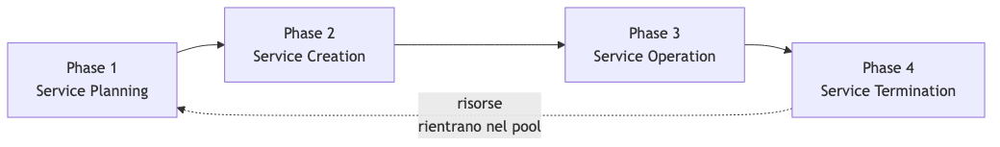
*Fig. — Le quattro fasi del Cloud Service Lifecycle.*

### Phase 1: Service Planning

La fase di planning è **strategica**: si decide se vale la pena creare un servizio. Il professore fa l'esempio dell'università: a un certo punto si è valutata la domanda di web server per i professori (siti di ricerca, didattica, etc.) e si è deciso di supportare solo WordPress, semplificando il portfolio ma soddisfacendo la maggior parte della domanda.

Le domande chiave del planning:
- Quali servizi verranno creati o aggiornati? Qual è il service model appropriato (IaaS, PaaS, SaaS)?
- Quali risorse hardware e software sono necessarie?
- Chi sono i target consumer? Qual è la domanda prevista?
- Qual è il modello di deployment (private, public, hybrid)?
- Quali requisiti di compliance normativa esistono?

### Billing Policy

Il billing non riguarda solo fare profitto. Il professore insiste su questo punto: il cloud **nasconde i costi**. Quando si accede a un servizio cloud dallo smartphone, non si pensa all'energia consumata dai server, dagli switch, dai dischi. Se si archivia un documento inutile nel cloud, si sta sprecando energia e denaro.

> [!example] Esempio: Google Drive e i 100 TB
>
> Un collega del professore aveva accumulato 100 TB su Google Drive perché un backup era partito con le impostazioni sbagliate e nessuno l'aveva notato. Il problema era che quando il cloud era "infinito" e "gratuito", le persone non si rendevano conto dei costi. Google ha poi reso lo storage limitato per lo stesso motivo: indurre le persone a percepire il valore di ciò che consumano.

Il billing è anche uno **strumento di policy**: si può aumentare il prezzo di un servizio per scoraggiarne l'uso (es. un servizio energivoro o meno verde) e abbassare quello di un alternativa preferita. L'università di Pisa sta valutando di assegnare un "budget IT virtuale" a ricercatori e staff, con la possibilità di scalare usando fondi di ricerca se si supera la soglia — proprio per creare consapevolezza.

Tipi di billing nel private cloud:
- **Chargeback**: il costo viene effettivamente addebitato all'unità organizzativa.
- **Showback**: si mostra il costo senza addebitarlo, solo per trasparenza e consapevolezza.

### Phase 2: Service Creation

Si definisce il **service template** (struttura del servizio, attributi default, operazioni di gestione), si crea il **workflow di orchestrazione** corrispondente e si definisce la **service offering** nel catalogo. La service offering è la combinazione di:

- Template + struttura.
- Constraints (chi può accedere).
- Policy (QoS, firewall, bandwidth quota).
- Rules (limiti di scaling, periodo di subscription).
- Price.
- **SLA** (Service Level Agreement).

### Phase 3: Service Operation

Gestione operativa continua: monitoring, reporting, provisioning di nuove istanze, troubleshooting. L'obiettivo è automatizzare tutto il possibile.

### Phase 4: Service Termination

Quando un servizio viene terminato (per scelta del provider, del consumer, o per fine contratto), tutte le risorse vengono rilasciate e restituite al pool. La terminazione non deve impattare altri servizi né i dati dei consumer.

---

## Service Level Agreement (SLA)

Il professore dedica la parte finale della lezione all'SLA, considerandolo uno dei documenti più importanti — e più trascurati dai tecnici — nel cloud.

> [!definition] Service Level Agreement (SLA)
>
> Contratto che definisce la **qualità di servizio** che il provider garantisce al consumer. Non si acquista hardware specifico: si acquista un livello di qualità indipendentemente da come il provider lo realizzi.

Il cloud è "somewhere": non si sa su quale disco, in quale datacenter, in quale paese siano i propri dati. L'SLA è l'unico strumento contrattuale che garantisce che il servizio ricevuto corrisponda a quello pagato.

### Domande chiave dell'SLA

> [!question] Domande chiave dell'SLA
>
> 1. Quali sono i livelli minimi accettabili di performance e disponibilità?
> 2. C'è un limite alla quantità di risorse consumabili?
> 3. Come viene definita un'interruzione di servizio? Come vengono compensati i consumer?
> 4. Qual è il livello di servizio durante i periodi di manutenzione?
> 5. I consumer devono pagare licenze aggiuntive oltre ai costi del servizio?
> 6. Dove verrà archiviata la copia primaria dei dati? Come sarà protetta?
> 7. Vengono offerti compliance e data security come servizi supplementari?
> 8. I consumer verranno notificati se un'agenzia governativa richiede i loro dati?
> 9. Quali garanzie di customer service e tempi di risposta sono previste?

**Sul punto 1**: il costo aumenta in modo non lineare con il livello di disponibilità. Garantire il 95% di uptime costa relativamente poco; garantire il 99.99% richiede ridondanze massicce che si riflettono sul prezzo.

**Sul punto 3**: la definizione di "service outage" è il punto più critico e insidioso dell'SLA. È qui che i provider hanno margine di manovra legale.

**Sul punto 6**: per le pubbliche amministrazioni europee, i dati devono risiedere in datacenter europei (GDPR). L'SLA deve specificare esplicitamente la geolocalizzazione dei dati.

**Sul punto 8**: dopo gli attentati dell'11 settembre 2001, il governo USA si è riservato il diritto di accedere a email e comunicazioni di sospetti terroristici senza notificare gli interessati. Un SLA con un provider americano potrebbe non garantire notifica in caso di richieste di accesso governativo.

### La Definizione di Downtime: il Punto Critico

Il professore sottolinea che la prima cosa da leggere in un SLA non è la tabella delle compensazioni, ma la **sezione delle definizioni** — in particolare la definizione di downtime.

> [!warning] Trucchi nella definizione di downtime
>
> - **Misura in user-minutes**: il downtime non si misura in minuti di clock, ma in (minuti × utenti impattati). Se il problema riguarda solo un account su 50.000, l'impatto in user-minutes è quasi zero — quindi non viene contato come downtime.
> - **Slot minimi**: Amazon nel suo primo SLA dichiarava che un'interruzione veniva contata solo se la VM non era accessibile per almeno 5 minuti. Interruzioni da 4 minuti non esistevano. Molte interruzioni brevi potevano accumularsi senza essere conteggiate.
> - **Colpa di terze parti**: se il problema è nella rete del provider internet del consumer, o nel laptop del consumer, non è colpa del cloud provider.
> - **Scheduled downtime**: la manutenzione pianificata e notificata con almeno 5 giorni di anticipo non conta come downtime.

### Caso Pratico: Microsoft 365 SLA

Il professore apre live il documento SLA di Microsoft 365 e analizza le sezioni chiave.

**Definizione di Uptime Percentage**:

$$
\text{Uptime \%} = \frac{\text{User Minutes} - \text{Downtime}}{\text{User Minutes}} \times 100
$$

Dove:
- **User Minutes** = (minuti totali nel periodo − scheduled downtime) × numero di utenti.
- **Downtime** = Σ (durata incidente in minuti × utenti impattati dall'incidente).

**Scheduled Downtime**: "We will publish notice at least five days prior to the downtime." Se la notifica arriva tardi, quella manutenzione non è più "scheduled downtime" — è vera interruzione.

**Service Credits** (compensazioni):

| Uptime % | Credito |
|---|---|
| < 99.9% | 25% |
| < 99% | 10% |
| < 95% | 50% |
| Sotto ogni soglia garantita | 100% |

> [!note] I crediti sono crediti, non rimborsi
>
> Microsoft (e la quasi totalità dei provider) restituisce il valore sotto forma di **crediti di servizio**, non di denaro. Il consumer deve fare un claim, Microsoft deve approvarlo, e solo allora riceve crediti da spendere su servizi Microsoft.

> [!example] Impatto pratico della misura in user-minutes
>
> Se un'interruzione dura 1 ora e impatta solo il tuo account su 50.000 utenti dell'Università di Pisa, il downtime in user-minutes è 60 × 1 = 60 user-minutes. I total user-minutes del mese sono ≈ 50.000 × 43.200 = 2.160.000.000. L'impatto percentuale è trascurabile — praticamente zero ai fini del calcolo dell'SLA.

### Il Messaggio Finale

Il professore chiude con una riflessione: i tecnici tendono a guardare solo se il servizio è su o giù, senza preoccuparsi delle implicazioni legali. Ma stiamo entrando in un mondo in cui i sistemi digitali sono il corrispettivo del mondo reale: se i sistemi informatici universitari sono down il giorno della laurea per colpa del CIO, i danni sono reali e le responsabilità legali pure.

> [!abstract] Sintesi
>
> Il cloud non è solo tecnologia: è un sistema sociotecnico con implicazioni legali, economiche e organizzative. Il Control Layer gestisce l'infrastruttura in modo automatizzato e scalabile. Il Service e Orchestration Layer espongono questa infrastruttura come servizi consumabili. L'SLA è il contratto che definisce le garanzie — e la sua comprensione richiede attenzione legale, non solo tecnica.

```{=latex}
\newpage
```

